# PredictML

It is a Flask powered web app that classifies the income based on socio-economic information of US citizens and also predicts house prices of their houses based on their conditions.

It is hosted at https://predictML.herokuapp.com. Some models might cause the server to crash (more common to ensemble methods) due to the fact that they might demand a quantity of memory that exceeds the free plan for Heroku servers.

You can fork this and just run `flask run`.

It covers ML that can go from the basic concepts to the most advanced ones. All this can be seen more in detail in the files `census.ipynb` and `houses.ipynb`. The list below will discriminate the main concepts covered in this project:

### Exploratory Analysis
- **Boxplots**
- **Scatters**
- **Distribution Bars**
- **...**

### Data Cleaning
- **Missing Values**
- **Non-sense Values**
- **Duplicates**
- **Outliers (Boxplots, Tukey Method, etc.)**
- **Skewness**
- **Oversampling/Undersampling**
    - **SMOTE**
    - **Random**
- **...

### Feature Transformation
- **Label Encoding**
- **One Hot Encoding**
- **Standardization**
- **Normalization**
- **Binning**
- **...**

### Feature Creation
- **Deep Feature Synthesis**
- **...**

### Feature Selection/Dimensionality Reduction
- **Pearson Correlations**
- **Uncertainty coefficient matrix + Anova (for categorical/numerical correlations)**
- **PCA**
- **T-SNE**
- **Collinearity Study**
- **Wrapper Methods**
- **Embedded Methods**
- **Backward Elimination**
- **Filter Method**
- **Forward Selection**
- **Recursive Elimination**
- **SelectKBest**
- **Extra Trees**

### Shuffle and Split Data

### Classifiers
- **Base Learners**
    - **Ranfom Forest**
    - **Decision Tree**
    - **Naive Bayes**
    - **K-Nearest Neighbour**
    - **Logistic Regression**
    - **Support Vector Machines**
    - **Linear Discriminant Analysis**
    - **Stochastic Gradient Descent**
    - **Neural Networks**

- **Ensemble Learners** - with a previous study of the correlation among the predictions of the base learers
    - **Voting (Soft + Hard) - different combinations of the base learners**
    - **Bagging**
    - **Stacking**
    - **Blending** - different combinations of the base learners
    - **Boosting**
        - **AdaBoost**
        - **Gradient Boosting**
        - **CATBoost**
        - **XGBoost**

### Regressors
- **Base Learners**
    - **Ranfom Forest**
    - **Linear Regression + Ridge**
    - **Linear Regression + Lasso**
    - **Support Vector Regressor**

- **Ensemble Learners** - with a previous study of the correlation among the predictions of the base learers
    - **Voting (Soft + Hard)** - different combinations of the base learners
    - **Bagging**
    - **Stacking**
    - **Blending** - different combinations of the base learners
    - **Boosting**
        - **AdaBoost Regressor**
        - **GraBoost Regressor**
        - **CATBoost Regressor**
        - **XGBoost Regressor**

### Parameter Tuning of the Models
- **Random Search**
- **Grid Search**
- **Prunning Trees**

### Performance Metrics (Charts and Statistics)
- **Classification**
    - **Accuracies**
    - **Precision**
    - **Recalls**
    - **F-Scores**
    - **Confusion-Matrix**
    - **ROC Curves**
    - **AUCs**
    - **Precision-Recall Curves**
- **Regression**
    - **MSEs**
    - **MAEs**
    - **RMSEs**
    - **R-Squareds**

### Overfitting/Underfitting Study:
- **Charts with Test Scores Throughout Different Training Sizes**
- **Charts with Test Scores vs Cross Validation Scores vs Training Scores**


### Statistical Testing of the Results
- **30 Runs**
- **Ranking the Algorithms**
- **Friedman Test**
- **Nemenyi Test**

### Interpretability/Explainability
- **Feature Importance**
- **Permutation Importance**
- **SHAP Values**

### Making Pipelines and Prepare to Predict on new Data

### Deployment of the ML Models in an Web App Online


# Classify Annual Income of US Citizens Based on their Socio-Economic Information (<=50K or >50K dollars)

```python
"""
October 2019
Author: Joel Pires
"""

import pandas as pd
import numpy as np
import seaborn as sns
import math
import matplotlib.pyplot as plt
import missingno
import scipy.stats as st
import scikitplot as skplt
import warnings
import statsmodels.api as sm
import featuretools as ft
import pickle
import scikit_posthocs as sp
import imgkit
import os
import plotly as py
import cufflinks as cf
import plotly.graph_objs as go
import copy
import dython.nominal as nominal
import itertools
import shap
import joblib

from eli5 import show_weights
from eli5.sklearn import PermutationImportance
from operator import add, truediv
from shutil import copyfile
from plotly.offline import init_notebook_mode,iplot
from pathlib import Path
from collections import Counter
from mlxtend.feature_selection import SequentialFeatureSelector as sfs
from mlxtend.plotting import plot_sequential_feature_selection as plot_sfs
from sklearn.utils import shuffle
from sklearn.preprocessing import StandardScaler, MinMaxScaler, OneHotEncoder, LabelEncoder, KBinsDiscretizer
from sklearn.metrics import *
from sklearn.decomposition import PCA
from sklearn.ensemble import IsolationForest, RandomForestRegressor
from sklearn.impute import SimpleImputer
from sklearn.experimental import enable_iterative_imputer
from sklearn.impute import IterativeImputer
from sklearn.model_selection import learning_curve, StratifiedShuffleSplit, train_test_split, cross_val_score, cross_validate, StratifiedKFold, RandomizedSearchCV, GridSearchCV
from sklearn.feature_selection import SelectKBest, chi2, RFE, RFECV, SelectFromModel
from sklearn.ensemble import ExtraTreesClassifier
from sklearn.tree._tree import TREE_LEAF
from sklearn.linear_model import LinearRegression, RidgeCV, LassoCV, Ridge, Lasso
from sklearn.svm import LinearSVC
from sklearn.compose import ColumnTransformer
from sklearn.pipeline import Pipeline

#sometimes the import of imblearn triggers a bug -.-'
from imblearn.under_sampling import RandomUnderSampler, NearMiss
from imblearn.over_sampling import RandomOverSampler
from imblearn.combine import SMOTETomek

#classifiers evaluated
from catboost import CatBoostClassifier
from xgboost import XGBClassifier
from sklearn.linear_model import LogisticRegression
from sklearn.ensemble import AdaBoostClassifier
from sklearn.ensemble import GradientBoostingClassifier
from sklearn.ensemble import RandomForestClassifier
from sklearn.linear_model import SGDClassifier
from sklearn.neighbors import KNeighborsClassifier
from sklearn.neural_network import MLPClassifier
from sklearn.tree import DecisionTreeClassifier
from sklearn.naive_bayes import GaussianNB
from sklearn.discriminant_analysis import LinearDiscriminantAnalysis
from sklearn.svm import SVC
from mlens.ensemble import BlendEnsemble
from mlxtend.classifier import EnsembleVoteClassifier
from vecstack import stacking
from sklearn.ensemble import BaggingClassifier

%matplotlib inline
warnings.filterwarnings('ignore')
```


```python
#Load Data
df = pd.read_csv('./data/census/census.csv')
```


```python
categorical = ['workclass', 'education', 'marital.status', 'occupation', 'relationship', 'race', 'sex', 'native.country']
numerical = ['age', 'fnlwgt', 'education.num', 'capital.gain', 'capital.loss', 'hours.per.week']

#reorder dataframe columns for later better tracking of the features once encoded
original_order = df.columns[:-1].tolist()
new_order = ['age'] + numerical[1:] + categorical
total = new_order + ['income']
df = df[total]
```

# **EXPLORATORY ANALYSIS**


```python
# Preview Data
display(df.shape)
display(df.head())
display(df.tail())
display(df.info())
```


    (32561, 15)


<div>
<style scoped>
    .dataframe tbody tr th:only-of-type {
        vertical-align: middle;
    }

    .dataframe tbody tr th {
        vertical-align: top;
    }

    .dataframe thead th {
        text-align: right;
    }
</style>
<table border="1" class="dataframe">
  <thead>
    <tr style="text-align: right;">
      <th></th>
      <th>age</th>
      <th>fnlwgt</th>
      <th>education.num</th>
      <th>capital.gain</th>
      <th>capital.loss</th>
      <th>hours.per.week</th>
      <th>workclass</th>
      <th>education</th>
      <th>marital.status</th>
      <th>occupation</th>
      <th>relationship</th>
      <th>race</th>
      <th>sex</th>
      <th>native.country</th>
      <th>income</th>
    </tr>
  </thead>
  <tbody>
    <tr>
      <th>0</th>
      <td>90</td>
      <td>77053</td>
      <td>9</td>
      <td>0</td>
      <td>4356</td>
      <td>40</td>
      <td>?</td>
      <td>HS-grad</td>
      <td>Widowed</td>
      <td>?</td>
      <td>Not-in-family</td>
      <td>White</td>
      <td>Female</td>
      <td>United-States</td>
      <td>&lt;=50K</td>
    </tr>
    <tr>
      <th>1</th>
      <td>82</td>
      <td>132870</td>
      <td>9</td>
      <td>0</td>
      <td>4356</td>
      <td>18</td>
      <td>Private</td>
      <td>HS-grad</td>
      <td>Widowed</td>
      <td>Exec-managerial</td>
      <td>Not-in-family</td>
      <td>White</td>
      <td>Female</td>
      <td>United-States</td>
      <td>&lt;=50K</td>
    </tr>
    <tr>
      <th>2</th>
      <td>66</td>
      <td>186061</td>
      <td>10</td>
      <td>0</td>
      <td>4356</td>
      <td>40</td>
      <td>?</td>
      <td>Some-college</td>
      <td>Widowed</td>
      <td>?</td>
      <td>Unmarried</td>
      <td>Black</td>
      <td>Female</td>
      <td>United-States</td>
      <td>&lt;=50K</td>
    </tr>
    <tr>
      <th>3</th>
      <td>54</td>
      <td>140359</td>
      <td>4</td>
      <td>0</td>
      <td>3900</td>
      <td>40</td>
      <td>Private</td>
      <td>7th-8th</td>
      <td>Divorced</td>
      <td>Machine-op-inspct</td>
      <td>Unmarried</td>
      <td>White</td>
      <td>Female</td>
      <td>United-States</td>
      <td>&lt;=50K</td>
    </tr>
    <tr>
      <th>4</th>
      <td>41</td>
      <td>264663</td>
      <td>10</td>
      <td>0</td>
      <td>3900</td>
      <td>40</td>
      <td>Private</td>
      <td>Some-college</td>
      <td>Separated</td>
      <td>Prof-specialty</td>
      <td>Own-child</td>
      <td>White</td>
      <td>Female</td>
      <td>United-States</td>
      <td>&lt;=50K</td>
    </tr>
  </tbody>
</table>
</div>


<div>
<style scoped>
    .dataframe tbody tr th:only-of-type {
        vertical-align: middle;
    }

    .dataframe tbody tr th {
        vertical-align: top;
    }

    .dataframe thead th {
        text-align: right;
    }
</style>
<table border="1" class="dataframe">
  <thead>
    <tr style="text-align: right;">
      <th></th>
      <th>age</th>
      <th>fnlwgt</th>
      <th>education.num</th>
      <th>capital.gain</th>
      <th>capital.loss</th>
      <th>hours.per.week</th>
      <th>workclass</th>
      <th>education</th>
      <th>marital.status</th>
      <th>occupation</th>
      <th>relationship</th>
      <th>race</th>
      <th>sex</th>
      <th>native.country</th>
      <th>income</th>
    </tr>
  </thead>
  <tbody>
    <tr>
      <th>32556</th>
      <td>22</td>
      <td>310152</td>
      <td>10</td>
      <td>0</td>
      <td>0</td>
      <td>40</td>
      <td>Private</td>
      <td>Some-college</td>
      <td>Never-married</td>
      <td>Protective-serv</td>
      <td>Not-in-family</td>
      <td>White</td>
      <td>Male</td>
      <td>United-States</td>
      <td>&lt;=50K</td>
    </tr>
    <tr>
      <th>32557</th>
      <td>27</td>
      <td>257302</td>
      <td>12</td>
      <td>0</td>
      <td>0</td>
      <td>38</td>
      <td>Private</td>
      <td>Assoc-acdm</td>
      <td>Married-civ-spouse</td>
      <td>Tech-support</td>
      <td>Wife</td>
      <td>White</td>
      <td>Female</td>
      <td>United-States</td>
      <td>&lt;=50K</td>
    </tr>
    <tr>
      <th>32558</th>
      <td>40</td>
      <td>154374</td>
      <td>9</td>
      <td>0</td>
      <td>0</td>
      <td>40</td>
      <td>Private</td>
      <td>HS-grad</td>
      <td>Married-civ-spouse</td>
      <td>Machine-op-inspct</td>
      <td>Husband</td>
      <td>White</td>
      <td>Male</td>
      <td>United-States</td>
      <td>&gt;50K</td>
    </tr>
    <tr>
      <th>32559</th>
      <td>58</td>
      <td>151910</td>
      <td>9</td>
      <td>0</td>
      <td>0</td>
      <td>40</td>
      <td>Private</td>
      <td>HS-grad</td>
      <td>Widowed</td>
      <td>Adm-clerical</td>
      <td>Unmarried</td>
      <td>White</td>
      <td>Female</td>
      <td>United-States</td>
      <td>&lt;=50K</td>
    </tr>
    <tr>
      <th>32560</th>
      <td>22</td>
      <td>201490</td>
      <td>9</td>
      <td>0</td>
      <td>0</td>
      <td>20</td>
      <td>Private</td>
      <td>HS-grad</td>
      <td>Never-married</td>
      <td>Adm-clerical</td>
      <td>Own-child</td>
      <td>White</td>
      <td>Male</td>
      <td>United-States</td>
      <td>&lt;=50K</td>
    </tr>
  </tbody>
</table>
</div>


    <class 'pandas.core.frame.DataFrame'>
    RangeIndex: 32561 entries, 0 to 32560
    Data columns (total 15 columns):
    age               32561 non-null int64
    fnlwgt            32561 non-null int64
    education.num     32561 non-null int64
    capital.gain      32561 non-null int64
    capital.loss      32561 non-null int64
    hours.per.week    32561 non-null int64
    workclass         32561 non-null object
    education         32561 non-null object
    marital.status    32561 non-null object
    occupation        32561 non-null object
    relationship      32561 non-null object
    race              32561 non-null object
    sex               32561 non-null object
    native.country    32561 non-null object
    income            32561 non-null object
    dtypes: int64(6), object(9)
    memory usage: 3.7+ MB


    None


```python
# Value Counts
for col in df.columns:
    display(df[col].value_counts())
```


    36    898
    31    888
    34    886
    23    877
    35    876
         ...
    83      6
    85      3
    88      3
    87      1
    86      1
    Name: age, Length: 73, dtype: int64


    123011    13
    203488    13
    164190    13
    126675    12
    121124    12
              ..
    36376      1
    78567      1
    180407     1
    210869     1
    125489     1
    Name: fnlwgt, Length: 21648, dtype: int64


    9     10501
    10     7291
    13     5355
    14     1723
    11     1382
    7      1175
    12     1067
    6       933
    4       646
    15      576
    5       514
    8       433
    16      413
    3       333
    2       168
    1        51
    Name: education.num, dtype: int64


    0        29849
    15024      347
    7688       284
    7298       246
    99999      159
             ...
    4931         1
    1455         1
    6097         1
    22040        1
    1111         1
    Name: capital.gain, Length: 119, dtype: int64


    0       31042
    1902      202
    1977      168
    1887      159
    1848       51
            ...
    1411        1
    1539        1
    2472        1
    1944        1
    2201        1
    Name: capital.loss, Length: 92, dtype: int64


    40    15217
    50     2819
    45     1824
    60     1475
    35     1297
          ...
    92        1
    94        1
    87        1
    74        1
    82        1
    Name: hours.per.week, Length: 94, dtype: int64


    Private             22696
    Self-emp-not-inc     2541
    Local-gov            2093
    ?                    1836
    State-gov            1298
    Self-emp-inc         1116
    Federal-gov           960
    Without-pay            14
    Never-worked            7
    Name: workclass, dtype: int64


    HS-grad         10501
    Some-college     7291
    Bachelors        5355
    Masters          1723
    Assoc-voc        1382
    11th             1175
    Assoc-acdm       1067
    10th              933
    7th-8th           646
    Prof-school       576
    9th               514
    12th              433
    Doctorate         413
    5th-6th           333
    1st-4th           168
    Preschool          51
    Name: education, dtype: int64


    Married-civ-spouse       14976
    Never-married            10683
    Divorced                  4443
    Separated                 1025
    Widowed                    993
    Married-spouse-absent      418
    Married-AF-spouse           23
    Name: marital.status, dtype: int64


    Prof-specialty       4140
    Craft-repair         4099
    Exec-managerial      4066
    Adm-clerical         3770
    Sales                3650
    Other-service        3295
    Machine-op-inspct    2002
    ?                    1843
    Transport-moving     1597
    Handlers-cleaners    1370
    Farming-fishing       994
    Tech-support          928
    Protective-serv       649
    Priv-house-serv       149
    Armed-Forces            9
    Name: occupation, dtype: int64


    Husband           13193
    Not-in-family      8305
    Own-child          5068
    Unmarried          3446
    Wife               1568
    Other-relative      981
    Name: relationship, dtype: int64


    White                 27816
    Black                  3124
    Asian-Pac-Islander     1039
    Amer-Indian-Eskimo      311
    Other                   271
    Name: race, dtype: int64


    Male      21790
    Female    10771
    Name: sex, dtype: int64


    United-States                 29170
    Mexico                          643
    ?                               583
    Philippines                     198
    Germany                         137
    Canada                          121
    Puerto-Rico                     114
    El-Salvador                     106
    India                           100
    Cuba                             95
    England                          90
    Jamaica                          81
    South                            80
    China                            75
    Italy                            73
    Dominican-Republic               70
    Vietnam                          67
    Guatemala                        64
    Japan                            62
    Poland                           60
    Columbia                         59
    Taiwan                           51
    Haiti                            44
    Iran                             43
    Portugal                         37
    Nicaragua                        34
    Peru                             31
    France                           29
    Greece                           29
    Ecuador                          28
    Ireland                          24
    Hong                             20
    Cambodia                         19
    Trinadad&Tobago                  19
    Laos                             18
    Thailand                         18
    Yugoslavia                       16
    Outlying-US(Guam-USVI-etc)       14
    Honduras                         13
    Hungary                          13
    Scotland                         12
    Holand-Netherlands                1
    Name: native.country, dtype: int64


    <=50K    24720
    >50K      7841
    Name: income, dtype: int64


```python
# Values Distributions
pd.plotting.scatter_matrix(df.head(500), figsize = (15,9), diagonal = 'hist' )
plt.xticks(rotation = 90)
```


    (array([  0.,  25.,  50.,  75., 100., 125.]),
     <a list of 6 Text xticklabel objects>)


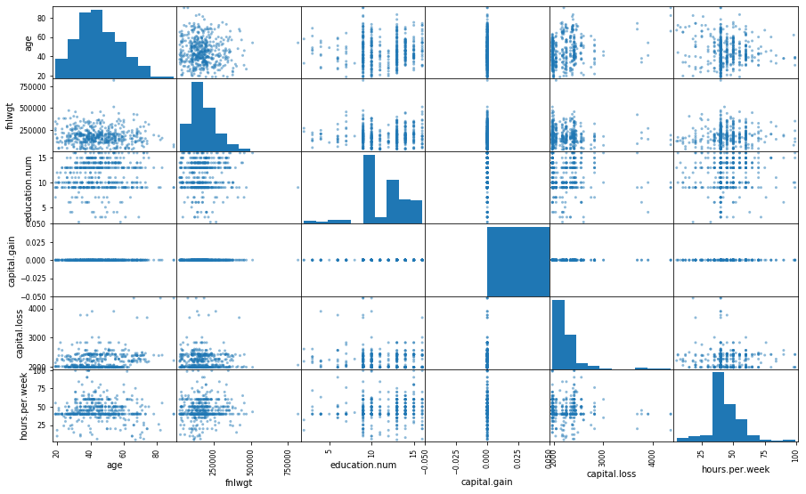


```python
#Relation of Each Feature with the target
fig, ((a,b),(c,d),(e,f)) = plt.subplots(3,2,figsize=(15,20))
plt.xticks(rotation=45)
sns.countplot(df['workclass'],hue=df['income'],ax=f)
sns.countplot(df['relationship'],hue=df['income'],ax=b)
sns.countplot(df['marital.status'],hue=df['income'],ax=c)
sns.countplot(df['race'],hue=df['income'],ax=d)
sns.countplot(df['sex'],hue=df['income'],ax=e)
sns.countplot(df['native.country'],hue=df['income'],ax=a)
```


    <matplotlib.axes._subplots.AxesSubplot at 0x1f840530208>


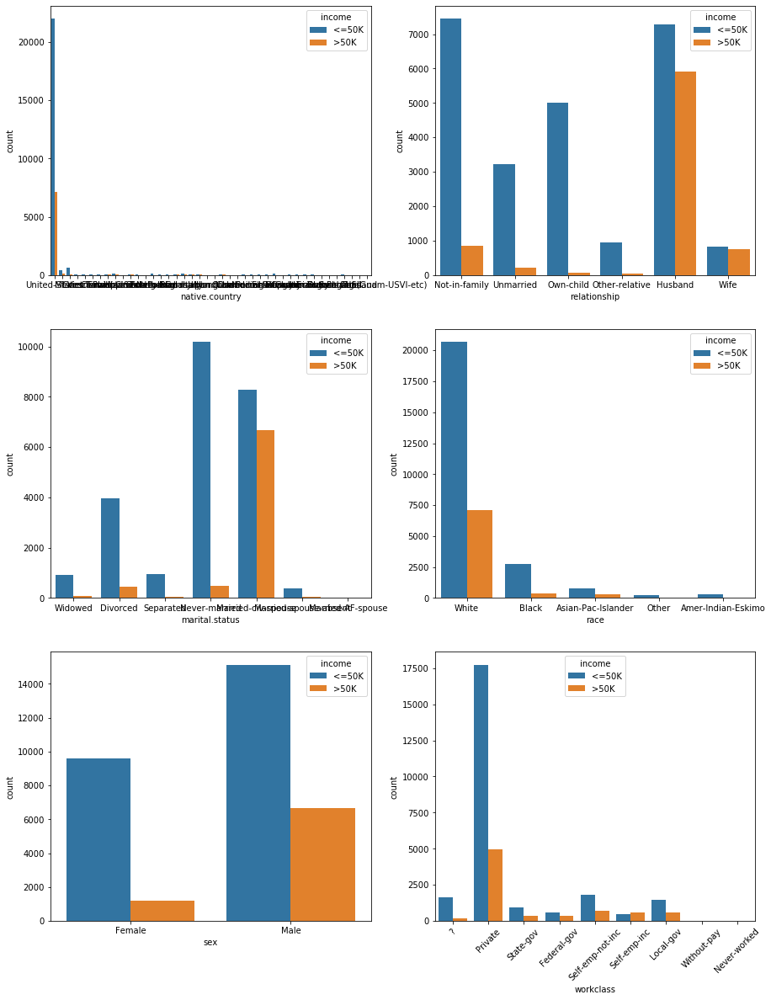


```python
#Relation of Each Feature with the target
fig, (a,b)= plt.subplots(1,2,figsize=(20,6))
sns.boxplot(y='hours.per.week',x='income',data=df,ax=a)
sns.boxplot(y='age',x='income',data=df,ax=b)
```


    <matplotlib.axes._subplots.AxesSubplot at 0x1f840ee65f8>


```python
#additional operations to manipulate data and see it through different perspectives

#df.sort_values(['age','fnlwgt'], ascending = False).head(20)
#df.groupby(df.age).count().plot(kind = 'bar')
#df.groupby('age')['fnlwgt'].mean().sort_values(ascending = False).head(10)
#pd.crosstab(df.age, df.fnlwgt).apply(lambda x: x/x.sum(), axis=1)
#df['young_male'] = ((df.fnlwgt == '19302') & (df.age < 30)).map({True: 'young male', False: 'other'})
#display(df['young_male'])
```

# Data Pre-Processing


## Nonsense values
Negative Values, etc


```python
pd.set_option('display.max_columns', 100)
for col in df:
    print(col)
    print (df[col].unique())
    print('\n')

```

    age
    [90 82 66 54 41 34 38 74 68 45 52 32 51 46 57 22 37 29 61 21 33 49 23 59
     60 63 53 44 43 71 48 73 67 40 50 42 39 55 47 31 58 62 36 72 78 83 26 70
     27 35 81 65 25 28 56 69 20 30 24 64 75 19 77 80 18 17 76 79 88 84 85 86
     87]


    fnlwgt
    [ 77053 132870 186061 ...  34066  84661 257302]


    education.num
    [ 9 10  4  6 16 15 13 14  7 12 11  2  3  8  5  1]


    capital.gain
    [    0 99999 41310 34095 27828 25236 25124 22040 20051 18481 15831 15024
     15020 14344 14084 13550 11678 10605 10566 10520  9562  9386  8614  7978
      7896  7688  7443  7430  7298  6849  6767  6723  6514  6497  6418  6360
      6097  5721  5556  5455  5178  5060  5013  4934  4931  4865  4787  4687
      4650  4508  4416  4386  4101  4064  3942  3908  3887  3818  3781  3674
      3471  3464  3456  3432  3418  3411  3325  3273  3137  3103  2993  2977
      2964  2961  2936  2907  2885  2829  2653  2635  2597  2580  2538  2463
      2414  2407  2387  2354  2346  2329  2290  2228  2202  2176  2174  2105
      2062  2050  2036  2009  1848  1831  1797  1639  1506  1471  1455  1424
      1409  1173  1151  1111  1086  1055   991   914   594   401   114]


    capital.loss
    [4356 3900 3770 3683 3004 2824 2754 2603 2559 2547 2489 2472 2467 2457
     2444 2415 2392 2377 2352 2339 2282 2267 2258 2246 2238 2231 2206 2205
     2201 2179 2174 2163 2149 2129 2080 2057 2051 2042 2002 2001 1980 1977
     1974 1944 1902 1887 1876 1848 1844 1825 1816 1762 1755 1741 1740 1735
     1726 1721 1719 1672 1669 1668 1651 1648 1628 1617 1602 1594 1590 1579
     1573 1564 1539 1504 1485 1411 1408 1380 1340 1258 1138 1092  974  880
      810  653  625  419  323  213  155    0]


    hours.per.week
    [40 18 45 20 60 35 55 76 50 42 25 32 90 48 15 70 52 72 39  6 65 12 80 67
     99 30 75 26 36 10 84 38 62 44  8 28 59  5 24 57 34 37 46 56 41 98 43 63
      1 47 68 54  2 16  9  3  4 33 23 22 64 51 19 58 53 96 66 21  7 13 27 11
     14 77 31 78 49 17 85 87 88 73 89 97 94 29 82 86 91 81 92 61 74 95]


    workclass
    ['?' 'Private' 'State-gov' 'Federal-gov' 'Self-emp-not-inc' 'Self-emp-inc'
     'Local-gov' 'Without-pay' 'Never-worked']


    education
    ['HS-grad' 'Some-college' '7th-8th' '10th' 'Doctorate' 'Prof-school'
     'Bachelors' 'Masters' '11th' 'Assoc-acdm' 'Assoc-voc' '1st-4th' '5th-6th'
     '12th' '9th' 'Preschool']


    marital.status
    ['Widowed' 'Divorced' 'Separated' 'Never-married' 'Married-civ-spouse'
     'Married-spouse-absent' 'Married-AF-spouse']


    occupation
    ['?' 'Exec-managerial' 'Machine-op-inspct' 'Prof-specialty'
     'Other-service' 'Adm-clerical' 'Craft-repair' 'Transport-moving'
     'Handlers-cleaners' 'Sales' 'Farming-fishing' 'Tech-support'
     'Protective-serv' 'Armed-Forces' 'Priv-house-serv']


    relationship
    ['Not-in-family' 'Unmarried' 'Own-child' 'Other-relative' 'Husband' 'Wife']


    race
    ['White' 'Black' 'Asian-Pac-Islander' 'Other' 'Amer-Indian-Eskimo']


    sex
    ['Female' 'Male']


    native.country
    ['United-States' '?' 'Mexico' 'Greece' 'Vietnam' 'China' 'Taiwan' 'India'
     'Philippines' 'Trinadad&Tobago' 'Canada' 'South' 'Holand-Netherlands'
     'Puerto-Rico' 'Poland' 'Iran' 'England' 'Germany' 'Italy' 'Japan' 'Hong'
     'Honduras' 'Cuba' 'Ireland' 'Cambodia' 'Peru' 'Nicaragua'
     'Dominican-Republic' 'Haiti' 'El-Salvador' 'Hungary' 'Columbia'
     'Guatemala' 'Jamaica' 'Ecuador' 'France' 'Yugoslavia' 'Scotland'
     'Portugal' 'Laos' 'Thailand' 'Outlying-US(Guam-USVI-etc)']


    income
    ['<=50K' '>50K']


```python
display(df.describe(include = 'all')) #it helps to understand non-sense values
```


<div>
<style scoped>
    .dataframe tbody tr th:only-of-type {
        vertical-align: middle;
    }

    .dataframe tbody tr th {
        vertical-align: top;
    }

    .dataframe thead th {
        text-align: right;
    }
</style>
<table border="1" class="dataframe">
  <thead>
    <tr style="text-align: right;">
      <th></th>
      <th>age</th>
      <th>fnlwgt</th>
      <th>education.num</th>
      <th>capital.gain</th>
      <th>capital.loss</th>
      <th>hours.per.week</th>
      <th>workclass</th>
      <th>education</th>
      <th>marital.status</th>
      <th>occupation</th>
      <th>relationship</th>
      <th>race</th>
      <th>sex</th>
      <th>native.country</th>
      <th>income</th>
    </tr>
  </thead>
  <tbody>
    <tr>
      <th>count</th>
      <td>32561.000000</td>
      <td>3.256100e+04</td>
      <td>32561.000000</td>
      <td>32561.000000</td>
      <td>32561.000000</td>
      <td>32561.000000</td>
      <td>32561</td>
      <td>32561</td>
      <td>32561</td>
      <td>32561</td>
      <td>32561</td>
      <td>32561</td>
      <td>32561</td>
      <td>32561</td>
      <td>32561</td>
    </tr>
    <tr>
      <th>unique</th>
      <td>NaN</td>
      <td>NaN</td>
      <td>NaN</td>
      <td>NaN</td>
      <td>NaN</td>
      <td>NaN</td>
      <td>9</td>
      <td>16</td>
      <td>7</td>
      <td>15</td>
      <td>6</td>
      <td>5</td>
      <td>2</td>
      <td>42</td>
      <td>2</td>
    </tr>
    <tr>
      <th>top</th>
      <td>NaN</td>
      <td>NaN</td>
      <td>NaN</td>
      <td>NaN</td>
      <td>NaN</td>
      <td>NaN</td>
      <td>Private</td>
      <td>HS-grad</td>
      <td>Married-civ-spouse</td>
      <td>Prof-specialty</td>
      <td>Husband</td>
      <td>White</td>
      <td>Male</td>
      <td>United-States</td>
      <td>&lt;=50K</td>
    </tr>
    <tr>
      <th>freq</th>
      <td>NaN</td>
      <td>NaN</td>
      <td>NaN</td>
      <td>NaN</td>
      <td>NaN</td>
      <td>NaN</td>
      <td>22696</td>
      <td>10501</td>
      <td>14976</td>
      <td>4140</td>
      <td>13193</td>
      <td>27816</td>
      <td>21790</td>
      <td>29170</td>
      <td>24720</td>
    </tr>
    <tr>
      <th>mean</th>
      <td>38.581647</td>
      <td>1.897784e+05</td>
      <td>10.080679</td>
      <td>1077.648844</td>
      <td>87.303830</td>
      <td>40.437456</td>
      <td>NaN</td>
      <td>NaN</td>
      <td>NaN</td>
      <td>NaN</td>
      <td>NaN</td>
      <td>NaN</td>
      <td>NaN</td>
      <td>NaN</td>
      <td>NaN</td>
    </tr>
    <tr>
      <th>std</th>
      <td>13.640433</td>
      <td>1.055500e+05</td>
      <td>2.572720</td>
      <td>7385.292085</td>
      <td>402.960219</td>
      <td>12.347429</td>
      <td>NaN</td>
      <td>NaN</td>
      <td>NaN</td>
      <td>NaN</td>
      <td>NaN</td>
      <td>NaN</td>
      <td>NaN</td>
      <td>NaN</td>
      <td>NaN</td>
    </tr>
    <tr>
      <th>min</th>
      <td>17.000000</td>
      <td>1.228500e+04</td>
      <td>1.000000</td>
      <td>0.000000</td>
      <td>0.000000</td>
      <td>1.000000</td>
      <td>NaN</td>
      <td>NaN</td>
      <td>NaN</td>
      <td>NaN</td>
      <td>NaN</td>
      <td>NaN</td>
      <td>NaN</td>
      <td>NaN</td>
      <td>NaN</td>
    </tr>
    <tr>
      <th>25%</th>
      <td>28.000000</td>
      <td>1.178270e+05</td>
      <td>9.000000</td>
      <td>0.000000</td>
      <td>0.000000</td>
      <td>40.000000</td>
      <td>NaN</td>
      <td>NaN</td>
      <td>NaN</td>
      <td>NaN</td>
      <td>NaN</td>
      <td>NaN</td>
      <td>NaN</td>
      <td>NaN</td>
      <td>NaN</td>
    </tr>
    <tr>
      <th>50%</th>
      <td>37.000000</td>
      <td>1.783560e+05</td>
      <td>10.000000</td>
      <td>0.000000</td>
      <td>0.000000</td>
      <td>40.000000</td>
      <td>NaN</td>
      <td>NaN</td>
      <td>NaN</td>
      <td>NaN</td>
      <td>NaN</td>
      <td>NaN</td>
      <td>NaN</td>
      <td>NaN</td>
      <td>NaN</td>
    </tr>
    <tr>
      <th>75%</th>
      <td>48.000000</td>
      <td>2.370510e+05</td>
      <td>12.000000</td>
      <td>0.000000</td>
      <td>0.000000</td>
      <td>45.000000</td>
      <td>NaN</td>
      <td>NaN</td>
      <td>NaN</td>
      <td>NaN</td>
      <td>NaN</td>
      <td>NaN</td>
      <td>NaN</td>
      <td>NaN</td>
      <td>NaN</td>
    </tr>
    <tr>
      <th>max</th>
      <td>90.000000</td>
      <td>1.484705e+06</td>
      <td>16.000000</td>
      <td>99999.000000</td>
      <td>4356.000000</td>
      <td>99.000000</td>
      <td>NaN</td>
      <td>NaN</td>
      <td>NaN</td>
      <td>NaN</td>
      <td>NaN</td>
      <td>NaN</td>
      <td>NaN</td>
      <td>NaN</td>
      <td>NaN</td>
    </tr>
  </tbody>
</table>
</div>


```python
#CHECK FOR NEGATIVE VALUES BY COLORING THEM
def color_negative_red(val):
    color = 'red' if val <= 0 else 'black'
    return 'color: %s' % color

test = df[['age','capital.gain', 'capital.loss', 'education.num', 'fnlwgt']]
colored = test.head().style.applymap(color_negative_red)

display(colored)
```


<style  type="text/css" >
    #T_cee5a7b4_4abc_11ea_90b5_b88687537bddrow0_col0 {
            color:  black;
        }    #T_cee5a7b4_4abc_11ea_90b5_b88687537bddrow0_col1 {
            color:  red;
        }    #T_cee5a7b4_4abc_11ea_90b5_b88687537bddrow0_col2 {
            color:  black;
        }    #T_cee5a7b4_4abc_11ea_90b5_b88687537bddrow0_col3 {
            color:  black;
        }    #T_cee5a7b4_4abc_11ea_90b5_b88687537bddrow0_col4 {
            color:  black;
        }    #T_cee5a7b4_4abc_11ea_90b5_b88687537bddrow1_col0 {
            color:  black;
        }    #T_cee5a7b4_4abc_11ea_90b5_b88687537bddrow1_col1 {
            color:  red;
        }    #T_cee5a7b4_4abc_11ea_90b5_b88687537bddrow1_col2 {
            color:  black;
        }    #T_cee5a7b4_4abc_11ea_90b5_b88687537bddrow1_col3 {
            color:  black;
        }    #T_cee5a7b4_4abc_11ea_90b5_b88687537bddrow1_col4 {
            color:  black;
        }    #T_cee5a7b4_4abc_11ea_90b5_b88687537bddrow2_col0 {
            color:  black;
        }    #T_cee5a7b4_4abc_11ea_90b5_b88687537bddrow2_col1 {
            color:  red;
        }    #T_cee5a7b4_4abc_11ea_90b5_b88687537bddrow2_col2 {
            color:  black;
        }    #T_cee5a7b4_4abc_11ea_90b5_b88687537bddrow2_col3 {
            color:  black;
        }    #T_cee5a7b4_4abc_11ea_90b5_b88687537bddrow2_col4 {
            color:  black;
        }    #T_cee5a7b4_4abc_11ea_90b5_b88687537bddrow3_col0 {
            color:  black;
        }    #T_cee5a7b4_4abc_11ea_90b5_b88687537bddrow3_col1 {
            color:  red;
        }    #T_cee5a7b4_4abc_11ea_90b5_b88687537bddrow3_col2 {
            color:  black;
        }    #T_cee5a7b4_4abc_11ea_90b5_b88687537bddrow3_col3 {
            color:  black;
        }    #T_cee5a7b4_4abc_11ea_90b5_b88687537bddrow3_col4 {
            color:  black;
        }    #T_cee5a7b4_4abc_11ea_90b5_b88687537bddrow4_col0 {
            color:  black;
        }    #T_cee5a7b4_4abc_11ea_90b5_b88687537bddrow4_col1 {
            color:  red;
        }    #T_cee5a7b4_4abc_11ea_90b5_b88687537bddrow4_col2 {
            color:  black;
        }    #T_cee5a7b4_4abc_11ea_90b5_b88687537bddrow4_col3 {
            color:  black;
        }    #T_cee5a7b4_4abc_11ea_90b5_b88687537bddrow4_col4 {
            color:  black;
        }</style><table id="T_cee5a7b4_4abc_11ea_90b5_b88687537bdd" ><thead>    <tr>        <th class="blank level0" ></th>        <th class="col_heading level0 col0" >age</th>        <th class="col_heading level0 col1" >capital.gain</th>        <th class="col_heading level0 col2" >capital.loss</th>        <th class="col_heading level0 col3" >education.num</th>        <th class="col_heading level0 col4" >fnlwgt</th>    </tr></thead><tbody>
                <tr>
                        <th id="T_cee5a7b4_4abc_11ea_90b5_b88687537bddlevel0_row0" class="row_heading level0 row0" >0</th>
                        <td id="T_cee5a7b4_4abc_11ea_90b5_b88687537bddrow0_col0" class="data row0 col0" >90</td>
                        <td id="T_cee5a7b4_4abc_11ea_90b5_b88687537bddrow0_col1" class="data row0 col1" >0</td>
                        <td id="T_cee5a7b4_4abc_11ea_90b5_b88687537bddrow0_col2" class="data row0 col2" >4356</td>
                        <td id="T_cee5a7b4_4abc_11ea_90b5_b88687537bddrow0_col3" class="data row0 col3" >9</td>
                        <td id="T_cee5a7b4_4abc_11ea_90b5_b88687537bddrow0_col4" class="data row0 col4" >77053</td>
            </tr>
            <tr>
                        <th id="T_cee5a7b4_4abc_11ea_90b5_b88687537bddlevel0_row1" class="row_heading level0 row1" >1</th>
                        <td id="T_cee5a7b4_4abc_11ea_90b5_b88687537bddrow1_col0" class="data row1 col0" >82</td>
                        <td id="T_cee5a7b4_4abc_11ea_90b5_b88687537bddrow1_col1" class="data row1 col1" >0</td>
                        <td id="T_cee5a7b4_4abc_11ea_90b5_b88687537bddrow1_col2" class="data row1 col2" >4356</td>
                        <td id="T_cee5a7b4_4abc_11ea_90b5_b88687537bddrow1_col3" class="data row1 col3" >9</td>
                        <td id="T_cee5a7b4_4abc_11ea_90b5_b88687537bddrow1_col4" class="data row1 col4" >132870</td>
            </tr>
            <tr>
                        <th id="T_cee5a7b4_4abc_11ea_90b5_b88687537bddlevel0_row2" class="row_heading level0 row2" >2</th>
                        <td id="T_cee5a7b4_4abc_11ea_90b5_b88687537bddrow2_col0" class="data row2 col0" >66</td>
                        <td id="T_cee5a7b4_4abc_11ea_90b5_b88687537bddrow2_col1" class="data row2 col1" >0</td>
                        <td id="T_cee5a7b4_4abc_11ea_90b5_b88687537bddrow2_col2" class="data row2 col2" >4356</td>
                        <td id="T_cee5a7b4_4abc_11ea_90b5_b88687537bddrow2_col3" class="data row2 col3" >10</td>
                        <td id="T_cee5a7b4_4abc_11ea_90b5_b88687537bddrow2_col4" class="data row2 col4" >186061</td>
            </tr>
            <tr>
                        <th id="T_cee5a7b4_4abc_11ea_90b5_b88687537bddlevel0_row3" class="row_heading level0 row3" >3</th>
                        <td id="T_cee5a7b4_4abc_11ea_90b5_b88687537bddrow3_col0" class="data row3 col0" >54</td>
                        <td id="T_cee5a7b4_4abc_11ea_90b5_b88687537bddrow3_col1" class="data row3 col1" >0</td>
                        <td id="T_cee5a7b4_4abc_11ea_90b5_b88687537bddrow3_col2" class="data row3 col2" >3900</td>
                        <td id="T_cee5a7b4_4abc_11ea_90b5_b88687537bddrow3_col3" class="data row3 col3" >4</td>
                        <td id="T_cee5a7b4_4abc_11ea_90b5_b88687537bddrow3_col4" class="data row3 col4" >140359</td>
            </tr>
            <tr>
                        <th id="T_cee5a7b4_4abc_11ea_90b5_b88687537bddlevel0_row4" class="row_heading level0 row4" >4</th>
                        <td id="T_cee5a7b4_4abc_11ea_90b5_b88687537bddrow4_col0" class="data row4 col0" >41</td>
                        <td id="T_cee5a7b4_4abc_11ea_90b5_b88687537bddrow4_col1" class="data row4 col1" >0</td>
                        <td id="T_cee5a7b4_4abc_11ea_90b5_b88687537bddrow4_col2" class="data row4 col2" >3900</td>
                        <td id="T_cee5a7b4_4abc_11ea_90b5_b88687537bddrow4_col3" class="data row4 col3" >10</td>
                        <td id="T_cee5a7b4_4abc_11ea_90b5_b88687537bddrow4_col4" class="data row4 col4" >264663</td>
            </tr>
    </tbody></table>


## Missing Values


```python
missingno.matrix(df, figsize=(12, 5))
```


    <matplotlib.axes._subplots.AxesSubplot at 0x1f840a605c0>


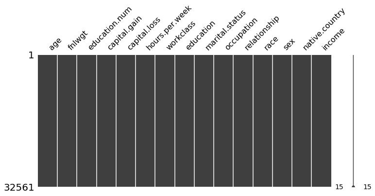


```python
df.isnull().sum()
```


    age               0
    fnlwgt            0
    education.num     0
    capital.gain      0
    capital.loss      0
    hours.per.week    0
    workclass         0
    education         0
    marital.status    0
    occupation        0
    relationship      0
    race              0
    sex               0
    native.country    0
    income            0
    dtype: int64


```python
#convert '?' to NaN
df[df == '?'] = np.nan
"""
columns = df.columns

imputer = SimpleImputer(strategy='most_frequent', missing_values=np.nan,  add_indicator=False)
df = pd.DataFrame(imputer.fit_transform(df))

df.columns = columns

display(df.head())
"""


#fill the NaN values with the mode. It could be filled with median, mean, etc
for col in df.columns:
    df[col].fillna(df[col].mode()[0], inplace=True)

#we could fill every missing values with medians of the columns
#df = data.fillna(df.median())

#also, instead of fill, we can remove every row in which 10% of the values are missing
# df = df.loc[df.isnull().mean(axis=1) < 0.1]

"""
#It is possible to use an imputer. and fill with the values of median, mean, etc
#If imputation technique is used, it is a good practice to add an additional binary feature as a missing indicator.
imputer = SimpleImputer(strategy='most_frequent', missing_values=np.nan,  add_indicator=True)
imputer = SimpleImputer(strategy='mean')
imputer = SimpleImputer(strategy='median')
imputer = SimpleImputer(strategy='constant')
df = pd.DataFrame(imputer.fit_transform(df))
"""

"""
# It is also possible to run a bivariate imputer (iterative imputer). However, it is needed to do labelencoding first. The code below enables us to run the imputer with a Random Forest estimator
# The Iterative Imputer is developed by Scikit-Learn and models each feature with missing values as a function of other features. It uses that as an estimate for imputation. At each step, a feature is selected as output y and all other features are treated as inputs X. A regressor is then fitted on X and y and used to predict the missing values of y. This is done for each feature and repeated for several imputation rounds.
# The great thing about this method is that it allows you to use an estimator of your choosing. I used a RandomForestRegressor to mimic the behavior of the frequently used missForest in R.
imp = IterativeImputer(RandomForestRegressor(), max_iter=10, random_state=0)
df = pd.DataFrame(imp.fit_transform(df), columns=df.columns)

#If you have sufficient data, then it might be an attractive option to simply delete samples with missing data. However, keep in mind that it could create bias in your data. Perhaps the missing data follows a pattern that you miss out on.

#The Iterative Imputer allows for different estimators to be used. After some testing, I found out that you can even use Catboost as an estimator! Unfortunately, LightGBM and XGBoost do not work since their random state names differ.
"""
```


    '\n# It is also possible to run a bivariate imputer (iterative imputer). However, it is needed to do labelencoding first. The code below enables us to run the imputer with a Random Forest estimator\n# The Iterative Imputer is developed by Scikit-Learn and models each feature with missing values as a function of other features. It uses that as an estimate for imputation. At each step, a feature is selected as output y and all other features are treated as inputs X. A regressor is then fitted on X and y and used to predict the missing values of y. This is done for each feature and repeated for several imputation rounds.\n# The great thing about this method is that it allows you to use an estimator of your choosing. I used a RandomForestRegressor to mimic the behavior of the frequently used missForest in R.\nimp = IterativeImputer(RandomForestRegressor(), max_iter=10, random_state=0)\ndf = pd.DataFrame(imp.fit_transform(df), columns=df.columns)\n\n#If you have sufficient data, then it might be an attractive option to simply delete samples with missing data. However, keep in mind that it could create bias in your data. Perhaps the missing data follows a pattern that you miss out on.\n\n#The Iterative Imputer allows for different estimators to be used. After some testing, I found out that you can even use Catboost as an estimator! Unfortunately, LightGBM and XGBoost do not work since their random state names differ.\n'


(more examples of operations for replacing values if needed in the future)


```python
"""
#Replace specific values if needed
Replace symbol in whole column
df['age'] = df['age'].str.replace('–', '**', regex = True)


#DROP multiple columns
df.drop(['age' , 'fnlwgt'], axis = 1, inplace = True)


#Find text with regex and replace with nothing
 df = df.replace({
     'age':'[A-Za-z]',
     'fnlwgt': '[A-Za-z]',
 },'',regex = True)


#Example of applying a formula to entire column

 def euro(cell):
     cell = cell.strip('€')
     return cell
 df.Wage = df.Wage.apply(euro)

#Insert value in cell depending on values from other cells
 def impute_age(cols):
     age = cols[0]
     Pclass = cols[1]
     if pd.isnull(Age):
         if Pclass == 1:
             return 37
         else:
             return 24
     else:
         return Age

#CHANGING DATA TYPES
#changing values to float
df[['Value','Wage','Age']].apply(pd.to_numeric, errors = 'coerce')
df.column.astype(float)
df.dtypes
"""
```


    "\n#Replace specific values if needed\nReplace symbol in whole column\ndf['age'] = df['age'].str.replace('–', '**', regex = True)\n\n\n#DROP multiple columns\ndf.drop(['age' , 'fnlwgt'], axis = 1, inplace = True)\n\n\n#Find text with regex and replace with nothing\n df = df.replace({\n     'age':'[A-Za-z]', \n     'fnlwgt': '[A-Za-z]',\n },'',regex = True)\n\n\n#Example of applying a formula to entire column\n\n def euro(cell):\n     cell = cell.strip('€')\n     return cell\n df.Wage = df.Wage.apply(euro)\n\n#Insert value in cell depending on values from other cells\n def impute_age(cols):\n     age = cols[0]\n     Pclass = cols[1]\n     if pd.isnull(Age):\n         if Pclass == 1:\n             return 37\n         else:\n             return 24\n     else:\n         return Age\n         \n#CHANGING DATA TYPES\n#changing values to float\ndf[['Value','Wage','Age']].apply(pd.to_numeric, errors = 'coerce')\ndf.column.astype(float)\ndf.dtypes\n"


## Duplicates
We can confidently remove duplicates now, because when we'll do the oversampling we we'll use the Smote method that won't generate more duplicates (in contrast to RandomOverSampling). Also, by doing this before the oversampling, we are guaranteeing that we'll have exactly 50%-50% of y-labels balance later.


```python
print(df.duplicated().sum()) #check if there are duplicates
df.drop_duplicates(keep = 'first', inplace = True) #get rid of them
```

    24


## Feature Transformation/Creation
- Feature Transformation (Modidy existing features) -> Scaling, normalize, standarize, logarithim, ...
- Feature Creation (Add useful features) -> Modify to new, Combine features, Cluster some feature, ...

### Label Encoding


```python
#using labelencoder
label_encoders = [] #this was needed to reverse label encoding later
le = LabelEncoder()
for feature in categorical:
    new_le = copy.deepcopy(le)
    df[feature] = new_le.fit_transform(df[feature])
    label_encoders.append(new_le)


```

## Finding Outliers

We can detect outliers in 3 ways:

- Standard Deviation
- Percentiles (Tukey method)
- Isolation Forest or LocalOutlierFactor (more appropriate for Anomaly/Fraud Detection Problems)

Then, we can handle them by:
 - Remove them
 - Change them to max/min limit

The definition of outlier is quite dubious, but we can defined them as those values that surpasse the limit of 1.5 * IQR.
In this case, either the standard deviation method or Tukey method are valid options. We just need to try and see which gives better results (if it produces better results at all).


```python
#See outliers through boxplots
df.plot(kind = 'box', sharex = False, sharey = False)
plt.show()
```


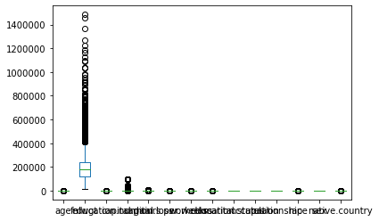


```python
# Tukey Method

n = 2 #In this case, we considered outliers as rows that have at least two outlied numerical values. The optimal value for this parameter can be later determined though the cross-validation
indexes = []

for col in df.columns[0:14]:
    Q1 = np.percentile(df[col], 25)
    Q3 = np.percentile(df[col],75)
    IQR = Q3 - Q1

    limit = 1.5 * IQR

    list_outliers = df[(df[col] < Q1 - limit) | (df[col] > Q3 + limit )].index # Determine a list of indices of outliers for feature col

    indexes.extend(list_outliers) # append the found outlier indices for col to the list of outlier indices

indexes = Counter(indexes)
multiple_outliers = list( k for k, v in indexes.items() if v > n )

df.drop(multiple_outliers, axis = 0)

df = df.drop(multiple_outliers, axis = 0).reset_index(drop=True)
print(str(len(multiple_outliers)) + " outliers were eliminated")
```

    2499 outliers were eliminated


```python
#You can try with this method to see if it provides better results
"""
#Setting the min/max to outliers using standard deviation
for col in df.columns[0:14]:
    factor = 3 #The optimal value for this parameter can be later determined though the cross-validation
    upper_lim = df[col].mean () + df[col].std () * factor
    lower_lim = df[col].mean () - df[col].std () * factor

    df = df[(df[col] < upper_lim) & (df[col] > lower_lim)]
"""
```


    '\n#Setting the min/max to outliers using standard deviation\nfor col in df.columns[0:14]:\n    factor = 3 #The optimal value for this parameter can be later determined though the cross-validation\n    upper_lim = df[col].mean () + df[col].std () * factor\n    lower_lim = df[col].mean () - df[col].std () * factor\n\n    df = df[(df[col] < upper_lim) & (df[col] > lower_lim)]\n'


## Dealing with imbalanced data


```python
#Check if there are labels imbalance
sns.countplot(x=df['income'],palette='RdBu_r')
df.groupby('income').size()
```


    income
    <=50K    22841
    >50K      7197
    dtype: int64


```python
df['income'] = df['income'].map({'>50K': 1, '<=50K': 0})

Y = df['income']
X = df.drop('income',axis=1)
```

### Oversampling the data **


```python
# Oversampling using smote
smk = SMOTETomek(random_state = 42)
X, Y = smk.fit_sample(X, Y)

"""
# RANDOM Oversample #####
os = RandomOverSampler() #ratio of one feature and another is 50% and 50% respectively
X, Y = os.fit_sample(X, Y)
"""
```


    '\n# RANDOM Oversample #####\nos = RandomOverSampler() #ratio of one feature and another is 50% and 50% respectively\nX, Y = os.fit_sample(X, Y)\n'


```python
#If dowsample was needed...

"""
# RANDOM Undersample #####
os = RandomUnderSampler() #ratio of one feature and another is 50% and 50% respectively
X, Y = os.fit_sample(X, Y)
"""

"""
#Using nearmiss
nm = NearMiss()
X, Y = nm.fit_sample(X, Y)
"""
```


    '\n#Using nearmiss\nnm = NearMiss()\nX, Y = nm.fit_sample(X, Y)\n'


```python
#making sure that everything is good now
df = pd.concat([X, Y], axis=1)
sns.countplot(x=Y,palette='RdBu_r')
```


    <matplotlib.axes._subplots.AxesSubplot at 0x1f83f619668>


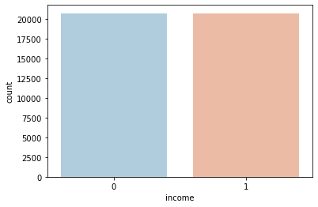


## Transforming Skewed Continuous Features


```python
def analyze_skew():
    #analyze which features are skewed
    fig = plt.figure(figsize = (15,10))
    cols = 3
    rows = math.ceil(float(df[numerical].shape[1] / cols))
    for i, column in enumerate(numerical):
        ax = fig.add_subplot(rows, cols, i + 1)
        ax.set_title(column)
        if df.dtypes[column] == np.object:
            df[column].value_counts().plot(kind = 'bar', axes = ax)
        else:
            df[column].hist(axes = ax)
            plt.xticks(rotation = 'vertical')
    plt.subplots_adjust(hspace = 0.7, wspace = 0.2)
    plt.show()

    # from the plots we can see that there are multiple features skewed. However, the following procedure allows us to see in detail how skewed are they.
    skew_feats = df[numerical].skew().sort_values(ascending=False)
    skewness = pd.DataFrame({'Skew': skew_feats})

    display(skewness)
```


```python
analyze_skew()
```


<div>
<style scoped>
    .dataframe tbody tr th:only-of-type {
        vertical-align: middle;
    }

    .dataframe tbody tr th {
        vertical-align: top;
    }

    .dataframe thead th {
        text-align: right;
    }
</style>
<table border="1" class="dataframe">
  <thead>
    <tr style="text-align: right;">
      <th></th>
      <th>Skew</th>
    </tr>
  </thead>
  <tbody>
    <tr>
      <th>capital.gain</th>
      <td>8.866929</td>
    </tr>
    <tr>
      <th>capital.loss</th>
      <td>4.138455</td>
    </tr>
    <tr>
      <th>fnlwgt</th>
      <td>1.277222</td>
    </tr>
    <tr>
      <th>age</th>
      <td>0.321511</td>
    </tr>
    <tr>
      <th>hours.per.week</th>
      <td>0.109324</td>
    </tr>
    <tr>
      <th>education.num</th>
      <td>-0.195546</td>
    </tr>
  </tbody>
</table>
</div>


```python
#Let's reduce the skew of fnlwgt, capital.gain, capital.loss
skewed = ['fnlwgt', 'capital.gain', 'capital.loss']
features_log_transformed = pd.DataFrame(data=df)
features_log_transformed[skewed] = df[skewed].apply(lambda x: np.log(x + 1)) #it can be other function like polynomial, but generally the log funtion is suitable
```


```python
#check again if is everything ok
analyze_skew()
```


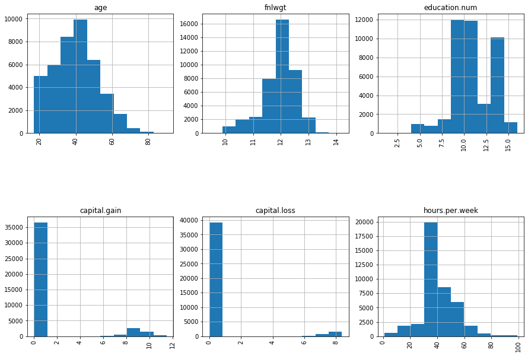


<div>
<style scoped>
    .dataframe tbody tr th:only-of-type {
        vertical-align: middle;
    }

    .dataframe tbody tr th {
        vertical-align: top;
    }

    .dataframe thead th {
        text-align: right;
    }
</style>
<table border="1" class="dataframe">
  <thead>
    <tr style="text-align: right;">
      <th></th>
      <th>Skew</th>
    </tr>
  </thead>
  <tbody>
    <tr>
      <th>capital.loss</th>
      <td>3.892085</td>
    </tr>
    <tr>
      <th>capital.gain</th>
      <td>2.407371</td>
    </tr>
    <tr>
      <th>age</th>
      <td>0.321511</td>
    </tr>
    <tr>
      <th>hours.per.week</th>
      <td>0.109324</td>
    </tr>
    <tr>
      <th>education.num</th>
      <td>-0.195546</td>
    </tr>
    <tr>
      <th>fnlwgt</th>
      <td>-0.905550</td>
    </tr>
  </tbody>
</table>
</div>


### Binning
Binning continuous variables prevents overfitting which is a common problem for tree based models like decision trees and random forest.

Let's binning the age and see later if the results improved or not.

Binning with fixed-width intervals (good for uniform distributions). For skewed distributions (not normal), we can use binning adaptive (quantile based).

TO-DO: analyze if binning really improves the model. Include experimenting binning after and before the remove of outliers. Theoretically, if it is a linear mode, and data has a lot of "outliers" binning probability is better. If we have a tree model, then, outlier and binning will make too much difference.


```python
#Binner adaptive
binner = KBinsDiscretizer(encode='ordinal')
binner.fit(X[['age']])
X['age'] = binner.transform(X[['age']])

"""
#Using fixed-width intervals
age_labels = ['infant','child','teenager','young_adult','adult','old', 'very_old']

ranges = [0,5,12,18,35,60,81,100]

df['age'] = pd.cut(df.age, ranges, labels = age_labels)

"""
#age now becomes a category
categorical = ['age', 'workclass', 'education', 'marital.status', 'occupation', 'relationship', 'race', 'sex', 'native.country']
numerical = ['fnlwgt', 'education.num', 'capital.gain', 'capital.loss', 'hours.per.week']
```

# Feature Selection
- Feature Selection/Reduction (Remove useless features) -> See feature importance, correlations, Dimensionality reduction,

As we only have 14 features, we are not pressured to make a feature selection/reduction in order to increase drastically the computing time of the algorithms. So, for now, we are going to investigate if there are features extremely correlated to each other. After tuning and choosing the best model, we are revisiting feature selection methods just in case we face overfitting or to see if we could achieve the same results with the chosen model but with fewer features.

## Correlation

Since we have a mix of numerical and categorical variables, we are going to analyze the correlation between them independently and then mixed.

- Numerical & Numerical: Pearson correlation is a good one to use, although there are others.
- Categorical & Categorical: We will make use Chi-squared and uncertainty correlation methods through a library called dython.
- Numerical & Categorical: We can use point biserial correlation (only if categorical variable is binary type), or ANOVA test.


```python
#Simple regression line of various variables in relation to  one other
sns.pairplot(X, x_vars = ['capital.loss', 'hours.per.week', 'education.num'], y_vars = 'age', size = 7, aspect = 0.7, kind = 'reg')
```


    <seaborn.axisgrid.PairGrid at 0x1f841db5d68>


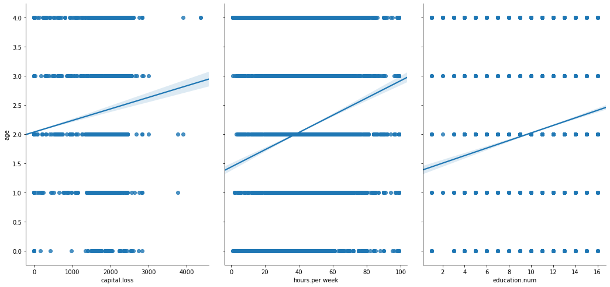


```python
# Overview
sns.pairplot(data = X)
```


    <seaborn.axisgrid.PairGrid at 0x1f841965080>


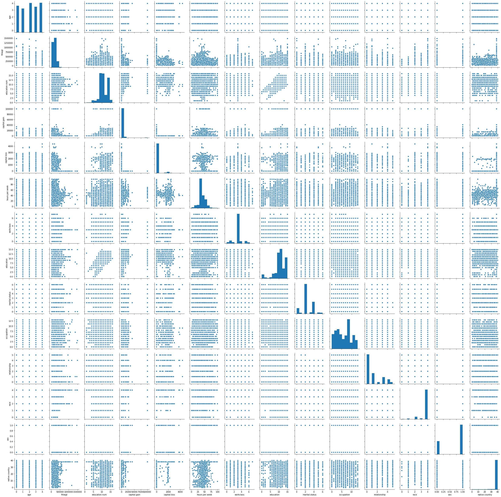


**Correlations between numerical features**


```python
data = X[X.columns.intersection(numerical)]

plt.subplots(figsize=(20,7))
sns.heatmap(data.corr(method = 'pearson'),annot=True,cmap='coolwarm') # the method can also be 'spearman' or kendall'

#to see the correlation between just two variables
#df['age'].corr(df['capital.gain'])
```


    <matplotlib.axes._subplots.AxesSubplot at 0x1f84a410da0>


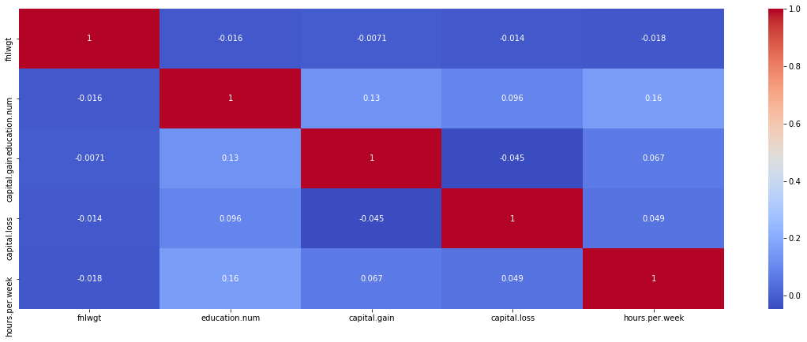


**Correlations between categorical features**


```python
data = X[X.columns.intersection(categorical)]

cols = data.columns
clen = cols.size

pairings = list(itertools.product(data.columns, repeat=2))
theils_mat = np.reshape([nominal.theils_u(data[p[1]],data[p[0]]) for p in pairings],(clen,clen))
final = pd.DataFrame(theils_mat, index=cols, columns=cols)

fig, ax = plt.subplots(1,1, figsize=(14,10))
sns.heatmap(final,0,1,ax=ax,annot=True,fmt="0.2f").set_title("Uncertainty coefficient matrix")
plt.show()
```


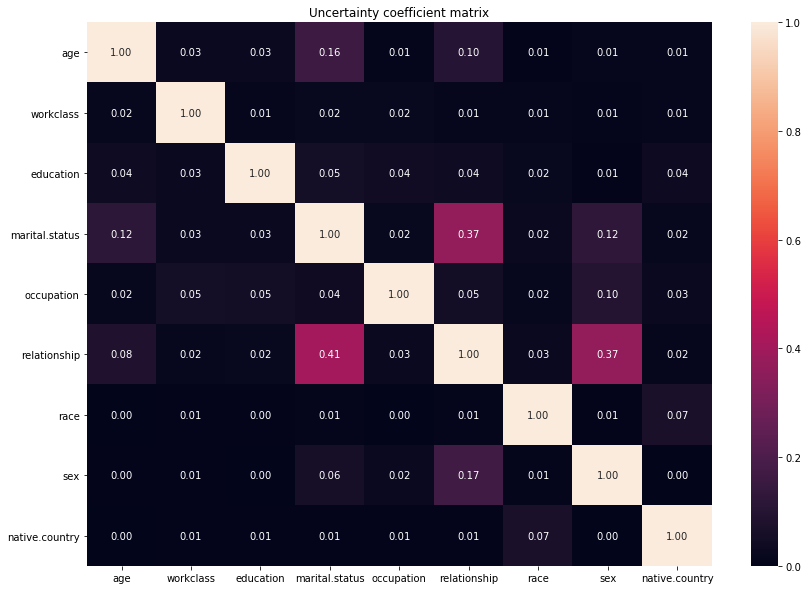


**Correlations between categorical and numerical features**


```python
for num_feature in numerical:
    for cat_feature in categorical:
        args_list = []
        for unique in X[cat_feature].unique():
            args_list.append(X[num_feature][X[cat_feature] == unique])

        f_val, p_val = st.f_oneway(*args_list) # Calculate f statistics and p value
        print('Anova Result between ' + num_feature, ' & '+ cat_feature, ':' , f_val, p_val)

```

    Anova Result between fnlwgt  & age : 46.5268912453089 4.4569777829507625e-39
    Anova Result between fnlwgt  & workclass : 17.225633165330635 6.288135071856597e-23
    Anova Result between fnlwgt  & education : 2.0441905248254884 0.009762901624964735
    Anova Result between fnlwgt  & marital.status : 12.765005429527205 1.863796006189575e-14
    Anova Result between fnlwgt  & occupation : 4.886910693344456 1.238304197319541e-08
    Anova Result between fnlwgt  & relationship : 4.632298851532457 0.000315172576659874
    Anova Result between fnlwgt  & race : 124.46697285232068 8.419234664072455e-106
    Anova Result between fnlwgt  & sex : 21.376514181262525 3.7850098384784932e-06
    Anova Result between fnlwgt  & native.country : 9.016744621966946 6.041379543094484e-53
    Anova Result between education.num  & age : 375.3390218104468 4.008967e-318
    Anova Result between education.num  & workclass : 182.34501783540682 2.926460563414695e-267
    Anova Result between education.num  & education : 5874.925074869358 0.0
    Anova Result between education.num  & marital.status : 207.67100057268635 4.7265446935979185e-262
    Anova Result between education.num  & occupation : 605.773266243161 0.0
    Anova Result between education.num  & relationship : 246.32120236666677 3.117505747544441e-260
    Anova Result between education.num  & race : 85.96173466306159 7.523971631740549e-73
    Anova Result between education.num  & sex : 24.26929527750691 8.408547862045385e-07
    Anova Result between education.num  & native.country : 15.214672870622104 6.5531373835088584e-102
    Anova Result between capital.gain  & age : 97.54627256174153 9.048233185410699e-83
    Anova Result between capital.gain  & workclass : 26.659564001805485 9.497051132020881e-37
    Anova Result between capital.gain  & education : 57.25662990299335 1.5772001139176394e-171
    Anova Result between capital.gain  & marital.status : 65.30649867210741 3.9069285725268614e-81
    Anova Result between capital.gain  & occupation : 22.491427163876043 1.511115096742876e-54
    Anova Result between capital.gain  & relationship : 63.835305644122805 1.3702987209190776e-66
    Anova Result between capital.gain  & race : 14.388196809574213 9.649791689017093e-12
    Anova Result between capital.gain  & sex : 42.2774531570832 8.0097340213292e-11
    Anova Result between capital.gain  & native.country : 1.849066154215362 0.0008742708362504769
    Anova Result between capital.loss  & age : 66.65056129376039 2.62124407780919e-56
    Anova Result between capital.loss  & workclass : 7.736879107133807 2.2206018659137144e-09
    Anova Result between capital.loss  & education : 25.535166947189456 5.751833981133012e-72
    Anova Result between capital.loss  & marital.status : 70.34549955060385 1.425499427099666e-87
    Anova Result between capital.loss  & occupation : 13.338079870080929 4.410942393103499e-30
    Anova Result between capital.loss  & relationship : 69.97708008709682 3.8088254101184346e-73
    Anova Result between capital.loss  & race : 27.964937122591284 3.1392641188756056e-23
    Anova Result between capital.loss  & sex : 66.70885194981354 3.2351620235406776e-16
    Anova Result between capital.loss  & native.country : 2.2109975580088883 1.6462553536982556e-05
    Anova Result between hours.per.week  & age : 759.6640175162116 0.0
    Anova Result between hours.per.week  & workclass : 103.93195315890651 1.7929268693146216e-151
    Anova Result between hours.per.week  & education : 136.6072666563404 0.0
    Anova Result between hours.per.week  & marital.status : 560.932605751092 0.0
    Anova Result between hours.per.week  & occupation : 182.48938946404172 0.0
    Anova Result between hours.per.week  & relationship : 958.1440531263778 0.0
    Anova Result between hours.per.week  & race : 30.19742409346436 3.943048355869619e-25
    Anova Result between hours.per.week  & sex : 2249.3140628997767 0.0
    Anova Result between hours.per.week  & native.country : 0.9600660300833455 0.5422773966387063


**As the p-values are less than 0.05, there are statistical differences between the means of the features (except for hours.per.week  & native.country). Also, as we could perceive from the heatmaps, there are no highly correlated features. Down bellow are the procedures to drop the highest correlated features, even though it's not needed in this case or it might even result in worse results. Let's then proceed with PCA and Backward Elimination methods anyway**

## PCA


```python
#Scalling first a copy of the data
X_copy = X
col_names = X_copy.columns
features = X_copy[col_names]

scaler = StandardScaler().fit(features.values)
features = scaler.transform(features.values)

X_copy[col_names] = features

n_comp = len(X_copy.columns)

pca = PCA(n_components=n_comp, svd_solver='full', random_state=1001)
X_pca = pca.fit_transform(X_copy)

print('Variance contributions of each feature:')
for j in range(n_comp):
    print(pca.explained_variance_ratio_[j])
```

    Variance contributions of each feature:
    0.15333401147860812
    0.09017507190925453
    0.08077640443554379
    0.07919458379640437
    0.07488899723544273
    0.0720853390020408
    0.07012768352266005
    0.06833299091935036
    0.0643652090787114
    0.0639435579889216
    0.06009493042000803
    0.049936405472590574
    0.045804112412883596
    0.026940702327580116


As we can see, every feature has a meaningful contribution to variance. So there's no need to use PCA-componentes. Anyway, we can render the graph to see how the pca-components data look like.


```python
colors = ['blue', 'red']
plt.figure(1, figsize=(10, 10))

for color, i, target_name in zip(colors, [0, 1], np.unique(Y)):
    plt.scatter(X_pca[Y == i, 0], X_pca[Y == i, 1], color=color, s=1,
                alpha=.8, label=target_name, marker='.')
plt.legend(loc='best', shadow=False, scatterpoints=3)
plt.title(
        "Scatter plot of the training data projected on the 1st "
        "and 2nd principal components")
plt.xlabel("Principal axis 1 - Explains %.1f %% of the variance" % (
        pca.explained_variance_ratio_[0] * 100.0))
plt.ylabel("Principal axis 2 - Explains %.1f %% of the variance" % (
        pca.explained_variance_ratio_[1] * 100.0))


plt.show()
```


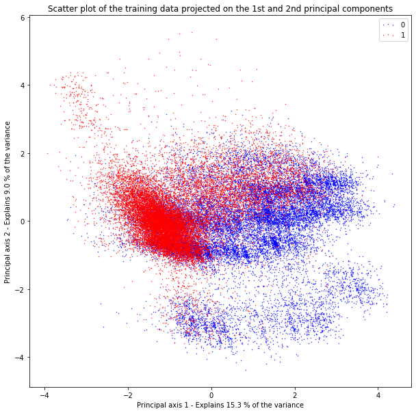


```python
#Making the feature reduction if it was actually needed
#X = pd.DataFrame(data = pca_train, columns = ['pca-1', 'pca-2'])
```

## BACKWARD ELIMINATION (wrapper method 1)

- 1) We select a significance level (SL) to stay in the model
- 2) Fit the full model with all possible predictors
- 3) Loop (while p-value < SL)
    - 4) Consider the predictor with highest p-value.
    - 5) Remove the predictor
    - 6) Fit model without this variable

So basically we are feeding all the possible features to the model and then proceed to iteratively remove
the worst performing features one by one. The metric to evaluate feature performance is pvalue above 0.05 (to keep the feature).


```python
pmax = 1
SL = 0.05 # the smaller the SL, the more features will be removed
cols = list(X.columns)
while (len(X.columns) > 0):

    p_values = []

    Xtemp = X[cols]
    Xtemp = sm.add_constant(Xtemp)
    model = sm.OLS(Y,Xtemp).fit()

    p = pd.Series(model.pvalues.values[1:],index = cols)
    p_max = max(p)
    feature_pmax = p.idxmax()

    if(p_max > SL):
        cols.remove(feature_pmax)
    else:
        break

print('A total of {} features selected: {}'.format(len(cols), cols))

#to apply feature reduction
#X = X[cols]
```

    A total of 14 features selected: ['age', 'fnlwgt', 'education.num', 'capital.gain', 'capital.loss', 'hours.per.week', 'workclass', 'education', 'marital.status', 'occupation', 'relationship', 'race', 'sex', 'native.country']


Backward elimination actually tells us that we can eliminate the feature native.country. However, as we have just a few features, we don't have the urge to sacrifice a little bit of the accuracy of the model due to performing speed. In the latter parts of this notebook there are shown more advanced feature selection techniques just in case will be needed in the future.

# Base Line Model
It is useful to have a reference if our models are doing realy good or not


```python
l=pd.DataFrame(Y)
l['baseline'] = 0
k = pd.DataFrame(confusion_matrix(Y,l['baseline']))
print(k)
print("Accuracy: " + str(accuracy_score(Y, l['baseline'])))

"""
#If we just want to perform OLS regression to find out interesting stats:
X1 = sm.add_constant(X)
model = sm.OLS(Y, X1).fit()
display(model.summary())
print(model.pvalues)
"""
```

           0  1
    0  20756  0
    1  20756  0
    Accuracy: 0.5


    '\n#If we just want to perform OLS regression to find out interesting stats:\nX1 = sm.add_constant(X)\nmodel = sm.OLS(Y, X1).fit()\ndisplay(model.summary())\nprint(model.pvalues)\n'


```python
#Saving data before OneHotEncoding to assess future importance later
X_not_encoded = copy.deepcopy(X)
X_not_encoded[X.columns] = StandardScaler().fit_transform(X) #not encoded yet, but scaled!
```

# Constructing the Pipeline | One Hot Encoding | Standardization

After analyzing the data and all the feature engineering possibilities, methods and what results from them, it is important to build an ML pipeline, i.e, a structure that encodes the sequence of all the transformations needed to each feature.

This is particularly usefull for making predictions on new data. We want to transform new prediction data futurely to the standard with which our models were trained.

We couldn't do at first because we had to know first if it would be needed to eliminate outliers or not, it it would be needed to make reduce dimensionality, etc. Those operations can change the number of features left or created when we encode posteriorly.

So, our pipeline will only cover operations that can change the value and number of final features, and not other feature engineering aspects like class imbalance, skewness, outliers, etc.

- 1) We'll revert all the feature transformations absolutely needed to deal with class imbalance, skewness, outliers, pca, etc. For example: to check if a pca was needed, we had to standardize the values; to eliminate outliers, we had to encode the categorical variables before...So, in the end of this, we are able to fit the pipeline with all the data cleaned and with the original structure.
      - Revert scaler -> binning -> label encoding
- 2) Construct and fit the pipeline with:
      - imputer (we want our model to be able to predict new data with missing fields) -> binning -> hot encoding -> scaler -> pca

We don't need to aggregate a preferred classifier right now to the pipeline because we will still assess and tune multiple models.


```python
#inverse scaling
X = pd.DataFrame(scaler.inverse_transform(X))
X.columns = df.columns[:-1]

#inverse binning of 'Age'.
X['age'] = binner.inverse_transform(X[['age']])

#meanwhile, 'Age' becomes numerical again
#inverse label encoding
categories = copy.deepcopy(categorical) #removing age
categories = categories[1:]
for index, feature in enumerate(categories):
    X[feature] = label_encoders[index].inverse_transform(X[feature].astype(int))

bin_transformer = Pipeline(steps = [
    ('imputer', SimpleImputer(strategy='most_frequent', missing_values=np.nan,  add_indicator=False)),
    ('binning', KBinsDiscretizer(encode='ordinal')),
    ('onehot', OneHotEncoder(categories="auto", handle_unknown='ignore')),
    ('scaler', StandardScaler(with_mean=False))
])

numeric_transformer = Pipeline(steps = [
    ('imputer', SimpleImputer(strategy='most_frequent', missing_values=np.nan,  add_indicator=False)),
    ('scaler', StandardScaler())
    #('pca', pca()) - in our case, reduction of features was not needed
])

categorical_transformer = Pipeline(steps = [
    ('imputer', SimpleImputer(strategy='most_frequent', missing_values=np.nan,  add_indicator=False)),
    ('onehot', OneHotEncoder(categories="auto", handle_unknown='ignore')),
    ('scaler', StandardScaler(with_mean=False))
    #('pca', pca()) - in our case, reduction of features was not needed
])


preprocessor = ColumnTransformer(transformers = [
        ('bin', bin_transformer, ['age']),
        ('num', numeric_transformer, numerical),
        ('cat', categorical_transformer, categories)
    ])

pipeline = Pipeline(steps=[('preprocessor', preprocessor)])


temp = pipeline.fit_transform(X)
columns = pipeline.named_steps['preprocessor'].transformers_[0][1].named_steps['onehot'].get_feature_names(['age']).tolist() + numerical + pipeline.named_steps['preprocessor'].transformers_[2][1].named_steps['onehot'].get_feature_names(categories).tolist()
X = pd.DataFrame(temp.toarray(), columns=columns)

#Save the pipeline for later loading and make new predictions
joblib.dump(pipeline, './models/census/preprocessing_pipeline.pkl')

```


['./models/census/preprocessing_pipeline.pkl']


```python
# Here's code if we want to one hot encode just the categorical features without pipeline nd merge them with the numerical data for further standardization!
"""
encoder = OneHotEncoder(categories="auto")
encoded_feat = pd.DataFrame(encoder.fit_transform(df[categorical]).toarray(), columns=encoder.get_feature_names(categorical))

#concatenate without adding null values -.-''
l1=encoded_feat.values.tolist()
l2=df[numerical].values.tolist()
for i in range(len(l1)):
    l1[i].extend(l2[i])

X=pd.DataFrame(l1,columns=encoded_feat.columns.tolist()+df[numerical].columns.tolist())
"""
```


    '\nencoder = OneHotEncoder(categories="auto")\nencoded_feat = pd.DataFrame(encoder.fit_transform(df[categorical]).toarray(), columns=encoder.get_feature_names(categorical))\n\n#concatenate without adding null values -.-\'\'\nl1=encoded_feat.values.tolist()\nl2=df[numerical].values.tolist()\nfor i in range(len(l1)):\n    l1[i].extend(l2[i])\n\nX=pd.DataFrame(l1,columns=encoded_feat.columns.tolist()+df[numerical].columns.tolist())\n'


StandardScaler removes the mean and scales the data to unit variance. However, the outliers have an influence when computing the empirical mean and standard deviation which shrink the range of the feature values as shown in the left figure below. Note in particular that because the outliers on each feature have different magnitudes, the spread of the transformed data on each feature is very different: most of the data lie in the [-2, 4] range for the transformed median income feature while the same data is squeezed in the smaller [-0.2, 0.2] range for the transformed number of households.

StandardScaler therefore cannot guarantee balanced feature scales in the presence of outliers.

MinMaxScaler rescales the data set such that all feature values are in the range [0, 1] as shown in the right panel below. However, this scaling compress all inliers in the narrow range [0, 0.005] for the transformed number of households.

[Source of the Theory](https://stackoverflow.com/questions/51237635/difference-between-standard-scaler-and-minmaxscaler)


```python
# Here's code if we want to standardize without pipeline.
#Standard
"""
col_names = X.columns

features = X[col_names]

scaler = StandardScaler().fit(features.values)
features = scaler.transform(features.values)

X[col_names] = features
"""
```


    '\ncol_names = X.columns\n\nfeatures = X[col_names]\n\nscaler = StandardScaler().fit(features.values)\nfeatures = scaler.transform(features.values)\n\nX[col_names] = features\n'


```python
#We can also try the minimax and see if it results in better performances
"""
#Minimax
col_names = X.columns

features = X[col_names]

scaler = MinMaxScaler().fit(features.values)
features = scaler.transform(features.values)

X[col_names] = features
"""
```


    '\n#Minimax\ncol_names = X.columns\n\nfeatures = X[col_names]\n\nscaler = MinMaxScaler().fit(features.values)\nfeatures = scaler.transform(features.values)\n\nX[col_names] = features\n'


# Split Data

### Shuffle before split


```python
l1=X.values.tolist()
l2=pd.DataFrame(Y).values.tolist()
for i in range(len(l1)):
    l1[i].extend(l2[i])

new_df=pd.DataFrame(l1,columns=X.columns.tolist()+pd.DataFrame(Y).columns.tolist())

new_df = shuffle(new_df, random_state=42)
```


```python
testSize = 0.3 #we can try with different test_sizes

#dividing features that were not hotencoded for frther analysis of the feature importance for each classifier
X_original_train, X_original_test, y_original_train, y_original_test = train_test_split(X_not_encoded, Y, test_size = 0.2)

train,test = train_test_split(new_df,test_size=testSize)

y_train = train['income']
X_train = train.drop('income',axis=1)
y_test = test['income']
X_test = test.drop('income',axis=1)
```

# Building Classifiers and Finding their Best Parameters
Just tuning the crutial parameters, not all of them.
I intercalate between randomizedSearch and GridSearch to diversify


```python
models = []
tree_classifiers = [] #useful to analyze SHAP values later
tuning_num_folds = 2
jobs=4
num_random_state=10
scoring_criteria='accuracy'
predictions = pd.DataFrame()
```


```python
def permutation_importance(fittted_model, XTest, YTest):

    perm_model = PermutationImportance(fittted_model, random_state = num_random_state, cv = 'prefit', scoring="accuracy")
    perm_model.fit(XTest, YTest, scoring="accuracy")

    display(show_weights(perm_model, feature_names = list(XTest.columns)))
```


```python
def check_fitting(model, name):

    plt.figure(figsize = (12,8))

    number_chunks = 5
    train_sizes, train_scores, test_scores = learning_curve(model, X, Y,
                                            train_sizes = np.linspace(0.01, 1.0, number_chunks), cv = 2, scoring = 'accuracy',
                                            n_jobs = -1, random_state = 0)

    train_mean = np.mean(train_scores, axis = 1)
    train_std = np.std(train_scores, axis = 1)

    test_mean = np.mean(test_scores, axis = 1)
    test_std = np.std(test_scores, axis = 1)

    plt.plot(train_sizes, train_mean, '*-', color = 'blue',  label = 'Training score')
    plt.plot(train_sizes, test_mean, '*-', color = 'yellow', label = 'Cross-validation score')

    plt.fill_between(train_sizes, train_mean - train_std, train_mean + train_std, alpha = 0.1, color = 'b') # Alpha controls band transparency.
    plt.fill_between(train_sizes, test_mean - test_std, test_mean + test_std, alpha = 0.1, color = 'y')

    font_size = 12
    plt.xlabel('Training Set Size', fontsize = font_size)
    plt.ylabel('Accuracy Score', fontsize = font_size)
    plt.xticks(fontsize = font_size)
    plt.yticks(fontsize = font_size)
    plt.legend(loc = 'best')
    plt.grid()

    plt.suptitle('Check for Overfitting/Underfitting Issues of ' + name + ' When Submited to Different Training Sizes', fontsize = 15)
    plt.tight_layout(rect = [0, 0.03, 1, 0.97])
    Path("./results/census/" + name).mkdir(parents=True, exist_ok=True)

    #saving the image
    plt.savefig('./results/census/' + name + '/learning_curve.png')
    plt.show()
```


```python
# It displays the scores of the combinations of the tunning parameters. It is useful, for example, to see if a parameter is really worth to wasting time to varying it by assess the impact that its variation has in the score
# It can only be applied when we use grid search because we know the combinations made,contrary to randomSearch
def display_tuning_scores(params, tunning):
    keys  = list(params.keys())
    lengths = [len(params[x]) for x in keys]
    if 1 in lengths:
        lengths.remove(1)
    lengths.sort(reverse=True)
    master_scores = tunning.cv_results_['mean_test_score']

    for length in lengths:
        for key, value in params.items():
            if len(value) == length:
                myKey = key
                break

        scores = np.array(master_scores).reshape(tuple(lengths))
        scores = [x.mean() for x in scores]

        plt.figure(figsize=(10,5))
        plt.plot(params[myKey],scores, '*-',)
        plt.xlabel(myKey)
        plt.ylabel('Mean score')
        plt.show()
        params.pop(myKey, None)
        lengths = lengths[1:] + [lengths[0]]
```

## Random Forest Tuning


```python
name = 'Random Forest'
params ={
             'max_depth': st.randint(3, 11),
            'n_estimators': [50,100,250]
            }

""" #due to lack of computational power, the parameters supposed to tune were diminished
params ={
             'max_depth': st.randint(3, 11),
            'n_estimators': [50,100,150,200,250],
             'max_features':["sqrt", "log2"],
             'max_leaf_nodes':st.randint(6, 10)
            }

#remember that the line tunned_model = ... needs to be adjusted depending on the parameters that you include
"""

skf = StratifiedKFold(n_splits=tuning_num_folds, shuffle = True)

random_search = RandomizedSearchCV(RandomForestClassifier(), param_distributions=params, scoring='roc_auc', n_jobs=jobs, cv=skf.split(X_train,y_train), verbose=3, random_state=num_random_state)
random_search.fit(X_train,y_train)

#These two lines are useful to analyze SHAP values later
tree_classifiers.append(('Random Forest', RandomForestClassifier(n_estimators=random_search.best_params_['n_estimators'], max_depth=random_search.best_params_['max_depth'])))
tree_classifiers.append(('Random Forest', RandomForestClassifier(n_estimators=random_search.best_params_['n_estimators'], max_depth=random_search.best_params_['max_depth'])))

model_config_1 = RandomForestClassifier(n_estimators=random_search.best_params_['n_estimators'], max_depth=random_search.best_params_['max_depth'])
model_config_2 = RandomForestClassifier(n_estimators=random_search.best_params_['n_estimators'], max_depth=random_search.best_params_['max_depth'])
tunned_model = model_config_1.fit(X_train,y_train)
models.append((name, tunned_model))

#let's save the predictions to analyze later their correlation
predictions[name] = tunned_model.predict(X_test)

#Analyze feature importance of Original Data
print(name + " - Feature Importances")
permutation_importance(model_config_2.fit(X_original_train,y_original_train), X_original_test, y_original_test)

#saving model
pickle.dump(tunned_model, open('./models/census/' + name + '_model.sav', 'wb'))
```

    Fitting 2 folds for each of 10 candidates, totalling 20 fits


    [Parallel(n_jobs=4)]: Using backend LokyBackend with 4 concurrent workers.
    [Parallel(n_jobs=4)]: Done  20 out of  20 | elapsed:   12.6s remaining:    0.0s
    [Parallel(n_jobs=4)]: Done  20 out of  20 | elapsed:   12.6s finished


    Random Forest - Feature Importances


    <style>
    table.eli5-weights tr:hover {
        filter: brightness(85%);
    }
</style>


        <table class="eli5-weights eli5-feature-importances" style="border-collapse: collapse; border: none; margin-top: 0em; table-layout: auto;">
    <thead>
    <tr style="border: none;">
        <th style="padding: 0 1em 0 0.5em; text-align: right; border: none;">Weight</th>
        <th style="padding: 0 0.5em 0 0.5em; text-align: left; border: none;">Feature</th>
    </tr>
    </thead>
    <tbody>

        <tr style="background-color: hsl(120, 100.00%, 80.00%); border: none;">
            <td style="padding: 0 1em 0 0.5em; text-align: right; border: none;">
                0.1314

                    &plusmn; 0.0017

            </td>
            <td style="padding: 0 0.5em 0 0.5em; text-align: left; border: none;">
                relationship
            </td>
        </tr>

        <tr style="background-color: hsl(120, 100.00%, 90.06%); border: none;">
            <td style="padding: 0 1em 0 0.5em; text-align: right; border: none;">
                0.0484

                    &plusmn; 0.0074

            </td>
            <td style="padding: 0 0.5em 0 0.5em; text-align: left; border: none;">
                marital.status
            </td>
        </tr>

        <tr style="background-color: hsl(120, 100.00%, 92.42%); border: none;">
            <td style="padding: 0 1em 0 0.5em; text-align: right; border: none;">
                0.0328

                    &plusmn; 0.0010

            </td>
            <td style="padding: 0 0.5em 0 0.5em; text-align: left; border: none;">
                capital.gain
            </td>
        </tr>

        <tr style="background-color: hsl(120, 100.00%, 93.05%); border: none;">
            <td style="padding: 0 1em 0 0.5em; text-align: right; border: none;">
                0.0290

                    &plusmn; 0.0039

            </td>
            <td style="padding: 0 0.5em 0 0.5em; text-align: left; border: none;">
                education.num
            </td>
        </tr>

        <tr style="background-color: hsl(120, 100.00%, 94.22%); border: none;">
            <td style="padding: 0 1em 0 0.5em; text-align: right; border: none;">
                0.0223

                    &plusmn; 0.0049

            </td>
            <td style="padding: 0 0.5em 0 0.5em; text-align: left; border: none;">
                age
            </td>
        </tr>

        <tr style="background-color: hsl(120, 100.00%, 95.63%); border: none;">
            <td style="padding: 0 1em 0 0.5em; text-align: right; border: none;">
                0.0150

                    &plusmn; 0.0022

            </td>
            <td style="padding: 0 0.5em 0 0.5em; text-align: left; border: none;">
                education
            </td>
        </tr>

        <tr style="background-color: hsl(120, 100.00%, 97.09%); border: none;">
            <td style="padding: 0 1em 0 0.5em; text-align: right; border: none;">
                0.0084

                    &plusmn; 0.0022

            </td>
            <td style="padding: 0 0.5em 0 0.5em; text-align: left; border: none;">
                hours.per.week
            </td>
        </tr>

        <tr style="background-color: hsl(120, 100.00%, 97.27%); border: none;">
            <td style="padding: 0 1em 0 0.5em; text-align: right; border: none;">
                0.0076

                    &plusmn; 0.0023

            </td>
            <td style="padding: 0 0.5em 0 0.5em; text-align: left; border: none;">
                sex
            </td>
        </tr>

        <tr style="background-color: hsl(120, 100.00%, 97.39%); border: none;">
            <td style="padding: 0 1em 0 0.5em; text-align: right; border: none;">
                0.0072

                    &plusmn; 0.0017

            </td>
            <td style="padding: 0 0.5em 0 0.5em; text-align: left; border: none;">
                workclass
            </td>
        </tr>

        <tr style="background-color: hsl(120, 100.00%, 97.90%); border: none;">
            <td style="padding: 0 1em 0 0.5em; text-align: right; border: none;">
                0.0053

                    &plusmn; 0.0012

            </td>
            <td style="padding: 0 0.5em 0 0.5em; text-align: left; border: none;">
                occupation
            </td>
        </tr>

        <tr style="background-color: hsl(120, 100.00%, 98.59%); border: none;">
            <td style="padding: 0 1em 0 0.5em; text-align: right; border: none;">
                0.0030

                    &plusmn; 0.0005

            </td>
            <td style="padding: 0 0.5em 0 0.5em; text-align: left; border: none;">
                capital.loss
            </td>
        </tr>

        <tr style="background-color: hsl(120, 100.00%, 99.58%); border: none;">
            <td style="padding: 0 1em 0 0.5em; text-align: right; border: none;">
                0.0005

                    &plusmn; 0.0003

            </td>
            <td style="padding: 0 0.5em 0 0.5em; text-align: left; border: none;">
                race
            </td>
        </tr>

        <tr style="background-color: hsl(120, 100.00%, 99.71%); border: none;">
            <td style="padding: 0 1em 0 0.5em; text-align: right; border: none;">
                0.0003

                    &plusmn; 0.0006

            </td>
            <td style="padding: 0 0.5em 0 0.5em; text-align: left; border: none;">
                fnlwgt
            </td>
        </tr>

        <tr style="background-color: hsl(120, 100.00%, 99.77%); border: none;">
            <td style="padding: 0 1em 0 0.5em; text-align: right; border: none;">
                0.0002

                    &plusmn; 0.0002

            </td>
            <td style="padding: 0 0.5em 0 0.5em; text-align: left; border: none;">
                native.country
            </td>
        </tr>


    </tbody>
</table>


## Tuning Logistic Regression


```python
name = 'Logistic Regression'

param = {'penalty': ['l1','l2'], 'C': [0.0001, 0.001, 0.01, 0.1, 1, 10.0, 100.0, 1000.0]}

""" #due to lack of computational power, the parameters supposed to tune were diminished
C_vals = [0.0001, 0.001, 0.01, 0.1,0.13,0.2, .15, .25, .275, .33, 0.5, .66, 0.75, 1.0, 2.5, 4.0,4.5,5.0,5.1,5.5,6.0, 10.0, 100.0, 1000.0]
penalties = ['l1','l2']
param = {'penalty': penalties, 'C': C_vals}

#remember that the line tunned_model = ... needs to be adjusted depending on the parameters that you include
"""

grid = GridSearchCV(LogisticRegression(), param,verbose=False, cv = StratifiedKFold(n_splits=tuning_num_folds,random_state=num_random_state,shuffle=True), n_jobs=jobs,scoring=scoring_criteria)
grid.fit(X_train,y_train)

model_config_1 = LogisticRegression(penalty=grid.best_params_['penalty'], C=grid.best_params_['C'])
model_config_2 = LogisticRegression(penalty=grid.best_params_['penalty'], C=grid.best_params_['C'])
tunned_model = model_config_1.fit(X_train,y_train)

models.append((name, tunned_model))

#let's save the predictions to analyze later their correlation
predictions[name] = tunned_model.predict(X_test)

#Analyze feature importance of Original Data
print(name + " - Feature Importances")
permutation_importance(model_config_2.fit(X_original_train,y_original_train), X_original_test, y_original_test)

#saving model
pickle.dump(tunned_model, open('./models/census/' + name + '_model.sav', 'wb'))
```

    Logistic Regression - Feature Importances


    <style>
    table.eli5-weights tr:hover {
        filter: brightness(85%);
    }
</style>


        <table class="eli5-weights eli5-feature-importances" style="border-collapse: collapse; border: none; margin-top: 0em; table-layout: auto;">
    <thead>
    <tr style="border: none;">
        <th style="padding: 0 1em 0 0.5em; text-align: right; border: none;">Weight</th>
        <th style="padding: 0 0.5em 0 0.5em; text-align: left; border: none;">Feature</th>
    </tr>
    </thead>
    <tbody>

        <tr style="background-color: hsl(120, 100.00%, 80.00%); border: none;">
            <td style="padding: 0 1em 0 0.5em; text-align: right; border: none;">
                0.0576

                    &plusmn; 0.0074

            </td>
            <td style="padding: 0 0.5em 0 0.5em; text-align: left; border: none;">
                education.num
            </td>
        </tr>

        <tr style="background-color: hsl(120, 100.00%, 83.05%); border: none;">
            <td style="padding: 0 1em 0 0.5em; text-align: right; border: none;">
                0.0455

                    &plusmn; 0.0019

            </td>
            <td style="padding: 0 0.5em 0 0.5em; text-align: left; border: none;">
                relationship
            </td>
        </tr>

        <tr style="background-color: hsl(120, 100.00%, 84.93%); border: none;">
            <td style="padding: 0 1em 0 0.5em; text-align: right; border: none;">
                0.0385

                    &plusmn; 0.0038

            </td>
            <td style="padding: 0 0.5em 0 0.5em; text-align: left; border: none;">
                age
            </td>
        </tr>

        <tr style="background-color: hsl(120, 100.00%, 85.16%); border: none;">
            <td style="padding: 0 1em 0 0.5em; text-align: right; border: none;">
                0.0376

                    &plusmn; 0.0020

            </td>
            <td style="padding: 0 0.5em 0 0.5em; text-align: left; border: none;">
                capital.gain
            </td>
        </tr>

        <tr style="background-color: hsl(120, 100.00%, 90.65%); border: none;">
            <td style="padding: 0 1em 0 0.5em; text-align: right; border: none;">
                0.0194

                    &plusmn; 0.0012

            </td>
            <td style="padding: 0 0.5em 0 0.5em; text-align: left; border: none;">
                hours.per.week
            </td>
        </tr>

        <tr style="background-color: hsl(120, 100.00%, 91.44%); border: none;">
            <td style="padding: 0 1em 0 0.5em; text-align: right; border: none;">
                0.0172

                    &plusmn; 0.0046

            </td>
            <td style="padding: 0 0.5em 0 0.5em; text-align: left; border: none;">
                marital.status
            </td>
        </tr>

        <tr style="background-color: hsl(120, 100.00%, 94.23%); border: none;">
            <td style="padding: 0 1em 0 0.5em; text-align: right; border: none;">
                0.0098

                    &plusmn; 0.0030

            </td>
            <td style="padding: 0 0.5em 0 0.5em; text-align: left; border: none;">
                workclass
            </td>
        </tr>

        <tr style="background-color: hsl(120, 100.00%, 94.84%); border: none;">
            <td style="padding: 0 1em 0 0.5em; text-align: right; border: none;">
                0.0083

                    &plusmn; 0.0018

            </td>
            <td style="padding: 0 0.5em 0 0.5em; text-align: left; border: none;">
                capital.loss
            </td>
        </tr>

        <tr style="background-color: hsl(120, 100.00%, 98.13%); border: none;">
            <td style="padding: 0 1em 0 0.5em; text-align: right; border: none;">
                0.0020

                    &plusmn; 0.0017

            </td>
            <td style="padding: 0 0.5em 0 0.5em; text-align: left; border: none;">
                occupation
            </td>
        </tr>

        <tr style="background-color: hsl(120, 100.00%, 99.48%); border: none;">
            <td style="padding: 0 1em 0 0.5em; text-align: right; border: none;">
                0.0003

                    &plusmn; 0.0018

            </td>
            <td style="padding: 0 0.5em 0 0.5em; text-align: left; border: none;">
                education
            </td>
        </tr>

        <tr style="background-color: hsl(120, 100.00%, 99.51%); border: none;">
            <td style="padding: 0 1em 0 0.5em; text-align: right; border: none;">
                0.0003

                    &plusmn; 0.0009

            </td>
            <td style="padding: 0 0.5em 0 0.5em; text-align: left; border: none;">
                race
            </td>
        </tr>

        <tr style="background-color: hsl(0, 100.00%, 99.70%); border: none;">
            <td style="padding: 0 1em 0 0.5em; text-align: right; border: none;">
                -0.0001

                    &plusmn; 0.0015

            </td>
            <td style="padding: 0 0.5em 0 0.5em; text-align: left; border: none;">
                fnlwgt
            </td>
        </tr>

        <tr style="background-color: hsl(0, 100.00%, 99.60%); border: none;">
            <td style="padding: 0 1em 0 0.5em; text-align: right; border: none;">
                -0.0002

                    &plusmn; 0.0003

            </td>
            <td style="padding: 0 0.5em 0 0.5em; text-align: left; border: none;">
                native.country
            </td>
        </tr>

        <tr style="background-color: hsl(0, 100.00%, 99.23%); border: none;">
            <td style="padding: 0 1em 0 0.5em; text-align: right; border: none;">
                -0.0006

                    &plusmn; 0.0015

            </td>
            <td style="padding: 0 0.5em 0 0.5em; text-align: left; border: none;">
                sex
            </td>
        </tr>


    </tbody>
</table>


## MLPClassifier tuning


```python
name = 'MLP'

param ={
             'activation':['logistic', 'tanh', 'relu'],
             'learning_rate': ['adaptive'],
}

""" #due to lack of computational power, the parameters supposed to tune were diminished
param ={'max_iter': np.logspace(1, 5, 10).astype("int32"),
             'hidden_layer_sizes': np.logspace(2, 3, 4).astype("int32"),
             'activation':['identity', 'logistic', 'tanh', 'relu'],
             'learning_rate': ['adaptive'],
             'early_stopping': [True],
             'alpha': np.logspace(2, 3, 4).astype("int32")
}

#remember that the line tunned_model = ... needs to be adjusted depending on the parameters that you include
"""

grid = GridSearchCV(MLPClassifier(), param,verbose=True, cv = StratifiedKFold(n_splits=tuning_num_folds,random_state=num_random_state,shuffle=True), n_jobs=jobs,scoring=scoring_criteria)
grid.fit(X_train,y_train)

model_config_1 = MLPClassifier(activation=grid.best_params_['activation'], learning_rate=grid.best_params_['learning_rate'])
model_config_2 = MLPClassifier(activation=grid.best_params_['activation'], learning_rate=grid.best_params_['learning_rate'])
tunned_model = model_config_1.fit(X_train,y_train)

models.append((name, tunned_model))

#let's save the predictions to analyze later their correlation
predictions[name] = tunned_model.predict(X_test)

#Analyze feature importance of Original Data
print(name + " - Feature Importances")
permutation_importance(model_config_2.fit(X_original_train,y_original_train), X_original_test, y_original_test)

#display tunning parameters scores
display_tuning_scores(param, grid)

#saving model
pickle.dump(tunned_model, open('./models/census/' + name + '_model.sav', 'wb'))
```

    Fitting 2 folds for each of 3 candidates, totalling 6 fits


    [Parallel(n_jobs=4)]: Using backend LokyBackend with 4 concurrent workers.
    [Parallel(n_jobs=4)]: Done   6 out of   6 | elapsed:  1.4min remaining:    0.0s
    [Parallel(n_jobs=4)]: Done   6 out of   6 | elapsed:  1.4min finished


    MLP - Feature Importances


    <style>
    table.eli5-weights tr:hover {
        filter: brightness(85%);
    }
</style>


        <table class="eli5-weights eli5-feature-importances" style="border-collapse: collapse; border: none; margin-top: 0em; table-layout: auto;">
    <thead>
    <tr style="border: none;">
        <th style="padding: 0 1em 0 0.5em; text-align: right; border: none;">Weight</th>
        <th style="padding: 0 0.5em 0 0.5em; text-align: left; border: none;">Feature</th>
    </tr>
    </thead>
    <tbody>

        <tr style="background-color: hsl(120, 100.00%, 80.00%); border: none;">
            <td style="padding: 0 1em 0 0.5em; text-align: right; border: none;">
                0.1030

                    &plusmn; 0.0034

            </td>
            <td style="padding: 0 0.5em 0 0.5em; text-align: left; border: none;">
                marital.status
            </td>
        </tr>

        <tr style="background-color: hsl(120, 100.00%, 84.14%); border: none;">
            <td style="padding: 0 1em 0 0.5em; text-align: right; border: none;">
                0.0739

                    &plusmn; 0.0052

            </td>
            <td style="padding: 0 0.5em 0 0.5em; text-align: left; border: none;">
                relationship
            </td>
        </tr>

        <tr style="background-color: hsl(120, 100.00%, 88.83%); border: none;">
            <td style="padding: 0 1em 0 0.5em; text-align: right; border: none;">
                0.0448

                    &plusmn; 0.0027

            </td>
            <td style="padding: 0 0.5em 0 0.5em; text-align: left; border: none;">
                education.num
            </td>
        </tr>

        <tr style="background-color: hsl(120, 100.00%, 90.90%); border: none;">
            <td style="padding: 0 1em 0 0.5em; text-align: right; border: none;">
                0.0334

                    &plusmn; 0.0043

            </td>
            <td style="padding: 0 0.5em 0 0.5em; text-align: left; border: none;">
                age
            </td>
        </tr>

        <tr style="background-color: hsl(120, 100.00%, 91.81%); border: none;">
            <td style="padding: 0 1em 0 0.5em; text-align: right; border: none;">
                0.0288

                    &plusmn; 0.0015

            </td>
            <td style="padding: 0 0.5em 0 0.5em; text-align: left; border: none;">
                capital.gain
            </td>
        </tr>

        <tr style="background-color: hsl(120, 100.00%, 91.95%); border: none;">
            <td style="padding: 0 1em 0 0.5em; text-align: right; border: none;">
                0.0281

                    &plusmn; 0.0021

            </td>
            <td style="padding: 0 0.5em 0 0.5em; text-align: left; border: none;">
                hours.per.week
            </td>
        </tr>

        <tr style="background-color: hsl(120, 100.00%, 92.40%); border: none;">
            <td style="padding: 0 1em 0 0.5em; text-align: right; border: none;">
                0.0258

                    &plusmn; 0.0022

            </td>
            <td style="padding: 0 0.5em 0 0.5em; text-align: left; border: none;">
                education
            </td>
        </tr>

        <tr style="background-color: hsl(120, 100.00%, 92.77%); border: none;">
            <td style="padding: 0 1em 0 0.5em; text-align: right; border: none;">
                0.0241

                    &plusmn; 0.0026

            </td>
            <td style="padding: 0 0.5em 0 0.5em; text-align: left; border: none;">
                sex
            </td>
        </tr>

        <tr style="background-color: hsl(120, 100.00%, 96.20%); border: none;">
            <td style="padding: 0 1em 0 0.5em; text-align: right; border: none;">
                0.0096

                    &plusmn; 0.0032

            </td>
            <td style="padding: 0 0.5em 0 0.5em; text-align: left; border: none;">
                workclass
            </td>
        </tr>

        <tr style="background-color: hsl(120, 100.00%, 96.89%); border: none;">
            <td style="padding: 0 1em 0 0.5em; text-align: right; border: none;">
                0.0072

                    &plusmn; 0.0020

            </td>
            <td style="padding: 0 0.5em 0 0.5em; text-align: left; border: none;">
                occupation
            </td>
        </tr>

        <tr style="background-color: hsl(120, 100.00%, 97.58%); border: none;">
            <td style="padding: 0 1em 0 0.5em; text-align: right; border: none;">
                0.0050

                    &plusmn; 0.0005

            </td>
            <td style="padding: 0 0.5em 0 0.5em; text-align: left; border: none;">
                capital.loss
            </td>
        </tr>

        <tr style="background-color: hsl(120, 100.00%, 98.03%); border: none;">
            <td style="padding: 0 1em 0 0.5em; text-align: right; border: none;">
                0.0038

                    &plusmn; 0.0016

            </td>
            <td style="padding: 0 0.5em 0 0.5em; text-align: left; border: none;">
                race
            </td>
        </tr>

        <tr style="background-color: hsl(120, 100.00%, 98.58%); border: none;">
            <td style="padding: 0 1em 0 0.5em; text-align: right; border: none;">
                0.0024

                    &plusmn; 0.0017

            </td>
            <td style="padding: 0 0.5em 0 0.5em; text-align: left; border: none;">
                native.country
            </td>
        </tr>

        <tr style="background-color: hsl(120, 100.00%, 98.64%); border: none;">
            <td style="padding: 0 1em 0 0.5em; text-align: right; border: none;">
                0.0022

                    &plusmn; 0.0016

            </td>
            <td style="padding: 0 0.5em 0 0.5em; text-align: left; border: none;">
                fnlwgt
            </td>
        </tr>


    </tbody>
</table>


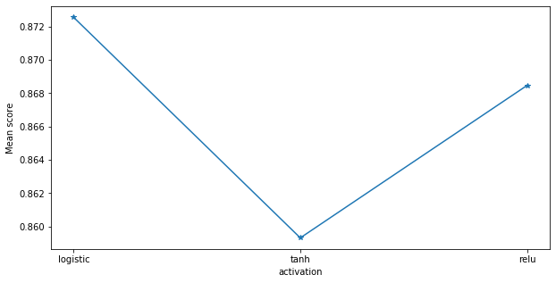


## KNeighborsClassifier tuning


```python
name = 'KNN'
params ={'n_neighbors': [5, 15,35],
            'n_neighbors': [1],
            'weights':['uniform','distance']
            }

""" #due to lack of computational power, the parameters supposed to tune were diminished
params ={'n_neighbors': st.randint(5,50),
            'weights':['uniform','distance']
            }
}

#remember that the line tunned_model = ... needs to be adjusted depending on the parameters that you include
"""

skf = StratifiedKFold(n_splits=tuning_num_folds, shuffle = True)

random_search = RandomizedSearchCV(KNeighborsClassifier(), param_distributions=params, scoring='roc_auc', n_jobs=jobs, cv=skf.split(X_train,y_train), verbose=3, random_state=num_random_state)
random_search.fit(X_train,y_train)

model_config_1 = KNeighborsClassifier(n_neighbors=random_search.best_params_['n_neighbors'], weights=random_search.best_params_['weights'])
model_config_2 = KNeighborsClassifier(n_neighbors=random_search.best_params_['n_neighbors'], weights=random_search.best_params_['weights'])
tunned_model = model_config_1.fit(X_train,y_train)

models.append((name, tunned_model))

#let's save the predictions to analyze later their correlation
predictions[name] = tunned_model.predict(X_test)

#Analyze feature importance of Original Data
print(name + " - Feature Importances")
permutation_importance(model_config_2.fit(X_original_train,y_original_train), X_original_test, y_original_test)

#display tunning parameters scores
display_tuning_scores(param, grid)

#saving model
pickle.dump(tunned_model, open('./models/census/' + name + '_model.sav', 'wb'))
```

    Fitting 2 folds for each of 2 candidates, totalling 4 fits


    [Parallel(n_jobs=4)]: Using backend LokyBackend with 4 concurrent workers.
    [Parallel(n_jobs=4)]: Done   4 out of   4 | elapsed:  1.5min finished


    KNN - Feature Importances


    <style>
    table.eli5-weights tr:hover {
        filter: brightness(85%);
    }
</style>


        <table class="eli5-weights eli5-feature-importances" style="border-collapse: collapse; border: none; margin-top: 0em; table-layout: auto;">
    <thead>
    <tr style="border: none;">
        <th style="padding: 0 1em 0 0.5em; text-align: right; border: none;">Weight</th>
        <th style="padding: 0 0.5em 0 0.5em; text-align: left; border: none;">Feature</th>
    </tr>
    </thead>
    <tbody>

        <tr style="background-color: hsl(120, 100.00%, 80.00%); border: none;">
            <td style="padding: 0 1em 0 0.5em; text-align: right; border: none;">
                0.1207

                    &plusmn; 0.0039

            </td>
            <td style="padding: 0 0.5em 0 0.5em; text-align: left; border: none;">
                marital.status
            </td>
        </tr>

        <tr style="background-color: hsl(120, 100.00%, 87.62%); border: none;">
            <td style="padding: 0 1em 0 0.5em; text-align: right; border: none;">
                0.0608

                    &plusmn; 0.0046

            </td>
            <td style="padding: 0 0.5em 0 0.5em; text-align: left; border: none;">
                age
            </td>
        </tr>

        <tr style="background-color: hsl(120, 100.00%, 88.43%); border: none;">
            <td style="padding: 0 1em 0 0.5em; text-align: right; border: none;">
                0.0552

                    &plusmn; 0.0034

            </td>
            <td style="padding: 0 0.5em 0 0.5em; text-align: left; border: none;">
                education.num
            </td>
        </tr>

        <tr style="background-color: hsl(120, 100.00%, 89.39%); border: none;">
            <td style="padding: 0 1em 0 0.5em; text-align: right; border: none;">
                0.0488

                    &plusmn; 0.0050

            </td>
            <td style="padding: 0 0.5em 0 0.5em; text-align: left; border: none;">
                relationship
            </td>
        </tr>

        <tr style="background-color: hsl(120, 100.00%, 89.79%); border: none;">
            <td style="padding: 0 1em 0 0.5em; text-align: right; border: none;">
                0.0462

                    &plusmn; 0.0049

            </td>
            <td style="padding: 0 0.5em 0 0.5em; text-align: left; border: none;">
                hours.per.week
            </td>
        </tr>

        <tr style="background-color: hsl(120, 100.00%, 90.41%); border: none;">
            <td style="padding: 0 1em 0 0.5em; text-align: right; border: none;">
                0.0422

                    &plusmn; 0.0049

            </td>
            <td style="padding: 0 0.5em 0 0.5em; text-align: left; border: none;">
                education
            </td>
        </tr>

        <tr style="background-color: hsl(120, 100.00%, 90.86%); border: none;">
            <td style="padding: 0 1em 0 0.5em; text-align: right; border: none;">
                0.0394

                    &plusmn; 0.0045

            </td>
            <td style="padding: 0 0.5em 0 0.5em; text-align: left; border: none;">
                occupation
            </td>
        </tr>

        <tr style="background-color: hsl(120, 100.00%, 91.73%); border: none;">
            <td style="padding: 0 1em 0 0.5em; text-align: right; border: none;">
                0.0342

                    &plusmn; 0.0066

            </td>
            <td style="padding: 0 0.5em 0 0.5em; text-align: left; border: none;">
                sex
            </td>
        </tr>

        <tr style="background-color: hsl(120, 100.00%, 91.76%); border: none;">
            <td style="padding: 0 1em 0 0.5em; text-align: right; border: none;">
                0.0340

                    &plusmn; 0.0059

            </td>
            <td style="padding: 0 0.5em 0 0.5em; text-align: left; border: none;">
                fnlwgt
            </td>
        </tr>

        <tr style="background-color: hsl(120, 100.00%, 92.07%); border: none;">
            <td style="padding: 0 1em 0 0.5em; text-align: right; border: none;">
                0.0322

                    &plusmn; 0.0027

            </td>
            <td style="padding: 0 0.5em 0 0.5em; text-align: left; border: none;">
                workclass
            </td>
        </tr>

        <tr style="background-color: hsl(120, 100.00%, 92.75%); border: none;">
            <td style="padding: 0 1em 0 0.5em; text-align: right; border: none;">
                0.0283

                    &plusmn; 0.0017

            </td>
            <td style="padding: 0 0.5em 0 0.5em; text-align: left; border: none;">
                capital.gain
            </td>
        </tr>

        <tr style="background-color: hsl(120, 100.00%, 95.14%); border: none;">
            <td style="padding: 0 1em 0 0.5em; text-align: right; border: none;">
                0.0160

                    &plusmn; 0.0016

            </td>
            <td style="padding: 0 0.5em 0 0.5em; text-align: left; border: none;">
                race
            </td>
        </tr>

        <tr style="background-color: hsl(120, 100.00%, 95.57%); border: none;">
            <td style="padding: 0 1em 0 0.5em; text-align: right; border: none;">
                0.0140

                    &plusmn; 0.0027

            </td>
            <td style="padding: 0 0.5em 0 0.5em; text-align: left; border: none;">
                capital.loss
            </td>
        </tr>

        <tr style="background-color: hsl(120, 100.00%, 96.78%); border: none;">
            <td style="padding: 0 1em 0 0.5em; text-align: right; border: none;">
                0.0089

                    &plusmn; 0.0008

            </td>
            <td style="padding: 0 0.5em 0 0.5em; text-align: left; border: none;">
                native.country
            </td>
        </tr>


    </tbody>
</table>


## Linear Discriminant tuning


```python
name = 'LDA'

param={'solver': ['svd', 'lsqr', 'eigen']}

grid = GridSearchCV(LinearDiscriminantAnalysis(), param,verbose=True, cv = StratifiedKFold(n_splits=tuning_num_folds,random_state=num_random_state,shuffle=True), n_jobs=jobs,scoring=scoring_criteria)
grid.fit(X_train,y_train)

model_config_1 = LinearDiscriminantAnalysis(solver=grid.best_params_['solver'])
model_config_2 = LinearDiscriminantAnalysis(solver=grid.best_params_['solver'])
tunned_model = model_config_1.fit(X_train,y_train)

models.append((name, tunned_model))

#let's save the predictions to analyze later their correlation
predictions[name] = tunned_model.predict(X_test)

#Analyze feature importance of Original Data
print(name + " - Feature Importances")
permutation_importance(model_config_2.fit(X_original_train,y_original_train), X_original_test, y_original_test)

#display tunning parameters scores
display_tuning_scores(param, grid)

#saving model
pickle.dump(tunned_model, open('./models/census/' + name + '_model.sav', 'wb'))
```

    Fitting 2 folds for each of 3 candidates, totalling 6 fits


    [Parallel(n_jobs=4)]: Using backend LokyBackend with 4 concurrent workers.
    [Parallel(n_jobs=4)]: Done   6 out of   6 | elapsed:    8.0s remaining:    0.0s
    [Parallel(n_jobs=4)]: Done   6 out of   6 | elapsed:    8.0s finished


    LDA - Feature Importances


    <style>
    table.eli5-weights tr:hover {
        filter: brightness(85%);
    }
</style>


        <table class="eli5-weights eli5-feature-importances" style="border-collapse: collapse; border: none; margin-top: 0em; table-layout: auto;">
    <thead>
    <tr style="border: none;">
        <th style="padding: 0 1em 0 0.5em; text-align: right; border: none;">Weight</th>
        <th style="padding: 0 0.5em 0 0.5em; text-align: left; border: none;">Feature</th>
    </tr>
    </thead>
    <tbody>

        <tr style="background-color: hsl(120, 100.00%, 80.00%); border: none;">
            <td style="padding: 0 1em 0 0.5em; text-align: right; border: none;">
                0.0624

                    &plusmn; 0.0099

            </td>
            <td style="padding: 0 0.5em 0 0.5em; text-align: left; border: none;">
                education.num
            </td>
        </tr>

        <tr style="background-color: hsl(120, 100.00%, 84.07%); border: none;">
            <td style="padding: 0 1em 0 0.5em; text-align: right; border: none;">
                0.0451

                    &plusmn; 0.0050

            </td>
            <td style="padding: 0 0.5em 0 0.5em; text-align: left; border: none;">
                age
            </td>
        </tr>

        <tr style="background-color: hsl(120, 100.00%, 84.36%); border: none;">
            <td style="padding: 0 1em 0 0.5em; text-align: right; border: none;">
                0.0439

                    &plusmn; 0.0023

            </td>
            <td style="padding: 0 0.5em 0 0.5em; text-align: left; border: none;">
                relationship
            </td>
        </tr>

        <tr style="background-color: hsl(120, 100.00%, 91.67%); border: none;">
            <td style="padding: 0 1em 0 0.5em; text-align: right; border: none;">
                0.0179

                    &plusmn; 0.0059

            </td>
            <td style="padding: 0 0.5em 0 0.5em; text-align: left; border: none;">
                marital.status
            </td>
        </tr>

        <tr style="background-color: hsl(120, 100.00%, 92.68%); border: none;">
            <td style="padding: 0 1em 0 0.5em; text-align: right; border: none;">
                0.0148

                    &plusmn; 0.0021

            </td>
            <td style="padding: 0 0.5em 0 0.5em; text-align: left; border: none;">
                hours.per.week
            </td>
        </tr>

        <tr style="background-color: hsl(120, 100.00%, 94.16%); border: none;">
            <td style="padding: 0 1em 0 0.5em; text-align: right; border: none;">
                0.0107

                    &plusmn; 0.0029

            </td>
            <td style="padding: 0 0.5em 0 0.5em; text-align: left; border: none;">
                workclass
            </td>
        </tr>

        <tr style="background-color: hsl(120, 100.00%, 95.34%); border: none;">
            <td style="padding: 0 1em 0 0.5em; text-align: right; border: none;">
                0.0078

                    &plusmn; 0.0021

            </td>
            <td style="padding: 0 0.5em 0 0.5em; text-align: left; border: none;">
                capital.gain
            </td>
        </tr>

        <tr style="background-color: hsl(120, 100.00%, 96.22%); border: none;">
            <td style="padding: 0 1em 0 0.5em; text-align: right; border: none;">
                0.0058

                    &plusmn; 0.0019

            </td>
            <td style="padding: 0 0.5em 0 0.5em; text-align: left; border: none;">
                capital.loss
            </td>
        </tr>

        <tr style="background-color: hsl(120, 100.00%, 99.22%); border: none;">
            <td style="padding: 0 1em 0 0.5em; text-align: right; border: none;">
                0.0006

                    &plusmn; 0.0012

            </td>
            <td style="padding: 0 0.5em 0 0.5em; text-align: left; border: none;">
                race
            </td>
        </tr>

        <tr style="background-color: hsl(120, 100.00%, 99.38%); border: none;">
            <td style="padding: 0 1em 0 0.5em; text-align: right; border: none;">
                0.0004

                    &plusmn; 0.0008

            </td>
            <td style="padding: 0 0.5em 0 0.5em; text-align: left; border: none;">
                sex
            </td>
        </tr>

        <tr style="background-color: hsl(120, 100.00%, 99.48%); border: none;">
            <td style="padding: 0 1em 0 0.5em; text-align: right; border: none;">
                0.0003

                    &plusmn; 0.0011

            </td>
            <td style="padding: 0 0.5em 0 0.5em; text-align: left; border: none;">
                fnlwgt
            </td>
        </tr>

        <tr style="background-color: hsl(120, 100.00%, 99.48%); border: none;">
            <td style="padding: 0 1em 0 0.5em; text-align: right; border: none;">
                0.0003

                    &plusmn; 0.0015

            </td>
            <td style="padding: 0 0.5em 0 0.5em; text-align: left; border: none;">
                occupation
            </td>
        </tr>

        <tr style="background-color: hsl(0, 100.00%, 99.68%); border: none;">
            <td style="padding: 0 1em 0 0.5em; text-align: right; border: none;">
                -0.0002

                    &plusmn; 0.0005

            </td>
            <td style="padding: 0 0.5em 0 0.5em; text-align: left; border: none;">
                native.country
            </td>
        </tr>

        <tr style="background-color: hsl(0, 100.00%, 99.27%); border: none;">
            <td style="padding: 0 1em 0 0.5em; text-align: right; border: none;">
                -0.0006

                    &plusmn; 0.0013

            </td>
            <td style="padding: 0 0.5em 0 0.5em; text-align: left; border: none;">
                education
            </td>
        </tr>


    </tbody>
</table>


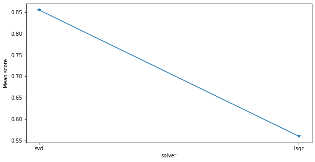


## DecisionTreeClassifier tuning

Since each split in the decision tree distinguishes the dependent variable, splits closer to the root, aka starting point, have optimally been determined to have the greatest splitting effect. The feature importance graphic measures how much splitting impact each feature has. It is important to note that this by no means points to causality, but just like in hierarchical clustering, does point to a nebulous groups. Furthermore, for ensemble tree methods, feature impact is aggregated over all the trees.


```python
name = 'DT'
param = {'min_samples_split': [4,7,10,12]}

grid = GridSearchCV(DecisionTreeClassifier(), param,verbose=True, cv = StratifiedKFold(n_splits=tuning_num_folds,random_state=num_random_state,shuffle=True), n_jobs=jobs,scoring=scoring_criteria)
grid.fit(X_train,y_train)

```

    Fitting 2 folds for each of 4 candidates, totalling 8 fits


    [Parallel(n_jobs=4)]: Using backend LokyBackend with 4 concurrent workers.
    [Parallel(n_jobs=4)]: Done   8 out of   8 | elapsed:    1.7s finished


    GridSearchCV(cv=StratifiedKFold(n_splits=2, random_state=10, shuffle=True),
                 error_score=nan,
                 estimator=DecisionTreeClassifier(ccp_alpha=0.0, class_weight=None,
                                                  criterion='gini', max_depth=None,
                                                  max_features=None,
                                                  max_leaf_nodes=None,
                                                  min_impurity_decrease=0.0,
                                                  min_impurity_split=None,
                                                  min_samples_leaf=1,
                                                  min_samples_split=2,
                                                  min_weight_fraction_leaf=0.0,
                                                  presort='deprecated',
                                                  random_state=None,
                                                  splitter='best'),
                 iid='deprecated', n_jobs=4,
                 param_grid={'min_samples_split': [4, 7, 10, 12]},
                 pre_dispatch='2*n_jobs', refit=True, return_train_score=False,
                 scoring='accuracy', verbose=True)


```python
"""
# Helper Function to visualize feature importance if needed
plt.rcParams['figure.figsize'] = (8, 4)
predictors = [x for x in X.columns]
def feature_imp(model):
    MO = model.fit(X_train, y_train)
    feat_imp = pd.Series(MO.feature_importances_, predictors).sort_values(ascending=False)
    feat_imp.plot(kind='bar', title='Feature Importances')
    plt.ylabel('Feature Importance Score')
"""

```


    "\n# Helper Function to visualize feature importance if needed\nplt.rcParams['figure.figsize'] = (8, 4)\npredictors = [x for x in X.columns]\ndef feature_imp(model):\n    MO = model.fit(X_train, y_train)\n    feat_imp = pd.Series(MO.feature_importances_, predictors).sort_values(ascending=False)\n    feat_imp.plot(kind='bar', title='Feature Importances')\n    plt.ylabel('Feature Importance Score')\n"


**Pruning the decision trees**

Adapted from [here](https://stackoverflow.com/questions/49428469/pruning-decision-trees)


```python
"""traverse the tree and remove all children of the nodes with minimum class count less than 5  (or any other condition you can think of)."""
def prune_index(inner_tree, index, threshold):
    if inner_tree.value[index].min() < threshold:
        # turn node into a leaf by "unlinking" its children
        inner_tree.children_left[index] = TREE_LEAF
        inner_tree.children_right[index] = TREE_LEAF
    # if there are children, visit them as well
    if inner_tree.children_left[index] != TREE_LEAF:
        prune_index(inner_tree, inner_tree.children_left[index], threshold)
        prune_index(inner_tree, inner_tree.children_right[index], threshold)


```


```python
#These two lines are useful to analyze SHAP values later
tree_classifiers.append(('DT', DecisionTreeClassifier(min_samples_split=grid.best_params_['min_samples_split'])))
tree_classifiers.append(('DT', DecisionTreeClassifier(min_samples_split=grid.best_params_['min_samples_split'])))

model_config_1 = DecisionTreeClassifier(min_samples_split=grid.best_params_['min_samples_split'])
model_config_2 = DecisionTreeClassifier(min_samples_split=grid.best_params_['min_samples_split'])
tunned_model = model_config_1.fit(X_train,y_train)

prune_index(tunned_model.tree_, 0, 5)

models.append((name, tunned_model))

#let's save the predictions to analyze later their correlation
predictions[name] = tunned_model.predict(X_test)

#Analyze feature importance of Original Data
print(name + " - Feature Importances")
permutation_importance(model_config_2.fit(X_original_train,y_original_train), X_original_test, y_original_test)

#display tunning parameters scores
display_tuning_scores(param, grid)

#saving model
pickle.dump(tunned_model, open('./models/census/' + name + '_model.sav', 'wb'))
```

    DT - Feature Importances


    <style>
    table.eli5-weights tr:hover {
        filter: brightness(85%);
    }
</style>


        <table class="eli5-weights eli5-feature-importances" style="border-collapse: collapse; border: none; margin-top: 0em; table-layout: auto;">
    <thead>
    <tr style="border: none;">
        <th style="padding: 0 1em 0 0.5em; text-align: right; border: none;">Weight</th>
        <th style="padding: 0 0.5em 0 0.5em; text-align: left; border: none;">Feature</th>
    </tr>
    </thead>
    <tbody>

        <tr style="background-color: hsl(120, 100.00%, 80.00%); border: none;">
            <td style="padding: 0 1em 0 0.5em; text-align: right; border: none;">
                0.1628

                    &plusmn; 0.0049

            </td>
            <td style="padding: 0 0.5em 0 0.5em; text-align: left; border: none;">
                relationship
            </td>
        </tr>

        <tr style="background-color: hsl(120, 100.00%, 87.20%); border: none;">
            <td style="padding: 0 1em 0 0.5em; text-align: right; border: none;">
                0.0861

                    &plusmn; 0.0090

            </td>
            <td style="padding: 0 0.5em 0 0.5em; text-align: left; border: none;">
                marital.status
            </td>
        </tr>

        <tr style="background-color: hsl(120, 100.00%, 90.05%); border: none;">
            <td style="padding: 0 1em 0 0.5em; text-align: right; border: none;">
                0.0600

                    &plusmn; 0.0043

            </td>
            <td style="padding: 0 0.5em 0 0.5em; text-align: left; border: none;">
                education.num
            </td>
        </tr>

        <tr style="background-color: hsl(120, 100.00%, 90.11%); border: none;">
            <td style="padding: 0 1em 0 0.5em; text-align: right; border: none;">
                0.0595

                    &plusmn; 0.0056

            </td>
            <td style="padding: 0 0.5em 0 0.5em; text-align: left; border: none;">
                education
            </td>
        </tr>

        <tr style="background-color: hsl(120, 100.00%, 92.21%); border: none;">
            <td style="padding: 0 1em 0 0.5em; text-align: right; border: none;">
                0.0423

                    &plusmn; 0.0018

            </td>
            <td style="padding: 0 0.5em 0 0.5em; text-align: left; border: none;">
                capital.gain
            </td>
        </tr>

        <tr style="background-color: hsl(120, 100.00%, 93.78%); border: none;">
            <td style="padding: 0 1em 0 0.5em; text-align: right; border: none;">
                0.0307

                    &plusmn; 0.0051

            </td>
            <td style="padding: 0 0.5em 0 0.5em; text-align: left; border: none;">
                age
            </td>
        </tr>

        <tr style="background-color: hsl(120, 100.00%, 94.27%); border: none;">
            <td style="padding: 0 1em 0 0.5em; text-align: right; border: none;">
                0.0273

                    &plusmn; 0.0053

            </td>
            <td style="padding: 0 0.5em 0 0.5em; text-align: left; border: none;">
                hours.per.week
            </td>
        </tr>

        <tr style="background-color: hsl(120, 100.00%, 96.36%); border: none;">
            <td style="padding: 0 1em 0 0.5em; text-align: right; border: none;">
                0.0143

                    &plusmn; 0.0050

            </td>
            <td style="padding: 0 0.5em 0 0.5em; text-align: left; border: none;">
                occupation
            </td>
        </tr>

        <tr style="background-color: hsl(120, 100.00%, 97.65%); border: none;">
            <td style="padding: 0 1em 0 0.5em; text-align: right; border: none;">
                0.0076

                    &plusmn; 0.0032

            </td>
            <td style="padding: 0 0.5em 0 0.5em; text-align: left; border: none;">
                workclass
            </td>
        </tr>

        <tr style="background-color: hsl(120, 100.00%, 97.84%); border: none;">
            <td style="padding: 0 1em 0 0.5em; text-align: right; border: none;">
                0.0068

                    &plusmn; 0.0011

            </td>
            <td style="padding: 0 0.5em 0 0.5em; text-align: left; border: none;">
                capital.loss
            </td>
        </tr>

        <tr style="background-color: hsl(120, 100.00%, 98.13%); border: none;">
            <td style="padding: 0 1em 0 0.5em; text-align: right; border: none;">
                0.0055

                    &plusmn; 0.0016

            </td>
            <td style="padding: 0 0.5em 0 0.5em; text-align: left; border: none;">
                sex
            </td>
        </tr>

        <tr style="background-color: hsl(120, 100.00%, 98.25%); border: none;">
            <td style="padding: 0 1em 0 0.5em; text-align: right; border: none;">
                0.0050

                    &plusmn; 0.0041

            </td>
            <td style="padding: 0 0.5em 0 0.5em; text-align: left; border: none;">
                fnlwgt
            </td>
        </tr>

        <tr style="background-color: hsl(120, 100.00%, 98.97%); border: none;">
            <td style="padding: 0 1em 0 0.5em; text-align: right; border: none;">
                0.0024

                    &plusmn; 0.0010

            </td>
            <td style="padding: 0 0.5em 0 0.5em; text-align: left; border: none;">
                race
            </td>
        </tr>

        <tr style="background-color: hsl(120, 100.00%, 98.97%); border: none;">
            <td style="padding: 0 1em 0 0.5em; text-align: right; border: none;">
                0.0023

                    &plusmn; 0.0009

            </td>
            <td style="padding: 0 0.5em 0 0.5em; text-align: left; border: none;">
                native.country
            </td>
        </tr>


    </tbody>
</table>


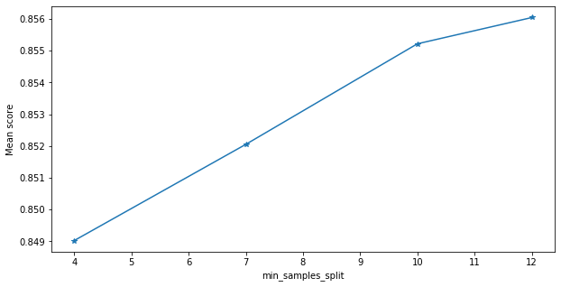


## SVC tuning


```python
name = 'SVC'
param={'C':[0.1,0.5, 1,1.3,1.5],
      'kernel': ["linear","rbf"]
      }

""" #due to lack of computational power, the parameters supposed to tune were diminished
param={'C':[0.1,0.8,0.9,1,1.1,1.2,1.3,1.4,1.5],
      'kernel': ["linear","rbf"]
      }

#remember that the line tunned_model = ... needs to be adjusted depending on the parameters that you include
"""

grid = GridSearchCV(SVC(), param,verbose=True, cv = StratifiedKFold(n_splits=tuning_num_folds,random_state=num_random_state,shuffle=True), n_jobs=jobs,scoring=scoring_criteria)
grid.fit(X_train,y_train)

model_config_1 = SVC(C=grid.best_params_['C'], kernel=grid.best_params_['kernel'], probability=True)
model_config_2 = SVC(C=grid.best_params_['C'], kernel=grid.best_params_['kernel'], probability=True)
tunned_model = model_config_1.fit(X_train,y_train)

models.append((name, tunned_model))

#let's save the predictions to analyze later their correlation
predictions[name] = tunned_model.predict(X_test)

#Analyze feature importance of Original Data
print(name + " - Feature Importances")
permutation_importance(model_config_2.fit(X_original_train,y_original_train), X_original_test, y_original_test)

#display tunning parameters scores
display_tuning_scores(param, grid)

#saving model
pickle.dump(tunned_model, open('./models/census/' + name + '_model.sav', 'wb'))
```

    Fitting 2 folds for each of 10 candidates, totalling 20 fits


    [Parallel(n_jobs=4)]: Using backend LokyBackend with 4 concurrent workers.
    [Parallel(n_jobs=4)]: Done  20 out of  20 | elapsed:  8.4min finished


    SVC - Feature Importances


    <style>
    table.eli5-weights tr:hover {
        filter: brightness(85%);
    }
</style>


        <table class="eli5-weights eli5-feature-importances" style="border-collapse: collapse; border: none; margin-top: 0em; table-layout: auto;">
    <thead>
    <tr style="border: none;">
        <th style="padding: 0 1em 0 0.5em; text-align: right; border: none;">Weight</th>
        <th style="padding: 0 0.5em 0 0.5em; text-align: left; border: none;">Feature</th>
    </tr>
    </thead>
    <tbody>

        <tr style="background-color: hsl(120, 100.00%, 80.00%); border: none;">
            <td style="padding: 0 1em 0 0.5em; text-align: right; border: none;">
                0.0996

                    &plusmn; 0.0072

            </td>
            <td style="padding: 0 0.5em 0 0.5em; text-align: left; border: none;">
                marital.status
            </td>
        </tr>

        <tr style="background-color: hsl(120, 100.00%, 89.92%); border: none;">
            <td style="padding: 0 1em 0 0.5em; text-align: right; border: none;">
                0.0374

                    &plusmn; 0.0066

            </td>
            <td style="padding: 0 0.5em 0 0.5em; text-align: left; border: none;">
                education.num
            </td>
        </tr>

        <tr style="background-color: hsl(120, 100.00%, 91.26%); border: none;">
            <td style="padding: 0 1em 0 0.5em; text-align: right; border: none;">
                0.0305

                    &plusmn; 0.0028

            </td>
            <td style="padding: 0 0.5em 0 0.5em; text-align: left; border: none;">
                age
            </td>
        </tr>

        <tr style="background-color: hsl(120, 100.00%, 91.65%); border: none;">
            <td style="padding: 0 1em 0 0.5em; text-align: right; border: none;">
                0.0286

                    &plusmn; 0.0026

            </td>
            <td style="padding: 0 0.5em 0 0.5em; text-align: left; border: none;">
                relationship
            </td>
        </tr>

        <tr style="background-color: hsl(120, 100.00%, 92.04%); border: none;">
            <td style="padding: 0 1em 0 0.5em; text-align: right; border: none;">
                0.0267

                    &plusmn; 0.0008

            </td>
            <td style="padding: 0 0.5em 0 0.5em; text-align: left; border: none;">
                capital.gain
            </td>
        </tr>

        <tr style="background-color: hsl(120, 100.00%, 92.47%); border: none;">
            <td style="padding: 0 1em 0 0.5em; text-align: right; border: none;">
                0.0247

                    &plusmn; 0.0024

            </td>
            <td style="padding: 0 0.5em 0 0.5em; text-align: left; border: none;">
                hours.per.week
            </td>
        </tr>

        <tr style="background-color: hsl(120, 100.00%, 93.94%); border: none;">
            <td style="padding: 0 1em 0 0.5em; text-align: right; border: none;">
                0.0181

                    &plusmn; 0.0024

            </td>
            <td style="padding: 0 0.5em 0 0.5em; text-align: left; border: none;">
                sex
            </td>
        </tr>

        <tr style="background-color: hsl(120, 100.00%, 94.06%); border: none;">
            <td style="padding: 0 1em 0 0.5em; text-align: right; border: none;">
                0.0176

                    &plusmn; 0.0035

            </td>
            <td style="padding: 0 0.5em 0 0.5em; text-align: left; border: none;">
                education
            </td>
        </tr>

        <tr style="background-color: hsl(120, 100.00%, 95.63%); border: none;">
            <td style="padding: 0 1em 0 0.5em; text-align: right; border: none;">
                0.0113

                    &plusmn; 0.0035

            </td>
            <td style="padding: 0 0.5em 0 0.5em; text-align: left; border: none;">
                workclass
            </td>
        </tr>

        <tr style="background-color: hsl(120, 100.00%, 96.81%); border: none;">
            <td style="padding: 0 1em 0 0.5em; text-align: right; border: none;">
                0.0072

                    &plusmn; 0.0021

            </td>
            <td style="padding: 0 0.5em 0 0.5em; text-align: left; border: none;">
                capital.loss
            </td>
        </tr>

        <tr style="background-color: hsl(120, 100.00%, 97.43%); border: none;">
            <td style="padding: 0 1em 0 0.5em; text-align: right; border: none;">
                0.0053

                    &plusmn; 0.0018

            </td>
            <td style="padding: 0 0.5em 0 0.5em; text-align: left; border: none;">
                occupation
            </td>
        </tr>

        <tr style="background-color: hsl(120, 100.00%, 97.62%); border: none;">
            <td style="padding: 0 1em 0 0.5em; text-align: right; border: none;">
                0.0048

                    &plusmn; 0.0023

            </td>
            <td style="padding: 0 0.5em 0 0.5em; text-align: left; border: none;">
                race
            </td>
        </tr>

        <tr style="background-color: hsl(120, 100.00%, 98.36%); border: none;">
            <td style="padding: 0 1em 0 0.5em; text-align: right; border: none;">
                0.0028

                    &plusmn; 0.0008

            </td>
            <td style="padding: 0 0.5em 0 0.5em; text-align: left; border: none;">
                fnlwgt
            </td>
        </tr>

        <tr style="background-color: hsl(120, 100.00%, 98.60%); border: none;">
            <td style="padding: 0 1em 0 0.5em; text-align: right; border: none;">
                0.0022

                    &plusmn; 0.0012

            </td>
            <td style="padding: 0 0.5em 0 0.5em; text-align: left; border: none;">
                native.country
            </td>
        </tr>


    </tbody>
</table>


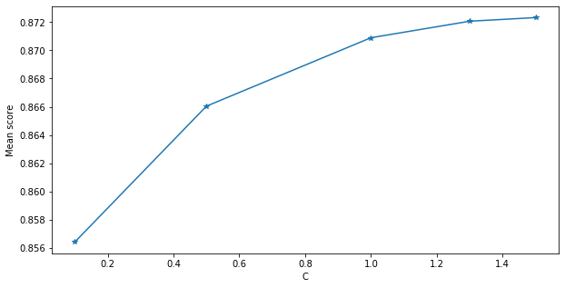


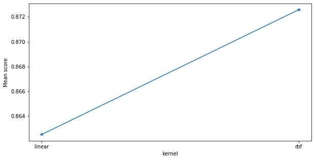


## SGDClassifier tuning


```python
name = 'SGD'
param ={'loss':["log","modified_huber"]} #the other available methods do not enable predict_proba that we need later for roc curves and soft voter

""" #due to lack of computational power, the parameters supposed to tune were diminished
param ={'loss':["log","modified_huber","epsilon_insensitive","squared_epsilon_insensitive"]}

#remember that the line tunned_model = ... needs to be adjusted depending on the parameters that you include
"""

grid = GridSearchCV(SGDClassifier(), param,verbose=False, cv = StratifiedKFold(n_splits=tuning_num_folds,random_state=num_random_state,shuffle=True), n_jobs=jobs,scoring=scoring_criteria)
grid.fit(X_train,y_train)

model_config_1 = SGDClassifier(loss=grid.best_params_['loss'])
model_config_2 = SGDClassifier(loss=grid.best_params_['loss'])
tunned_model = model_config_1.fit(X_train,y_train)

models.append((name, tunned_model))

#let's save the predictions to analyze later their correlation
predictions[name] = tunned_model.predict(X_test)

#Analyze feature importance of Original Data
print(name + " - Feature Importances")
permutation_importance(model_config_2.fit(X_original_train,y_original_train), X_original_test, y_original_test)

#display tunning parameters scores
display_tuning_scores(param, grid)

#saving model
pickle.dump(tunned_model, open('./models/census/' + name + '_model.sav', 'wb'))
```

    SGD - Feature Importances


    <style>
    table.eli5-weights tr:hover {
        filter: brightness(85%);
    }
</style>


        <table class="eli5-weights eli5-feature-importances" style="border-collapse: collapse; border: none; margin-top: 0em; table-layout: auto;">
    <thead>
    <tr style="border: none;">
        <th style="padding: 0 1em 0 0.5em; text-align: right; border: none;">Weight</th>
        <th style="padding: 0 0.5em 0 0.5em; text-align: left; border: none;">Feature</th>
    </tr>
    </thead>
    <tbody>

        <tr style="background-color: hsl(120, 100.00%, 80.00%); border: none;">
            <td style="padding: 0 1em 0 0.5em; text-align: right; border: none;">
                0.0579

                    &plusmn; 0.0056

            </td>
            <td style="padding: 0 0.5em 0 0.5em; text-align: left; border: none;">
                education.num
            </td>
        </tr>

        <tr style="background-color: hsl(120, 100.00%, 81.46%); border: none;">
            <td style="padding: 0 1em 0 0.5em; text-align: right; border: none;">
                0.0520

                    &plusmn; 0.0015

            </td>
            <td style="padding: 0 0.5em 0 0.5em; text-align: left; border: none;">
                relationship
            </td>
        </tr>

        <tr style="background-color: hsl(120, 100.00%, 85.32%); border: none;">
            <td style="padding: 0 1em 0 0.5em; text-align: right; border: none;">
                0.0372

                    &plusmn; 0.0017

            </td>
            <td style="padding: 0 0.5em 0 0.5em; text-align: left; border: none;">
                capital.gain
            </td>
        </tr>

        <tr style="background-color: hsl(120, 100.00%, 85.45%); border: none;">
            <td style="padding: 0 1em 0 0.5em; text-align: right; border: none;">
                0.0368

                    &plusmn; 0.0033

            </td>
            <td style="padding: 0 0.5em 0 0.5em; text-align: left; border: none;">
                age
            </td>
        </tr>

        <tr style="background-color: hsl(120, 100.00%, 93.00%); border: none;">
            <td style="padding: 0 1em 0 0.5em; text-align: right; border: none;">
                0.0129

                    &plusmn; 0.0034

            </td>
            <td style="padding: 0 0.5em 0 0.5em; text-align: left; border: none;">
                hours.per.week
            </td>
        </tr>

        <tr style="background-color: hsl(120, 100.00%, 94.80%); border: none;">
            <td style="padding: 0 1em 0 0.5em; text-align: right; border: none;">
                0.0085

                    &plusmn; 0.0038

            </td>
            <td style="padding: 0 0.5em 0 0.5em; text-align: left; border: none;">
                marital.status
            </td>
        </tr>

        <tr style="background-color: hsl(120, 100.00%, 95.38%); border: none;">
            <td style="padding: 0 1em 0 0.5em; text-align: right; border: none;">
                0.0071

                    &plusmn; 0.0026

            </td>
            <td style="padding: 0 0.5em 0 0.5em; text-align: left; border: none;">
                workclass
            </td>
        </tr>

        <tr style="background-color: hsl(120, 100.00%, 96.07%); border: none;">
            <td style="padding: 0 1em 0 0.5em; text-align: right; border: none;">
                0.0057

                    &plusmn; 0.0017

            </td>
            <td style="padding: 0 0.5em 0 0.5em; text-align: left; border: none;">
                capital.loss
            </td>
        </tr>

        <tr style="background-color: hsl(120, 100.00%, 98.63%); border: none;">
            <td style="padding: 0 1em 0 0.5em; text-align: right; border: none;">
                0.0013

                    &plusmn; 0.0026

            </td>
            <td style="padding: 0 0.5em 0 0.5em; text-align: left; border: none;">
                occupation
            </td>
        </tr>

        <tr style="background-color: hsl(120, 100.00%, 99.11%); border: none;">
            <td style="padding: 0 1em 0 0.5em; text-align: right; border: none;">
                0.0007

                    &plusmn; 0.0008

            </td>
            <td style="padding: 0 0.5em 0 0.5em; text-align: left; border: none;">
                race
            </td>
        </tr>

        <tr style="background-color: hsl(120, 100.00%, 99.30%); border: none;">
            <td style="padding: 0 1em 0 0.5em; text-align: right; border: none;">
                0.0005

                    &plusmn; 0.0008

            </td>
            <td style="padding: 0 0.5em 0 0.5em; text-align: left; border: none;">
                native.country
            </td>
        </tr>

        <tr style="background-color: hsl(120, 100.00%, 99.77%); border: none;">
            <td style="padding: 0 1em 0 0.5em; text-align: right; border: none;">
                0.0001

                    &plusmn; 0.0002

            </td>
            <td style="padding: 0 0.5em 0 0.5em; text-align: left; border: none;">
                sex
            </td>
        </tr>

        <tr style="background-color: hsl(120, 100.00%, 99.86%); border: none;">
            <td style="padding: 0 1em 0 0.5em; text-align: right; border: none;">
                0.0000

                    &plusmn; 0.0007

            </td>
            <td style="padding: 0 0.5em 0 0.5em; text-align: left; border: none;">
                education
            </td>
        </tr>

        <tr style="background-color: hsl(0, 100.00%, 97.42%); border: none;">
            <td style="padding: 0 1em 0 0.5em; text-align: right; border: none;">
                -0.0031

                    &plusmn; 0.0019

            </td>
            <td style="padding: 0 0.5em 0 0.5em; text-align: left; border: none;">
                fnlwgt
            </td>
        </tr>


    </tbody>
</table>


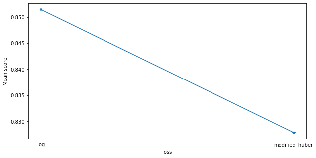


## Boosting

### GradientBoostingClassifier tuning


```python
name = 'GraBoost'
param_grid ={
            'loss': ['deviance', 'exponential'],
            'learning_rate': [0.1, 0.01,0.05,0.001],
            }

""" #due to lack of computational power, the parameters supposed to tune were diminished
param_grid ={'n_estimators': st.randint(100, 800),
            'loss': ['deviance', 'exponential'],
            'learning_rate': [0.1, 0.01,0.05,0.001],
            'max_depth': np.arange(2, 12, 1)}
#remember that the line tunned_model = ... needs to be adjusted depending on the parameters that you include
"""

random_search = RandomizedSearchCV(GradientBoostingClassifier(), param_distributions=param_grid, scoring='roc_auc', n_jobs=jobs, cv=skf.split(X_train,y_train), verbose=3, random_state=num_random_state)
random_search.fit(X_train,y_train)

model_config_1 = GradientBoostingClassifier( loss=random_search.best_params_['loss'], learning_rate=random_search.best_params_['learning_rate'], verbose=0)
model_config_2 = GradientBoostingClassifier( loss=random_search.best_params_['loss'], learning_rate=random_search.best_params_['learning_rate'], verbose=0)
tunned_model = model_config_1.fit(X_train,y_train)

models.append((name, tunned_model))

#let's save the predictions to analyze later their correlation
predictions[name] = tunned_model.predict(X_test)

#Analyze feature importance of Original Data
print(name + " - Feature Importances")
permutation_importance(model_config_2.fit(X_original_train,y_original_train), X_original_test, y_original_test)


#saving model
pickle.dump(tunned_model, open('./models/census/' + name + '_model.sav', 'wb'))
```

    Fitting 2 folds for each of 8 candidates, totalling 16 fits


    [Parallel(n_jobs=4)]: Using backend LokyBackend with 4 concurrent workers.
    [Parallel(n_jobs=4)]: Done  16 out of  16 | elapsed:  1.5min finished


    GraBoost - Feature Importances


    <style>
    table.eli5-weights tr:hover {
        filter: brightness(85%);
    }
</style>


        <table class="eli5-weights eli5-feature-importances" style="border-collapse: collapse; border: none; margin-top: 0em; table-layout: auto;">
    <thead>
    <tr style="border: none;">
        <th style="padding: 0 1em 0 0.5em; text-align: right; border: none;">Weight</th>
        <th style="padding: 0 0.5em 0 0.5em; text-align: left; border: none;">Feature</th>
    </tr>
    </thead>
    <tbody>

        <tr style="background-color: hsl(120, 100.00%, 80.00%); border: none;">
            <td style="padding: 0 1em 0 0.5em; text-align: right; border: none;">
                0.0633

                    &plusmn; 0.0048

            </td>
            <td style="padding: 0 0.5em 0 0.5em; text-align: left; border: none;">
                relationship
            </td>
        </tr>

        <tr style="background-color: hsl(120, 100.00%, 81.17%); border: none;">
            <td style="padding: 0 1em 0 0.5em; text-align: right; border: none;">
                0.0581

                    &plusmn; 0.0071

            </td>
            <td style="padding: 0 0.5em 0 0.5em; text-align: left; border: none;">
                marital.status
            </td>
        </tr>

        <tr style="background-color: hsl(120, 100.00%, 83.44%); border: none;">
            <td style="padding: 0 1em 0 0.5em; text-align: right; border: none;">
                0.0483

                    &plusmn; 0.0025

            </td>
            <td style="padding: 0 0.5em 0 0.5em; text-align: left; border: none;">
                education
            </td>
        </tr>

        <tr style="background-color: hsl(120, 100.00%, 84.23%); border: none;">
            <td style="padding: 0 1em 0 0.5em; text-align: right; border: none;">
                0.0450

                    &plusmn; 0.0023

            </td>
            <td style="padding: 0 0.5em 0 0.5em; text-align: left; border: none;">
                capital.gain
            </td>
        </tr>

        <tr style="background-color: hsl(120, 100.00%, 84.48%); border: none;">
            <td style="padding: 0 1em 0 0.5em; text-align: right; border: none;">
                0.0440

                    &plusmn; 0.0031

            </td>
            <td style="padding: 0 0.5em 0 0.5em; text-align: left; border: none;">
                education.num
            </td>
        </tr>

        <tr style="background-color: hsl(120, 100.00%, 90.32%); border: none;">
            <td style="padding: 0 1em 0 0.5em; text-align: right; border: none;">
                0.0224

                    &plusmn; 0.0041

            </td>
            <td style="padding: 0 0.5em 0 0.5em; text-align: left; border: none;">
                age
            </td>
        </tr>

        <tr style="background-color: hsl(120, 100.00%, 90.70%); border: none;">
            <td style="padding: 0 1em 0 0.5em; text-align: right; border: none;">
                0.0212

                    &plusmn; 0.0029

            </td>
            <td style="padding: 0 0.5em 0 0.5em; text-align: left; border: none;">
                hours.per.week
            </td>
        </tr>

        <tr style="background-color: hsl(120, 100.00%, 95.08%); border: none;">
            <td style="padding: 0 1em 0 0.5em; text-align: right; border: none;">
                0.0085

                    &plusmn; 0.0022

            </td>
            <td style="padding: 0 0.5em 0 0.5em; text-align: left; border: none;">
                workclass
            </td>
        </tr>

        <tr style="background-color: hsl(120, 100.00%, 95.65%); border: none;">
            <td style="padding: 0 1em 0 0.5em; text-align: right; border: none;">
                0.0072

                    &plusmn; 0.0017

            </td>
            <td style="padding: 0 0.5em 0 0.5em; text-align: left; border: none;">
                capital.loss
            </td>
        </tr>

        <tr style="background-color: hsl(120, 100.00%, 96.63%); border: none;">
            <td style="padding: 0 1em 0 0.5em; text-align: right; border: none;">
                0.0050

                    &plusmn; 0.0022

            </td>
            <td style="padding: 0 0.5em 0 0.5em; text-align: left; border: none;">
                sex
            </td>
        </tr>

        <tr style="background-color: hsl(120, 100.00%, 96.89%); border: none;">
            <td style="padding: 0 1em 0 0.5em; text-align: right; border: none;">
                0.0044

                    &plusmn; 0.0018

            </td>
            <td style="padding: 0 0.5em 0 0.5em; text-align: left; border: none;">
                occupation
            </td>
        </tr>

        <tr style="background-color: hsl(120, 100.00%, 99.17%); border: none;">
            <td style="padding: 0 1em 0 0.5em; text-align: right; border: none;">
                0.0007

                    &plusmn; 0.0006

            </td>
            <td style="padding: 0 0.5em 0 0.5em; text-align: left; border: none;">
                native.country
            </td>
        </tr>

        <tr style="background-color: hsl(120, 100.00%, 99.34%); border: none;">
            <td style="padding: 0 1em 0 0.5em; text-align: right; border: none;">
                0.0005

                    &plusmn; 0.0006

            </td>
            <td style="padding: 0 0.5em 0 0.5em; text-align: left; border: none;">
                race
            </td>
        </tr>

        <tr style="background-color: hsl(120, 100.00%, 99.65%); border: none;">
            <td style="padding: 0 1em 0 0.5em; text-align: right; border: none;">
                0.0002

                    &plusmn; 0.0008

            </td>
            <td style="padding: 0 0.5em 0 0.5em; text-align: left; border: none;">
                fnlwgt
            </td>
        </tr>


    </tbody>
</table>


### AdaBoostClassifier tuning


```python
name = 'AdaBoost'
params ={'n_estimators':st.randint(100, 400),
        'learning_rate':np.arange(.1, 4, .5)}

""" #due to lack of computational power, the parameters supposed to tune were diminished
params ={'n_estimators':st.randint(100, 800),
        'learning_rate':np.arange(.1, 4, .5)}

#remember that the line tunned_model = ... needs to be adjusted depending on the parameters that you include
"""

random_search = RandomizedSearchCV(AdaBoostClassifier(), param_distributions=params, scoring='roc_auc', n_jobs=jobs, cv=skf.split(X_train,y_train), verbose=3, random_state=num_random_state)
random_search.fit(X_train,y_train)

model_config_1 = AdaBoostClassifier(n_estimators=random_search.best_params_['n_estimators'], learning_rate=random_search.best_params_['learning_rate'])
model_config_2 = AdaBoostClassifier(n_estimators=random_search.best_params_['n_estimators'], learning_rate=random_search.best_params_['learning_rate'])
tunned_model = model_config_1.fit(X_train,y_train)

models.append((name, tunned_model))

#let's save the predictions to analyze later their correlation
predictions[name] = tunned_model.predict(X_test)

#Analyze feature importance of Original Data
print(name + " - Feature Importances")
permutation_importance(model_config_2.fit(X_original_train,y_original_train), X_original_test, y_original_test)

#saving model
pickle.dump(tunned_model, open('./models/census/' + name + '_model.sav', 'wb'))
```

    Fitting 2 folds for each of 10 candidates, totalling 20 fits


    [Parallel(n_jobs=4)]: Using backend LokyBackend with 4 concurrent workers.
    [Parallel(n_jobs=4)]: Done  20 out of  20 | elapsed:  3.3min remaining:    0.0s
    [Parallel(n_jobs=4)]: Done  20 out of  20 | elapsed:  3.3min finished


    AdaBoost - Feature Importances


    <style>
    table.eli5-weights tr:hover {
        filter: brightness(85%);
    }
</style>


        <table class="eli5-weights eli5-feature-importances" style="border-collapse: collapse; border: none; margin-top: 0em; table-layout: auto;">
    <thead>
    <tr style="border: none;">
        <th style="padding: 0 1em 0 0.5em; text-align: right; border: none;">Weight</th>
        <th style="padding: 0 0.5em 0 0.5em; text-align: left; border: none;">Feature</th>
    </tr>
    </thead>
    <tbody>

        <tr style="background-color: hsl(120, 100.00%, 80.00%); border: none;">
            <td style="padding: 0 1em 0 0.5em; text-align: right; border: none;">
                0.0788

                    &plusmn; 0.0031

            </td>
            <td style="padding: 0 0.5em 0 0.5em; text-align: left; border: none;">
                education
            </td>
        </tr>

        <tr style="background-color: hsl(120, 100.00%, 81.47%); border: none;">
            <td style="padding: 0 1em 0 0.5em; text-align: right; border: none;">
                0.0706

                    &plusmn; 0.0042

            </td>
            <td style="padding: 0 0.5em 0 0.5em; text-align: left; border: none;">
                marital.status
            </td>
        </tr>

        <tr style="background-color: hsl(120, 100.00%, 85.86%); border: none;">
            <td style="padding: 0 1em 0 0.5em; text-align: right; border: none;">
                0.0480

                    &plusmn; 0.0018

            </td>
            <td style="padding: 0 0.5em 0 0.5em; text-align: left; border: none;">
                capital.gain
            </td>
        </tr>

        <tr style="background-color: hsl(120, 100.00%, 86.13%); border: none;">
            <td style="padding: 0 1em 0 0.5em; text-align: right; border: none;">
                0.0467

                    &plusmn; 0.0037

            </td>
            <td style="padding: 0 0.5em 0 0.5em; text-align: left; border: none;">
                education.num
            </td>
        </tr>

        <tr style="background-color: hsl(120, 100.00%, 89.55%); border: none;">
            <td style="padding: 0 1em 0 0.5em; text-align: right; border: none;">
                0.0312

                    &plusmn; 0.0028

            </td>
            <td style="padding: 0 0.5em 0 0.5em; text-align: left; border: none;">
                hours.per.week
            </td>
        </tr>

        <tr style="background-color: hsl(120, 100.00%, 93.23%); border: none;">
            <td style="padding: 0 1em 0 0.5em; text-align: right; border: none;">
                0.0168

                    &plusmn; 0.0024

            </td>
            <td style="padding: 0 0.5em 0 0.5em; text-align: left; border: none;">
                age
            </td>
        </tr>

        <tr style="background-color: hsl(120, 100.00%, 94.70%); border: none;">
            <td style="padding: 0 1em 0 0.5em; text-align: right; border: none;">
                0.0118

                    &plusmn; 0.0024

            </td>
            <td style="padding: 0 0.5em 0 0.5em; text-align: left; border: none;">
                capital.loss
            </td>
        </tr>

        <tr style="background-color: hsl(120, 100.00%, 95.57%); border: none;">
            <td style="padding: 0 1em 0 0.5em; text-align: right; border: none;">
                0.0092

                    &plusmn; 0.0015

            </td>
            <td style="padding: 0 0.5em 0 0.5em; text-align: left; border: none;">
                workclass
            </td>
        </tr>

        <tr style="background-color: hsl(120, 100.00%, 96.12%); border: none;">
            <td style="padding: 0 1em 0 0.5em; text-align: right; border: none;">
                0.0076

                    &plusmn; 0.0029

            </td>
            <td style="padding: 0 0.5em 0 0.5em; text-align: left; border: none;">
                occupation
            </td>
        </tr>

        <tr style="background-color: hsl(120, 100.00%, 97.49%); border: none;">
            <td style="padding: 0 1em 0 0.5em; text-align: right; border: none;">
                0.0041

                    &plusmn; 0.0019

            </td>
            <td style="padding: 0 0.5em 0 0.5em; text-align: left; border: none;">
                sex
            </td>
        </tr>

        <tr style="background-color: hsl(120, 100.00%, 98.32%); border: none;">
            <td style="padding: 0 1em 0 0.5em; text-align: right; border: none;">
                0.0023

                    &plusmn; 0.0016

            </td>
            <td style="padding: 0 0.5em 0 0.5em; text-align: left; border: none;">
                native.country
            </td>
        </tr>

        <tr style="background-color: hsl(120, 100.00%, 99.34%); border: none;">
            <td style="padding: 0 1em 0 0.5em; text-align: right; border: none;">
                0.0006

                    &plusmn; 0.0018

            </td>
            <td style="padding: 0 0.5em 0 0.5em; text-align: left; border: none;">
                fnlwgt
            </td>
        </tr>

        <tr style="background-color: hsl(120, 100.00%, 99.42%); border: none;">
            <td style="padding: 0 1em 0 0.5em; text-align: right; border: none;">
                0.0005

                    &plusmn; 0.0018

            </td>
            <td style="padding: 0 0.5em 0 0.5em; text-align: left; border: none;">
                race
            </td>
        </tr>

        <tr style="background-color: hsl(0, 100.00%, 99.52%); border: none;">
            <td style="padding: 0 1em 0 0.5em; text-align: right; border: none;">
                -0.0004

                    &plusmn; 0.0010

            </td>
            <td style="padding: 0 0.5em 0 0.5em; text-align: left; border: none;">
                relationship
            </td>
        </tr>


    </tbody>
</table>


### XGBClassifier Tuning


```python
name = 'XGB'
params = {
        'gamma': [0.5, 1, 1.5, 2, 5],
        'max_depth': [3, 4, 5]
        }

""" #due to lack of computational power, the parameters supposed to tune were diminished
params = {
        'min_child_weight': [1, 5, 10],
        'gamma': [0.5, 1, 1.5, 2, 5],
        'subsample': [0.6, 0.8, 1.0],
        'colsample_bytree': [0.6, 0.8, 1.0],
        'max_depth': [3, 4, 5]
        }
#remember that the line tunned_model = ... needs to be adjusted depending on the parameters that you include
"""


skf = StratifiedKFold(n_splits=tuning_num_folds, shuffle = True)

random_search = RandomizedSearchCV(XGBClassifier(), param_distributions=params, scoring='roc_auc', n_jobs=jobs, cv=skf.split(X_train,y_train), verbose=3, random_state=num_random_state)
random_search.fit(X_train,y_train)

model_config_1 = XGBClassifier(gamma=random_search.best_params_['gamma'], max_depth=random_search.best_params_['max_depth'], verbose=0)
model_config_2 = XGBClassifier(gamma=random_search.best_params_['gamma'], max_depth=random_search.best_params_['max_depth'], verbose=0)
tunned_model = model_config_1.fit(X_train,y_train)

models.append((name, tunned_model))

#let's save the predictions to analyze later their correlation
predictions[name] = tunned_model.predict(X_test)

#Analyze feature importance of Original Data
print(name + " - Feature Importances")
permutation_importance(model_config_2.fit(X_original_train,y_original_train), X_original_test, y_original_test)

#saving model
pickle.dump(tunned_model, open('./models/census/' + name + '_model.sav', 'wb'))
```

    Fitting 2 folds for each of 10 candidates, totalling 20 fits


    [Parallel(n_jobs=4)]: Using backend LokyBackend with 4 concurrent workers.
    [Parallel(n_jobs=4)]: Done  20 out of  20 | elapsed:  3.0min remaining:    0.0s
    [Parallel(n_jobs=4)]: Done  20 out of  20 | elapsed:  3.0min finished


    XGB - Feature Importances


    <style>
    table.eli5-weights tr:hover {
        filter: brightness(85%);
    }
</style>


        <table class="eli5-weights eli5-feature-importances" style="border-collapse: collapse; border: none; margin-top: 0em; table-layout: auto;">
    <thead>
    <tr style="border: none;">
        <th style="padding: 0 1em 0 0.5em; text-align: right; border: none;">Weight</th>
        <th style="padding: 0 0.5em 0 0.5em; text-align: left; border: none;">Feature</th>
    </tr>
    </thead>
    <tbody>

        <tr style="background-color: hsl(120, 100.00%, 80.00%); border: none;">
            <td style="padding: 0 1em 0 0.5em; text-align: right; border: none;">
                0.0852

                    &plusmn; 0.0045

            </td>
            <td style="padding: 0 0.5em 0 0.5em; text-align: left; border: none;">
                marital.status
            </td>
        </tr>

        <tr style="background-color: hsl(120, 100.00%, 80.04%); border: none;">
            <td style="padding: 0 1em 0 0.5em; text-align: right; border: none;">
                0.0850

                    &plusmn; 0.0040

            </td>
            <td style="padding: 0 0.5em 0 0.5em; text-align: left; border: none;">
                relationship
            </td>
        </tr>

        <tr style="background-color: hsl(120, 100.00%, 85.19%); border: none;">
            <td style="padding: 0 1em 0 0.5em; text-align: right; border: none;">
                0.0555

                    &plusmn; 0.0022

            </td>
            <td style="padding: 0 0.5em 0 0.5em; text-align: left; border: none;">
                education
            </td>
        </tr>

        <tr style="background-color: hsl(120, 100.00%, 86.41%); border: none;">
            <td style="padding: 0 1em 0 0.5em; text-align: right; border: none;">
                0.0491

                    &plusmn; 0.0021

            </td>
            <td style="padding: 0 0.5em 0 0.5em; text-align: left; border: none;">
                education.num
            </td>
        </tr>

        <tr style="background-color: hsl(120, 100.00%, 87.45%); border: none;">
            <td style="padding: 0 1em 0 0.5em; text-align: right; border: none;">
                0.0438

                    &plusmn; 0.0005

            </td>
            <td style="padding: 0 0.5em 0 0.5em; text-align: left; border: none;">
                capital.gain
            </td>
        </tr>

        <tr style="background-color: hsl(120, 100.00%, 91.52%); border: none;">
            <td style="padding: 0 1em 0 0.5em; text-align: right; border: none;">
                0.0250

                    &plusmn; 0.0024

            </td>
            <td style="padding: 0 0.5em 0 0.5em; text-align: left; border: none;">
                hours.per.week
            </td>
        </tr>

        <tr style="background-color: hsl(120, 100.00%, 92.45%); border: none;">
            <td style="padding: 0 1em 0 0.5em; text-align: right; border: none;">
                0.0212

                    &plusmn; 0.0030

            </td>
            <td style="padding: 0 0.5em 0 0.5em; text-align: left; border: none;">
                age
            </td>
        </tr>

        <tr style="background-color: hsl(120, 100.00%, 95.78%); border: none;">
            <td style="padding: 0 1em 0 0.5em; text-align: right; border: none;">
                0.0092

                    &plusmn; 0.0023

            </td>
            <td style="padding: 0 0.5em 0 0.5em; text-align: left; border: none;">
                workclass
            </td>
        </tr>

        <tr style="background-color: hsl(120, 100.00%, 96.51%); border: none;">
            <td style="padding: 0 1em 0 0.5em; text-align: right; border: none;">
                0.0070

                    &plusmn; 0.0020

            </td>
            <td style="padding: 0 0.5em 0 0.5em; text-align: left; border: none;">
                sex
            </td>
        </tr>

        <tr style="background-color: hsl(120, 100.00%, 96.54%); border: none;">
            <td style="padding: 0 1em 0 0.5em; text-align: right; border: none;">
                0.0070

                    &plusmn; 0.0014

            </td>
            <td style="padding: 0 0.5em 0 0.5em; text-align: left; border: none;">
                capital.loss
            </td>
        </tr>

        <tr style="background-color: hsl(120, 100.00%, 96.81%); border: none;">
            <td style="padding: 0 1em 0 0.5em; text-align: right; border: none;">
                0.0062

                    &plusmn; 0.0008

            </td>
            <td style="padding: 0 0.5em 0 0.5em; text-align: left; border: none;">
                occupation
            </td>
        </tr>

        <tr style="background-color: hsl(120, 100.00%, 99.15%); border: none;">
            <td style="padding: 0 1em 0 0.5em; text-align: right; border: none;">
                0.0009

                    &plusmn; 0.0011

            </td>
            <td style="padding: 0 0.5em 0 0.5em; text-align: left; border: none;">
                native.country
            </td>
        </tr>

        <tr style="background-color: hsl(120, 100.00%, 99.45%); border: none;">
            <td style="padding: 0 1em 0 0.5em; text-align: right; border: none;">
                0.0005

                    &plusmn; 0.0014

            </td>
            <td style="padding: 0 0.5em 0 0.5em; text-align: left; border: none;">
                fnlwgt
            </td>
        </tr>

        <tr style="background-color: hsl(120, 100.00%, 99.63%); border: none;">
            <td style="padding: 0 1em 0 0.5em; text-align: right; border: none;">
                0.0003

                    &plusmn; 0.0008

            </td>
            <td style="padding: 0 0.5em 0 0.5em; text-align: left; border: none;">
                race
            </td>
        </tr>


    </tbody>
</table>


```python
name = 'Naive Bayes'
model_config_1 = GaussianNB()
model_config_2 = GaussianNB()
tunned_model = model_config_1.fit(X_train,y_train)

models.append((name, tunned_model))

#let's save the predictions to analyze later their correlation
predictions[name] = tunned_model.predict(X_test)

#Analyze feature importance of Original Data
print(name + " - Feature Importances")
permutation_importance(model_config_2.fit(X_original_train,y_original_train), X_original_test, y_original_test)

#saving model
pickle.dump(tunned_model, open('./models/census/' + name + '_model.sav', 'wb'))
```

    Naive Bayes - Feature Importances


    <style>
    table.eli5-weights tr:hover {
        filter: brightness(85%);
    }
</style>


        <table class="eli5-weights eli5-feature-importances" style="border-collapse: collapse; border: none; margin-top: 0em; table-layout: auto;">
    <thead>
    <tr style="border: none;">
        <th style="padding: 0 1em 0 0.5em; text-align: right; border: none;">Weight</th>
        <th style="padding: 0 0.5em 0 0.5em; text-align: left; border: none;">Feature</th>
    </tr>
    </thead>
    <tbody>

        <tr style="background-color: hsl(120, 100.00%, 80.00%); border: none;">
            <td style="padding: 0 1em 0 0.5em; text-align: right; border: none;">
                0.0705

                    &plusmn; 0.0061

            </td>
            <td style="padding: 0 0.5em 0 0.5em; text-align: left; border: none;">
                capital.gain
            </td>
        </tr>

        <tr style="background-color: hsl(120, 100.00%, 88.30%); border: none;">
            <td style="padding: 0 1em 0 0.5em; text-align: right; border: none;">
                0.0328

                    &plusmn; 0.0019

            </td>
            <td style="padding: 0 0.5em 0 0.5em; text-align: left; border: none;">
                marital.status
            </td>
        </tr>

        <tr style="background-color: hsl(120, 100.00%, 89.82%); border: none;">
            <td style="padding: 0 1em 0 0.5em; text-align: right; border: none;">
                0.0269

                    &plusmn; 0.0038

            </td>
            <td style="padding: 0 0.5em 0 0.5em; text-align: left; border: none;">
                relationship
            </td>
        </tr>

        <tr style="background-color: hsl(120, 100.00%, 90.29%); border: none;">
            <td style="padding: 0 1em 0 0.5em; text-align: right; border: none;">
                0.0251

                    &plusmn; 0.0030

            </td>
            <td style="padding: 0 0.5em 0 0.5em; text-align: left; border: none;">
                education.num
            </td>
        </tr>

        <tr style="background-color: hsl(120, 100.00%, 90.57%); border: none;">
            <td style="padding: 0 1em 0 0.5em; text-align: right; border: none;">
                0.0241

                    &plusmn; 0.0050

            </td>
            <td style="padding: 0 0.5em 0 0.5em; text-align: left; border: none;">
                capital.loss
            </td>
        </tr>

        <tr style="background-color: hsl(120, 100.00%, 91.46%); border: none;">
            <td style="padding: 0 1em 0 0.5em; text-align: right; border: none;">
                0.0209

                    &plusmn; 0.0029

            </td>
            <td style="padding: 0 0.5em 0 0.5em; text-align: left; border: none;">
                age
            </td>
        </tr>

        <tr style="background-color: hsl(120, 100.00%, 92.59%); border: none;">
            <td style="padding: 0 1em 0 0.5em; text-align: right; border: none;">
                0.0171

                    &plusmn; 0.0027

            </td>
            <td style="padding: 0 0.5em 0 0.5em; text-align: left; border: none;">
                hours.per.week
            </td>
        </tr>

        <tr style="background-color: hsl(120, 100.00%, 93.48%); border: none;">
            <td style="padding: 0 1em 0 0.5em; text-align: right; border: none;">
                0.0142

                    &plusmn; 0.0024

            </td>
            <td style="padding: 0 0.5em 0 0.5em; text-align: left; border: none;">
                sex
            </td>
        </tr>

        <tr style="background-color: hsl(120, 100.00%, 95.05%); border: none;">
            <td style="padding: 0 1em 0 0.5em; text-align: right; border: none;">
                0.0096

                    &plusmn; 0.0031

            </td>
            <td style="padding: 0 0.5em 0 0.5em; text-align: left; border: none;">
                education
            </td>
        </tr>

        <tr style="background-color: hsl(120, 100.00%, 97.96%); border: none;">
            <td style="padding: 0 1em 0 0.5em; text-align: right; border: none;">
                0.0027

                    &plusmn; 0.0012

            </td>
            <td style="padding: 0 0.5em 0 0.5em; text-align: left; border: none;">
                occupation
            </td>
        </tr>

        <tr style="background-color: hsl(120, 100.00%, 98.20%); border: none;">
            <td style="padding: 0 1em 0 0.5em; text-align: right; border: none;">
                0.0023

                    &plusmn; 0.0003

            </td>
            <td style="padding: 0 0.5em 0 0.5em; text-align: left; border: none;">
                race
            </td>
        </tr>

        <tr style="background-color: hsl(120, 100.00%, 98.42%); border: none;">
            <td style="padding: 0 1em 0 0.5em; text-align: right; border: none;">
                0.0019

                    &plusmn; 0.0024

            </td>
            <td style="padding: 0 0.5em 0 0.5em; text-align: left; border: none;">
                workclass
            </td>
        </tr>

        <tr style="background-color: hsl(0, 100.00%, 99.93%); border: none;">
            <td style="padding: 0 1em 0 0.5em; text-align: right; border: none;">
                -0.0000

                    &plusmn; 0.0014

            </td>
            <td style="padding: 0 0.5em 0 0.5em; text-align: left; border: none;">
                fnlwgt
            </td>
        </tr>

        <tr style="background-color: hsl(0, 100.00%, 98.68%); border: none;">
            <td style="padding: 0 1em 0 0.5em; text-align: right; border: none;">
                -0.0014

                    &plusmn; 0.0008

            </td>
            <td style="padding: 0 0.5em 0 0.5em; text-align: left; border: none;">
                native.country
            </td>
        </tr>


    </tbody>
</table>


### CatBoostClassifier Tuning


```python
name = 'CAT'
param = {'iterations': [100, 150], 'learning_rate': [0.3, 0.4, 0.5]}

grid = GridSearchCV(CatBoostClassifier(), param,verbose=True, cv = StratifiedKFold(n_splits=tuning_num_folds,random_state=num_random_state,shuffle=True), n_jobs=jobs,scoring=scoring_criteria)
grid.fit(X_train,y_train)

model_config_1 = CatBoostClassifier(iterations=grid.best_params_['iterations'], learning_rate=grid.best_params_['learning_rate'], verbose=0)
model_config_2 = CatBoostClassifier(iterations=grid.best_params_['iterations'], learning_rate=grid.best_params_['learning_rate'], verbose=0)
tunned_model = model_config_1.fit(X_train,y_train, verbose=0)

models.append((name, tunned_model))

#let's save the predictions to analyze later their correlation
predictions[name] = tunned_model.predict(X_test)

#Analyze feature importance of Original Data
print(name + " - Feature Importances")
permutation_importance(model_config_2.fit(X_original_train,y_original_train), X_original_test, y_original_test)

#display tunning parameters scores
display_tuning_scores(param, grid)

#saving model
pickle.dump(tunned_model, open('./models/census/' + name + '_model.sav', 'wb'))
```

    Fitting 2 folds for each of 6 candidates, totalling 12 fits


    [Parallel(n_jobs=4)]: Using backend LokyBackend with 4 concurrent workers.
    [Parallel(n_jobs=4)]: Done  12 out of  12 | elapsed:  1.5min finished


    0:	learn: 0.4729683	total: 88.1ms	remaining: 13.1s
    1:	learn: 0.3915143	total: 130ms	remaining: 9.6s
    2:	learn: 0.3534348	total: 167ms	remaining: 8.17s
    3:	learn: 0.3301681	total: 188ms	remaining: 6.87s
    4:	learn: 0.3187881	total: 285ms	remaining: 8.26s
    5:	learn: 0.3112287	total: 323ms	remaining: 7.75s
    6:	learn: 0.2996086	total: 349ms	remaining: 7.13s
    7:	learn: 0.2849331	total: 396ms	remaining: 7.02s
    8:	learn: 0.2802473	total: 428ms	remaining: 6.7s
    9:	learn: 0.2767624	total: 449ms	remaining: 6.29s
    10:	learn: 0.2664189	total: 475ms	remaining: 6s
    11:	learn: 0.2645821	total: 505ms	remaining: 5.81s
    12:	learn: 0.2605946	total: 525ms	remaining: 5.53s
    13:	learn: 0.2578862	total: 551ms	remaining: 5.36s
    14:	learn: 0.2561950	total: 606ms	remaining: 5.46s
    15:	learn: 0.2540116	total: 724ms	remaining: 6.07s
    16:	learn: 0.2519333	total: 825ms	remaining: 6.46s
    17:	learn: 0.2494914	total: 877ms	remaining: 6.43s
    18:	learn: 0.2480393	total: 934ms	remaining: 6.44s
    19:	learn: 0.2468824	total: 972ms	remaining: 6.32s
    20:	learn: 0.2432083	total: 1000ms	remaining: 6.14s
    21:	learn: 0.2421580	total: 1.02s	remaining: 5.94s
    22:	learn: 0.2409310	total: 1.05s	remaining: 5.82s
    23:	learn: 0.2399049	total: 1.12s	remaining: 5.88s
    24:	learn: 0.2389909	total: 1.15s	remaining: 5.77s
    25:	learn: 0.2381301	total: 1.18s	remaining: 5.63s
    26:	learn: 0.2371352	total: 1.21s	remaining: 5.49s
    27:	learn: 0.2366029	total: 1.25s	remaining: 5.46s
    28:	learn: 0.2353401	total: 1.29s	remaining: 5.37s
    29:	learn: 0.2337220	total: 1.32s	remaining: 5.3s
    30:	learn: 0.2330665	total: 1.36s	remaining: 5.23s
    31:	learn: 0.2323586	total: 1.39s	remaining: 5.14s
    32:	learn: 0.2316171	total: 1.44s	remaining: 5.12s
    33:	learn: 0.2301754	total: 1.48s	remaining: 5.06s
    34:	learn: 0.2292186	total: 1.51s	remaining: 4.97s
    35:	learn: 0.2282726	total: 1.54s	remaining: 4.88s
    36:	learn: 0.2278894	total: 1.6s	remaining: 4.88s
    37:	learn: 0.2269561	total: 1.64s	remaining: 4.83s
    38:	learn: 0.2254705	total: 1.67s	remaining: 4.75s
    39:	learn: 0.2247264	total: 1.7s	remaining: 4.66s
    40:	learn: 0.2241728	total: 1.76s	remaining: 4.69s
    41:	learn: 0.2237808	total: 1.84s	remaining: 4.72s
    42:	learn: 0.2235096	total: 1.89s	remaining: 4.7s
    43:	learn: 0.2229428	total: 1.92s	remaining: 4.62s
    44:	learn: 0.2222835	total: 1.98s	remaining: 4.61s
    45:	learn: 0.2216415	total: 2.02s	remaining: 4.57s
    46:	learn: 0.2210691	total: 2.07s	remaining: 4.53s
    47:	learn: 0.2198521	total: 2.1s	remaining: 4.46s
    48:	learn: 0.2178722	total: 2.12s	remaining: 4.37s
    49:	learn: 0.2170893	total: 2.18s	remaining: 4.36s
    50:	learn: 0.2150661	total: 2.21s	remaining: 4.29s
    51:	learn: 0.2143972	total: 2.24s	remaining: 4.21s
    52:	learn: 0.2139624	total: 2.29s	remaining: 4.18s
    53:	learn: 0.2135379	total: 2.31s	remaining: 4.1s
    54:	learn: 0.2131996	total: 2.33s	remaining: 4.03s
    55:	learn: 0.2127256	total: 2.37s	remaining: 3.98s
    56:	learn: 0.2121261	total: 2.41s	remaining: 3.93s
    57:	learn: 0.2117372	total: 2.43s	remaining: 3.86s
    58:	learn: 0.2114055	total: 2.47s	remaining: 3.81s
    59:	learn: 0.2108824	total: 2.5s	remaining: 3.75s
    60:	learn: 0.2099241	total: 2.52s	remaining: 3.68s
    61:	learn: 0.2094251	total: 2.57s	remaining: 3.65s
    62:	learn: 0.2089940	total: 2.6s	remaining: 3.6s
    63:	learn: 0.2084980	total: 2.63s	remaining: 3.53s
    64:	learn: 0.2081596	total: 2.68s	remaining: 3.51s
    65:	learn: 0.2069614	total: 2.71s	remaining: 3.45s
    66:	learn: 0.2065474	total: 2.73s	remaining: 3.39s
    67:	learn: 0.2059148	total: 2.78s	remaining: 3.35s
    68:	learn: 0.2054869	total: 2.81s	remaining: 3.29s
    69:	learn: 0.2050633	total: 2.84s	remaining: 3.24s
    70:	learn: 0.2046455	total: 2.86s	remaining: 3.19s
    71:	learn: 0.2044274	total: 2.9s	remaining: 3.14s
    72:	learn: 0.2040614	total: 2.94s	remaining: 3.1s
    73:	learn: 0.2037156	total: 2.98s	remaining: 3.06s
    74:	learn: 0.2034493	total: 3.01s	remaining: 3.01s
    75:	learn: 0.2028351	total: 3.08s	remaining: 3s
    76:	learn: 0.2024786	total: 3.19s	remaining: 3.02s
    77:	learn: 0.2022114	total: 3.24s	remaining: 3s
    78:	learn: 0.2018264	total: 3.34s	remaining: 3s
    79:	learn: 0.2014151	total: 3.44s	remaining: 3.01s
    80:	learn: 0.2012671	total: 3.48s	remaining: 2.97s
    81:	learn: 0.2008989	total: 3.51s	remaining: 2.91s
    82:	learn: 0.2003869	total: 3.58s	remaining: 2.89s
    83:	learn: 0.2000606	total: 3.63s	remaining: 2.85s
    84:	learn: 0.1998027	total: 3.66s	remaining: 2.8s
    85:	learn: 0.1991828	total: 3.68s	remaining: 2.74s
    86:	learn: 0.1986930	total: 3.71s	remaining: 2.68s
    87:	learn: 0.1980936	total: 3.75s	remaining: 2.64s
    88:	learn: 0.1977639	total: 3.77s	remaining: 2.59s
    89:	learn: 0.1975471	total: 3.85s	remaining: 2.56s
    90:	learn: 0.1970148	total: 3.87s	remaining: 2.51s
    91:	learn: 0.1966961	total: 3.91s	remaining: 2.46s
    92:	learn: 0.1961422	total: 3.93s	remaining: 2.41s
    93:	learn: 0.1959543	total: 3.98s	remaining: 2.37s
    94:	learn: 0.1957163	total: 4.01s	remaining: 2.32s
    95:	learn: 0.1956455	total: 4.08s	remaining: 2.29s
    96:	learn: 0.1953173	total: 4.19s	remaining: 2.29s
    97:	learn: 0.1949937	total: 4.22s	remaining: 2.24s
    98:	learn: 0.1947543	total: 4.28s	remaining: 2.2s
    99:	learn: 0.1944004	total: 4.31s	remaining: 2.16s
    100:	learn: 0.1941151	total: 4.34s	remaining: 2.11s
    101:	learn: 0.1939073	total: 4.39s	remaining: 2.07s
    102:	learn: 0.1934292	total: 4.43s	remaining: 2.02s
    103:	learn: 0.1925899	total: 4.47s	remaining: 1.98s
    104:	learn: 0.1923747	total: 4.5s	remaining: 1.93s
    105:	learn: 0.1919536	total: 4.57s	remaining: 1.9s
    106:	learn: 0.1917642	total: 4.6s	remaining: 1.85s
    107:	learn: 0.1914438	total: 4.64s	remaining: 1.8s
    108:	learn: 0.1908900	total: 4.7s	remaining: 1.77s
    109:	learn: 0.1905485	total: 4.73s	remaining: 1.72s
    110:	learn: 0.1901081	total: 4.75s	remaining: 1.67s
    111:	learn: 0.1896557	total: 4.8s	remaining: 1.63s
    112:	learn: 0.1893759	total: 4.84s	remaining: 1.59s
    113:	learn: 0.1890558	total: 4.87s	remaining: 1.54s
    114:	learn: 0.1886892	total: 4.91s	remaining: 1.49s
    115:	learn: 0.1880756	total: 4.93s	remaining: 1.44s
    116:	learn: 0.1875747	total: 4.95s	remaining: 1.4s
    117:	learn: 0.1871418	total: 4.99s	remaining: 1.35s
    118:	learn: 0.1869238	total: 5.04s	remaining: 1.31s
    119:	learn: 0.1866486	total: 5.13s	remaining: 1.28s
    120:	learn: 0.1863621	total: 5.18s	remaining: 1.24s
    121:	learn: 0.1861017	total: 5.23s	remaining: 1.2s
    122:	learn: 0.1858232	total: 5.25s	remaining: 1.15s
    123:	learn: 0.1854372	total: 5.29s	remaining: 1.11s
    124:	learn: 0.1850747	total: 5.31s	remaining: 1.06s
    125:	learn: 0.1847413	total: 5.34s	remaining: 1.02s
    126:	learn: 0.1844416	total: 5.36s	remaining: 971ms
    127:	learn: 0.1840402	total: 5.39s	remaining: 927ms
    128:	learn: 0.1837779	total: 5.41s	remaining: 882ms
    129:	learn: 0.1835798	total: 5.44s	remaining: 837ms
    130:	learn: 0.1833935	total: 5.46s	remaining: 793ms
    131:	learn: 0.1830063	total: 5.49s	remaining: 748ms
    132:	learn: 0.1827289	total: 5.54s	remaining: 708ms
    133:	learn: 0.1825402	total: 5.57s	remaining: 666ms
    134:	learn: 0.1823325	total: 5.6s	remaining: 623ms
    135:	learn: 0.1821067	total: 5.63s	remaining: 579ms
    136:	learn: 0.1819330	total: 5.68s	remaining: 539ms
    137:	learn: 0.1816996	total: 5.72s	remaining: 498ms
    138:	learn: 0.1814379	total: 5.75s	remaining: 455ms
    139:	learn: 0.1812804	total: 5.78s	remaining: 413ms
    140:	learn: 0.1810492	total: 5.83s	remaining: 372ms
    141:	learn: 0.1808818	total: 5.87s	remaining: 331ms
    142:	learn: 0.1807497	total: 5.9s	remaining: 289ms
    143:	learn: 0.1804044	total: 5.95s	remaining: 248ms
    144:	learn: 0.1801411	total: 5.99s	remaining: 206ms
    145:	learn: 0.1797765	total: 6.02s	remaining: 165ms
    146:	learn: 0.1794787	total: 6.04s	remaining: 123ms
    147:	learn: 0.1791834	total: 6.09s	remaining: 82.3ms
    148:	learn: 0.1790279	total: 6.11s	remaining: 41ms
    149:	learn: 0.1788011	total: 6.13s	remaining: 0us
    CAT - Feature Importances


    <style>
    table.eli5-weights tr:hover {
        filter: brightness(85%);
    }
</style>


        <table class="eli5-weights eli5-feature-importances" style="border-collapse: collapse; border: none; margin-top: 0em; table-layout: auto;">
    <thead>
    <tr style="border: none;">
        <th style="padding: 0 1em 0 0.5em; text-align: right; border: none;">Weight</th>
        <th style="padding: 0 0.5em 0 0.5em; text-align: left; border: none;">Feature</th>
    </tr>
    </thead>
    <tbody>

        <tr style="background-color: hsl(120, 100.00%, 80.00%); border: none;">
            <td style="padding: 0 1em 0 0.5em; text-align: right; border: none;">
                0.0887

                    &plusmn; 0.0042

            </td>
            <td style="padding: 0 0.5em 0 0.5em; text-align: left; border: none;">
                education
            </td>
        </tr>

        <tr style="background-color: hsl(120, 100.00%, 80.77%); border: none;">
            <td style="padding: 0 1em 0 0.5em; text-align: right; border: none;">
                0.0839

                    &plusmn; 0.0032

            </td>
            <td style="padding: 0 0.5em 0 0.5em; text-align: left; border: none;">
                education.num
            </td>
        </tr>

        <tr style="background-color: hsl(120, 100.00%, 81.50%); border: none;">
            <td style="padding: 0 1em 0 0.5em; text-align: right; border: none;">
                0.0794

                    &plusmn; 0.0042

            </td>
            <td style="padding: 0 0.5em 0 0.5em; text-align: left; border: none;">
                marital.status
            </td>
        </tr>

        <tr style="background-color: hsl(120, 100.00%, 83.26%); border: none;">
            <td style="padding: 0 1em 0 0.5em; text-align: right; border: none;">
                0.0688

                    &plusmn; 0.0042

            </td>
            <td style="padding: 0 0.5em 0 0.5em; text-align: left; border: none;">
                relationship
            </td>
        </tr>

        <tr style="background-color: hsl(120, 100.00%, 87.62%); border: none;">
            <td style="padding: 0 1em 0 0.5em; text-align: right; border: none;">
                0.0447

                    &plusmn; 0.0012

            </td>
            <td style="padding: 0 0.5em 0 0.5em; text-align: left; border: none;">
                capital.gain
            </td>
        </tr>

        <tr style="background-color: hsl(120, 100.00%, 92.64%); border: none;">
            <td style="padding: 0 1em 0 0.5em; text-align: right; border: none;">
                0.0213

                    &plusmn; 0.0040

            </td>
            <td style="padding: 0 0.5em 0 0.5em; text-align: left; border: none;">
                hours.per.week
            </td>
        </tr>

        <tr style="background-color: hsl(120, 100.00%, 93.85%); border: none;">
            <td style="padding: 0 1em 0 0.5em; text-align: right; border: none;">
                0.0165

                    &plusmn; 0.0029

            </td>
            <td style="padding: 0 0.5em 0 0.5em; text-align: left; border: none;">
                age
            </td>
        </tr>

        <tr style="background-color: hsl(120, 100.00%, 93.93%); border: none;">
            <td style="padding: 0 1em 0 0.5em; text-align: right; border: none;">
                0.0161

                    &plusmn; 0.0031

            </td>
            <td style="padding: 0 0.5em 0 0.5em; text-align: left; border: none;">
                sex
            </td>
        </tr>

        <tr style="background-color: hsl(120, 100.00%, 95.86%); border: none;">
            <td style="padding: 0 1em 0 0.5em; text-align: right; border: none;">
                0.0093

                    &plusmn; 0.0021

            </td>
            <td style="padding: 0 0.5em 0 0.5em; text-align: left; border: none;">
                workclass
            </td>
        </tr>

        <tr style="background-color: hsl(120, 100.00%, 96.02%); border: none;">
            <td style="padding: 0 1em 0 0.5em; text-align: right; border: none;">
                0.0088

                    &plusmn; 0.0027

            </td>
            <td style="padding: 0 0.5em 0 0.5em; text-align: left; border: none;">
                occupation
            </td>
        </tr>

        <tr style="background-color: hsl(120, 100.00%, 96.30%); border: none;">
            <td style="padding: 0 1em 0 0.5em; text-align: right; border: none;">
                0.0080

                    &plusmn; 0.0017

            </td>
            <td style="padding: 0 0.5em 0 0.5em; text-align: left; border: none;">
                capital.loss
            </td>
        </tr>

        <tr style="background-color: hsl(120, 100.00%, 99.13%); border: none;">
            <td style="padding: 0 1em 0 0.5em; text-align: right; border: none;">
                0.0010

                    &plusmn; 0.0008

            </td>
            <td style="padding: 0 0.5em 0 0.5em; text-align: left; border: none;">
                native.country
            </td>
        </tr>

        <tr style="background-color: hsl(120, 100.00%, 99.20%); border: none;">
            <td style="padding: 0 1em 0 0.5em; text-align: right; border: none;">
                0.0009

                    &plusmn; 0.0018

            </td>
            <td style="padding: 0 0.5em 0 0.5em; text-align: left; border: none;">
                fnlwgt
            </td>
        </tr>

        <tr style="background-color: hsl(120, 100.00%, 99.56%); border: none;">
            <td style="padding: 0 1em 0 0.5em; text-align: right; border: none;">
                0.0004

                    &plusmn; 0.0010

            </td>
            <td style="padding: 0 0.5em 0 0.5em; text-align: left; border: none;">
                race
            </td>
        </tr>


    </tbody>
</table>


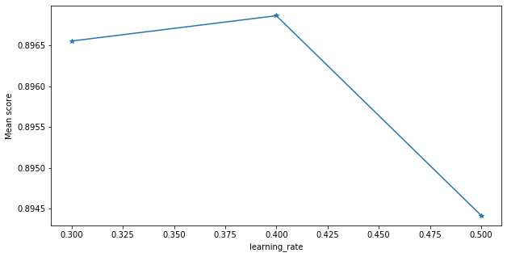


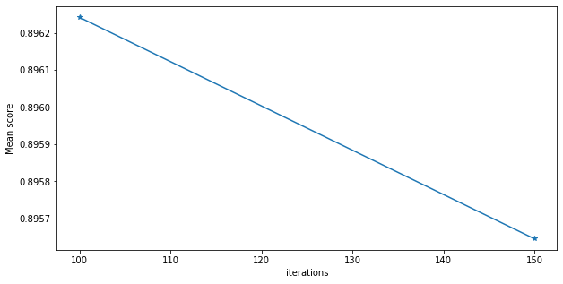


## Ensemble Methods

**Studying Correlation**
If base models' predictions are weakly correlated with each other, the ensemble will likely to perform better. On the other hand, for a strong correlation of predictions among the base models, the ensemble will unlikely to perform better.


```python
plt.figure(figsize = (20, 6))
correlations = predictions.corr()
sns.heatmap(correlations, annot = True)
plt.title('Prediction Correlation in Simpler Classifiers', fontsize = 18)
plt.show()
```


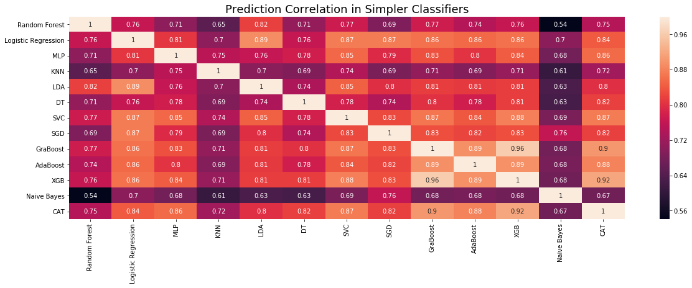


**As we can see, there are some classifiers that have a high correlated predictions. So, we won't use them to form the ensemble models.**


```python
classifiers = copy.deepcopy(models)
every_model = copy.deepcopy(models)

for i in range(0, len(correlations.columns)):
    for j in range(0, len(correlations.columns)):
        if j>=i:
            break
        else:
            if abs(correlations.iloc[i,j]) >= 0.85:
                for index, clf in enumerate(classifiers):
                    if correlations.columns[j] == clf[0]:
                        del classifiers[index]

classifiers = [i for i in classifiers]
```

### Voting

Voting can be subdivided into hard voting and soft voting.

Hard voting is purely atributing the majority class from the predictions of all the classifiers.

Soft voting is useful when we have probabilities as output of the classifiers, so we average those values and assume the class that it's close to the probability.

We are going to do just soft voting because it takes into account how certain each voter is, rather than just a binary input from the voter...so, theoretically, it's better.


```python
def soft_voting(average_results, models_test_accuracies, models_train_accuracies, models_validation_accuracies, X_train, X_test, Y_train, Y_test, seed, num_folds, scoring):
    copy_1 = average_results[average_results.Model.isin([i[0] for i in classifiers])]
    copy_1.sort_values(by=["Test Accuracy"], ascending=False, inplace=True)

    numb_voters = np.arange(2,len(classifiers)+1,1)

    #we we'll try to ensemble the best two classifiers, then the best three, the best, four, etc
    for i in numb_voters:
        models_names = list(copy_1.iloc[0:i,0])
        voting_models = []
        for model1 in models_names:
            for model2 in models:
                if model2[0] == model1:
                    voting_models.append(model2[1])

        model_config_1 = EnsembleVoteClassifier(clfs = voting_models, voting = 'soft')
        model_config_2 = EnsembleVoteClassifier(clfs = voting_models, voting = 'soft')
        model = model_config_1.fit(X_train,Y_train)

        name = "SoftVoter_" + str(i) + "_best"

        every_model.append((name, model))
        pickle.dump(model, open('./models/census/' + name + '_model.sav', 'wb'))
        average_results,models_test_accuracies, models_train_accuracies, models_validation_accuracies = classify_performance(name, model, X_train, X_test, Y_train, Y_test, num_folds, scoring, seed, average_results, models_test_accuracies, models_train_accuracies, models_validation_accuracies)

    return average_results,models_test_accuracies, models_train_accuracies, models_validation_accuracies
```
#To apply Hard Voting, here's the code anyway
"""
def hard_voting(average_results, models_test_accuracies, models_train_accuracies, models_validation_accuracies, X_train, X_test, Y_train, Y_test, seed, num_folds, scoring):

    copy_1 = average_results[average_results.Model.isin([i[0] for i in classifiers])]
    copy_1.sort_values(by=["Test Accuracy"], ascending=False, inplace=True)

    classifiers_voting = classifiers[:-1]

    #Hard-Voting
    numb_voters = np.arange(2,len(classifiers_voting)+1,1) #if catboost counted, it would be len(classifiers)+1

    all_test_accuracy = []
    all_y_pred = []

    #we we'll try to ensemble the best two classifiers, then the best three, the best, four, etc
    for i in numb_voters:
        models_names = list(copy_1.iloc[0:i,0])
        voting_models = []
        for model1 in models_names:
            for model2 in models[:-1]:
                if model2[0] == model1:
                    voting_models.append(model2[1])

        model_config_1 = EnsembleVoteClassifier(clfs = voting_models, voting = 'hard')
        model_config_2 = EnsembleVoteClassifier(clfs = voting_models, voting = 'hard')
        model = model_config_1.fit(X_train,Y_train)

        name = "HardVoter_" + str(i) + "_best"

        every_model.append((name, model))
        pickle.dump(model, open('./models/census/' + name + '_model.sav', 'wb'))
        average_results,models_test_accuracies, models_train_accuracies, models_validation_accuracies = classify_performance(name, model, X_train, X_test, Y_train, Y_test, num_folds, scoring, seed, average_results, models_test_accuracies, models_train_accuracies, models_validation_accuracies)

    return average_results,models_test_accuracies, models_train_accuracies, models_validation_accuracies
"""
### Bagging (Bootstrapping Aggregation)

Bagging is characteristic of random forest. You bootstrap or subdivide the same training set into multiple subsets or bags. This steps is also called row sampling with replacement. Each of these training bags will feed a mmodel to be trained. After each model being trained, it is time for aggragation, in other orders, to predict the outcome based on a voting system of each model trained.


```python
def bagging(average_results, models_test_accuracies, models_train_accuracies, models_validation_accuracies, X_train, X_test, Y_train, Y_test, seed, num_folds, scoring):

    random_forest_classifier = RandomForestClassifier() # is the random forest classifier

    model_config_1 = BaggingClassifier(base_estimator = random_forest_classifier, verbose = 0, n_jobs = -1, random_state = seed)
    model_config_2 = BaggingClassifier(base_estimator = random_forest_classifier, verbose = 0, n_jobs = -1, random_state = seed)

    model = model_config_1.fit(X_train, Y_train)
    name = "bagging"

    every_model.append((name, model))
    pickle.dump(model, open('./models/census/' + name + '_model.sav', 'wb'))

    return classify_performance(name, model, X_train, X_test, Y_train, Y_test, num_folds, scoring, seed, average_results, models_test_accuracies, models_train_accuracies, models_validation_accuracies)


```

### Blending


```python
def blending(average_results, models_test_accuracies, models_train_accuracies, models_validation_accuracies, X_train, X_test, Y_train, Y_test, seed, num_folds, scoring):

    copy_2 = average_results[average_results.Model.isin([i[0] for i in classifiers])]
    copy_2.sort_values(by=["Test Accuracy"], ascending=False, inplace=True)

    numb_voters = np.arange(2,len(classifiers)+1,1)

    #we we'll try to ensemble the best two classifiers, then the best three, the best, four, etc
    for i in numb_voters:
        models_names = list(copy_2.iloc[0:i,0])
        blending_models = []
        for model1 in models_names:
            for model2 in models:
                if model2[0] == model1:
                    blending_models.append(model2[1])

        blend_1 = BlendEnsemble(n_jobs = -1, test_size = 0.5, random_state = seed, scorer="accuracy")
        blend_1.add(blending_models, proba=True)
        blend_1.add_meta(RandomForestClassifier())

        blend_2 = BlendEnsemble(n_jobs = -1, test_size = 0.5, random_state = seed)
        blend_2.add(blending_models, proba=True) #proba=true s important in order to predict_proba function properly later
        blend_2.add_meta(RandomForestClassifier())

        model = blend_1.fit(X_train, Y_train, scoring="accuracy")
        name = "blending_" + str(i) + "_best"

        every_model.append((name, model))
        pickle.dump(model, open('./models/census/' + name + '_model.sav', 'wb'))

        average_results,models_test_accuracies, models_train_accuracies, models_validation_accuracies = classify_performance(name, model, X_train, X_test, Y_train, Y_test, num_folds, scoring, seed, average_results, models_test_accuracies, models_train_accuracies, models_validation_accuracies)


    return average_results,models_test_accuracies, models_train_accuracies, models_validation_accuracies

```

### Stacking

Shortly, we are trying to fit a model upon Y_valid data and models' predictions (stacked) made during the validation stage. Then, we will try to predict from the models' predictions (stacked) of test data to see if we reach Y_test values.

In this model we can't analyze the true feature importance because all the features that matter are the predictions of the classifiers!


```python
def stacking_function(average_results, models_test_accuracies, models_train_accuracies, models_validation_accuracies, X_train, X_test, Y_train, Y_test, seed, num_folds, scoring):
    numb_voters = np.arange(2,len(classifiers)+1, 1)

    final_classifiers = copy.deepcopy(classifiers)
    final_classifiers = [i[1] for i in final_classifiers]

    myStack = StackingTransformer(final_classifiers, X_train, Y_train, X_test, regression = False, mode = 'oof_pred_bag', needs_proba = False, save_dir = None,metric = accuracy_score, n_folds = num_folds, stratified = True, shuffle = True, random_state =  seed, verbose = 0)
    myStack.fit(X_train, Y_train)
    S_train = myStack.transform(X_train)
    S_test = myStack.transform(X_test)
    joblib.dump(myStack, open('./models/census/stack_transformer.pkl', 'wb'))

    super_learner = RandomForestClassifier()
    model_1 = super_learner.fit(S_train, Y_train)
    name = "stacking"

    every_model.append((name, model))
    pickle.dump(model, open('./models/census/' + name + '_model.sav', 'wb'))

    return classify_performance(name, model_1, S_train, S_test, Y_train, Y_test, num_folds, scoring, seed, average_results, models_test_accuracies, models_train_accuracies, models_validation_accuracies)

```

# Runs
**First of all, we'll execute 30 tests of cross-validation of all the models but with different seeds.**


```python
def classify_performance(name, model, X_train, X_test, Y_train, Y_test, num_folds, scoring, seed, average_results, models_test_accuracies, models_train_accuracies, models_validation_accuracies):
    stratifiedfold = StratifiedShuffleSplit(n_splits=num_folds, random_state=seed)

    cv_results = cross_validate(model, X_train, Y_train, cv=stratifiedfold, scoring=scoring, verbose=0, return_train_score=True)

    print("%s - Train: Accuracy mean - %.3f, Precision: %.3f, Recall: %.3f." % (name, cv_results['train_accuracy'].mean(), cv_results['train_precision'].mean(), cv_results['train_recall'].mean()))

    pred_proba = model.predict_proba(X_test)
    if (pred_proba[0].size == 1 ): #just in case that probabilities are not correctly retrieved
        pred_proba = pred_proba.T
    else:
        pred_proba = pred_proba[:, 1]

    y_pred =  [round(x) for x in pred_proba]

    precision, recall, fscore, support = precision_recall_fscore_support(Y_test, y_pred,average='binary')
    test_accuracy = accuracy_score(Y_test, y_pred)

    print("%s - Test: Accuracy - %.3f, Precision: %.3f, Recall: %.3f, F-Score: %.3f" % (name, test_accuracy, precision,recall, fscore))

    if (seed == 0):
        print(name + " - Learning Curve")
        check_fitting(model, name)

    fpr, tpr, thresholds1 = roc_curve(Y_test, pred_proba)
    pre, rec, thresholds2 = precision_recall_curve(Y_test, pred_proba)
    roc_auc = auc(fpr, tpr)

    TP = FP = TN = FN = 0
    for i in range(len(y_pred)):
        if ((y_pred[i] == 1) and (list(Y_test)[i] == y_pred[i])):
            TP += 1
        if y_pred[i]==1 and list(Y_test)[i]!=y_pred[i]:
            FP += 1
        if y_pred[i]==0 and list(Y_test)[i]==y_pred[i]:
            TN += 1
        if y_pred[i]==0 and list(Y_test)[i]!=y_pred[i]:
            FN += 1

    new_entry = {'Model': name,
                 'Test Accuracy': test_accuracy,
                 'Test Precision': precision,
                 'Test Recall': recall,
                 'Test F-Score': fscore,
                 'AUC': roc_auc,
                 'TPR': tpr,
                 'FPR': fpr,
                 'TP': TP,
                 'FP': FP,
                 'TN': TN,
                 'FN': FN,
                 'Train Accuracy':cv_results['train_accuracy'].mean(),
                 'Train Precision': cv_results['train_precision'].mean(),
                 'Train Recall': cv_results['train_recall'].mean(),
                 'Validation Accuracy':cv_results['test_accuracy'].mean(),
                 'Validation Precision': cv_results['test_precision'].mean(),
                 'Validation Recall': cv_results['test_recall'].mean(),
                 'PRE': pre,
                 'REC': rec
                }


    for key, value in new_entry.items():
        if key != 'Model':

            if key == 'TPR' or key == 'FPR' or key == 'PRE' or key =='REC':
                current = average_results.ix[average_results['Model'] == name][key].values

                if type(current[0]) == int:
                    average_results.iloc[average_results.ix[average_results['Model'] == name].index.values.astype(int)[0]][key] = value
                else:
                    summed = list(map(add, current[0], list(value)))
                    average_results.iloc[average_results.ix[average_results['Model'] == name].index.values.astype(int)[0]][key] = summed
            else:

                average_results.iloc[average_results.ix[average_results['Model'] == name].index.values.astype(int)[0]][key] = float(average_results.ix[average_results['Model'] == name][key].values) + value

            models_test_accuracies.iloc[seed, :][name] = test_accuracy
            models_train_accuracies.iloc[seed, :][name] = cv_results['train_accuracy'].mean()
            models_validation_accuracies.iloc[seed, :][name] = cv_results['test_accuracy'].mean()

    return average_results, models_test_accuracies, models_train_accuracies, models_validation_accuracies

```


```python
# RUNNING ALL THE EXPERIMENTS
###
num_experiments = 4
num_folds = 2
scoring = {'accuracy': 'accuracy',
           'precision': 'precision_macro',
           'recall': 'recall_macro'}


all_models = [i[0] for i in models]

for i in np.arange(2,len(classifiers)+1,1):
              all_models.append("blending_" + str(i) + "_best")

all_models.append("bagging")

for i in np.arange(2,len(classifiers)+1,1):
              all_models.append("SoftVoter_" + str(i) + "_best")

all_models.append("stacking")

models_test_accuracies = pd.DataFrame(columns=all_models)
models_train_accuracies = pd.DataFrame(columns=all_models)
models_validation_accuracies = pd.DataFrame(columns=all_models)

average_results = pd.DataFrame(columns=['Model',
                                        'Test Accuracy',
                                        'Test Precision',
                                        'Test Recall',
                                        'Test F-Score',
                                        'AUC',
                                        'TPR',
                                        'FPR',
                                        'TP',
                                        'FP',
                                        'TN',
                                        'FN',
                                        'Train Accuracy',
                                        'Train Precision',
                                        'Train Recall',
                                        'Validation Accuracy',
                                        'Validation Precision',
                                        'Validation Recall',
                                        'PRE',
                                        'REC'
                                        ]
                              )

for i, elem in enumerate(all_models):
    average_results = average_results.append(pd.Series(0, index=average_results.columns), ignore_index=True)
    average_results.ix[i,:]['Model'] = elem

for i in range(0, num_experiments):
    print("\n------------------------------- EXPERIMENT " + str(i+1) + " ------------------------------------")

    seed = i

    X_train, X_test, Y_train, Y_test = train_test_split(X,Y, stratify=Y,random_state=seed)

    models_train_accuracies = models_train_accuracies.append(pd.Series(0, index=models_train_accuracies.columns), ignore_index=True)
    models_validation_accuracies = models_validation_accuracies.append(pd.Series(0, index=models_validation_accuracies.columns), ignore_index=True)
    models_test_accuracies = models_test_accuracies.append(pd.Series(0, index=models_test_accuracies.columns), ignore_index=True)

    #Base Models
    for name, model_2 in models:
        average_results,models_test_accuracies, models_train_accuracies, models_validation_accuracies = classify_performance(name, model_2, X_train, X_test, Y_train, Y_test, num_folds, scoring, seed, average_results, models_test_accuracies, models_train_accuracies, models_validation_accuracies)

    #ensemble models
    average_results,models_test_accuracies, models_train_accuracies, models_validation_accuracies  = bagging(average_results, models_test_accuracies, models_train_accuracies, models_validation_accuracies, X_train, X_test, Y_train, Y_test, seed, num_folds, scoring)

    average_results,models_test_accuracies,models_train_accuracies, models_validation_accuracies  = blending(average_results,  models_test_accuracies, models_train_accuracies, models_validation_accuracies, X_train, X_test, Y_train, Y_test, seed, num_folds, scoring)

    average_results,models_test_accuracies,models_train_accuracies, models_validation_accuracies  = soft_voting(average_results,  models_test_accuracies, models_train_accuracies, models_validation_accuracies, X_train, X_test, Y_train, Y_test, seed, num_folds, scoring)

    average_results,models_test_accuracies, models_train_accuracies, models_validation_accuracies  = stacking_function(average_results,  models_test_accuracies, models_train_accuracies, models_validation_accuracies, X_train, X_test, Y_train, Y_test, seed, num_folds, scoring)

```

# Analysis of the results


```python
#calculating the average of the metrics
for key, value in enumerate(all_models):
    for col in average_results.columns:
        if col != 'Model':
            current = average_results.ix[average_results['Model'] == value][col].values
            if col == 'TPR' or col == 'FPR' or col == 'REC' or col == 'PRE':
                division = list(map(truediv, current[0], [num_experiments] *len(current[0])))
            else:
                division = float(current/num_experiments)

            average_results.iloc[average_results.ix[average_results['Model'] == value].index.values.astype(int)[0]][col] = division
```


```python
#sort by the criteria that you want
average_results.sort_values(by=["Test Accuracy", "Test F-Score","Test Precision", "Test Recall", "AUC"], ascending=False, inplace=True)

display(average_results)

for model in all_models:
    line = pd.DataFrame(columns=average_results.columns)

    line = line.append(pd.Series(average_results.iloc[0, :]), ignore_index=True)

    line.to_html('./results/census/' + model + '/average_results.html')
    imgkit.from_file('./results/census/' + model + '/average_results.html', './results/census/' + model + '/average_results.png') # you need to have wkhtmltoimage in your computer  and configure your environmental variable before executing this
    os.remove('./results/census/' + model + '/average_results.html')
```


```python
#confusion matrix and roc curves for each algorithm

for index, row in average_results.iterrows():

    name = average_results.iloc[index, 0]

    tp = average_results.iloc[index, 8]
    fp = average_results.iloc[index, 9]
    tn = average_results.iloc[index, 10]
    fn = average_results.iloc[index, 11]

    roc_auc = average_results.iloc[index, 5]
    tpr = average_results.iloc[index, 6]
    fpr = average_results.iloc[index, 7]
    pre = average_results.iloc[index, 18]
    rec = average_results.iloc[index, 19]

    confusion_matrix = pd.DataFrame({'1': [tp,  fn],
                                     '0': [fp,  tn]
                                    })

    confusion_matrix.rename(index={0:'1',1:'0'}, inplace=True)

    ax = sns.heatmap(confusion_matrix, annot=True,cmap='Blues', fmt='g')


    ax.set(xlabel='Predicted', ylabel='Actual')
    plt.title("Averaged Confusion Matrix of Model " + name)
    plt.savefig('./results/census/' + name + '/confusion_matrix.png')
    plt.show()

    plt.figure(figsize=(20,10))

    plt.plot(fpr, tpr, color = 'blue', label='{} ROC curve (area = {:.2})'.format(name, roc_auc))
    plt.xlim([-0.05, 1.05])
    plt.ylim([-0.05, 1.05])
    plt.xlabel('False Positive Rate')
    plt.ylabel('True Positive Rate')
    plt.title('ROC Curve')
    plt.legend(loc="lower right")
    plt.plot([0, 1], [0, 1], 'k--')
    plt.grid()
    plt.savefig('./results/census/' + name + '/roc_curve.png')
    plt.show()

    plt.figure(figsize=(20,10))
    plt.plot(rec, pre, color = 'green', label='Precision-Recall curve of {}'.format(name))
    plt.xlim([-0.05, 1.05])
    plt.ylim([-0.05, 1.05])
    plt.xlabel('Recall')
    plt.ylabel('Precision')
    plt.title('Precision-Recall Curve')
    plt.legend(loc="lower right")
    plt.grid()
    plt.savefig('./results/census/' + name + '/precision_recall_curve.png')
    plt.show()

```


```python
my_map = {}
for index,value in enumerate(all_models):
    my_map[index] = value

img_name1 = 'all_f_scores'
img_name2 = 'all_accuracies'
dload = os.path.expanduser('~\\Downloads')
save_dir = '.\\results\census'
```


```python
#Plot of the average of accuracies of the different algorithms

copy_accuracy = average_results
copy_accuracy.sort_values(by=["Test Accuracy"], ascending=False, inplace=True)
accuracies_sorted = copy_accuracy["Test Accuracy"]
accuracies_sorted.rename(index = my_map,inplace = True)

cf.go_offline()
init_notebook_mode()


figure = accuracies_sorted.T.iplot(kind = 'bar', asFigure = True, title = 'Average of Accuracies of the Different Algorithms (average of the 30 Experiments)', theme = 'pearl')
iplot(figure,filename=img_name1, image='png')

```


```python
#Plot of the f-scores of the different algorithms

copy_fscores = average_results
copy_fscores.sort_values(by=["Test F-Score"], ascending=False, inplace=True)
fscores_sorted = copy_fscores["Test F-Score"]
fscores_sorted.rename(index = my_map,inplace = True)

cf.go_offline()
init_notebook_mode()


figure = fscores_sorted.T.iplot(kind = 'bar', asFigure = True, title = 'F-Scores of the Different Algorithms (average of the 30 Experiments)', theme = 'solar')
iplot(figure,filename=img_name2, image='png')

```


```python
#roc curves of all algorithms overlapped
copy_roc = average_results
copy_roc.sort_values(by=["TPR"], ascending=False, inplace=True)
tprs_sorted = list(copy_roc["TPR"])
fprs_sorted = list(copy_roc["FPR"])
ticks = list(copy_roc["Model"])

fig1 = plt.figure(figsize=(15,15))
for i in range(0, len(fprs_sorted)):
    plt.plot(fprs_sorted[i], tprs_sorted[i], label='ROC curve of {}'.format(ticks[i]))
plt.xlim([-0.05, 1.05])
plt.ylim([-0.05, 1.05])
plt.xlabel('False Positive Rate')
plt.ylabel('True Positive Rate')
plt.title('ROC Curves of All Algorithms (average of the 30 Experiments)')
plt.legend(loc="lower right")
plt.plot([0, 1], [0, 1], 'k--')
plt.grid()
plt.savefig('./results/census/all_roc_curve.png')
```


```python
copy_precisionRecall = average_results
copy_precisionRecall.sort_values(by=["PRE"], ascending=False, inplace=True)
precisions_sorted = list(copy_precisionRecall["PRE"])
recalls_sorted = list(copy_precisionRecall["REC"])
ticks = list(copy_precisionRecall["Model"])

fig1 = plt.figure(figsize=(15,15))
for i in range(0, len(recalls_sorted)):
    plt.plot(recalls_sorted[i], precisions_sorted[i], label='Precision-Recall curve of {}'.format(ticks[i]))
plt.xlim([-0.05, 1.05])
plt.ylim([-0.05, 1.05])
plt.xlabel('Recall')
plt.ylabel('Precision')
plt.title('Precision-Recall Curve of All Algorithms (average of the 30 Experiments)')
plt.legend(loc="lower left")
plt.grid()
plt.savefig('./results/census/all_precision_recall.png')
plt.show()
```


```python
# boxplot algorithm comparison
plt.figure(figsize=(20,20))
plt.title('Comparison of the Models Accuracies (average of the 30 Experiments)', fontsize=20)
plt.boxplot(models_test_accuracies.T)
locs, labels=plt.xticks()
x_ticks = []
new_xticks=models_test_accuracies.columns
plt.xticks(locs,new_xticks, rotation=45, horizontalalignment='right')
plt.savefig('./results/census/boxplot_accuracies.png')
plt.show()

```


```python
#saving the plotly images
copyfile('{}\\{}.png'.format(dload, img_name1),
     '{}\\{}.png'.format(save_dir, img_name1))

copyfile('{}\\{}.png'.format(dload, img_name2),
     '{}\\{}.png'.format(save_dir, img_name2))
```

**Finally, we'll analyze the behavior of validation scores vs training scores vs test scores of each algorithm during the 30 experiments in order to check for overfitting/underfitting issues.**


```python
experiments_array = np.arange(1, num_experiments+1, 1)
for model in all_models:
    plt.figure(figsize=(20,10))
    plt.plot(experiments_array, models_train_accuracies[model].T, '*-', color = 'blue',  label = 'Score on Training')
    plt.plot(experiments_array, models_validation_accuracies[model].T, '*-', color = 'yellow', label = 'Score on Validation')
    plt.plot(experiments_array, models_test_accuracies[model].T, 'r--',  color = 'red', label = 'Score on Testing')


    font_size = 15
    plt.xlabel('Experiments', fontsize = font_size)
    plt.ylabel('Accuracy Score', fontsize = font_size)
    plt.xticks(fontsize = font_size)
    plt.yticks(fontsize = font_size)
    plt.legend(loc = 'best')
    plt.grid()
    plt.suptitle('Training vs Validating vs Testing Scores on ' + model + '', fontsize = 15)

    plt.tight_layout(rect = [0, 0.03, 1, 0.97])

    plt.savefig('./results/census/' + model + '/overfitting_underfitting.png')
    plt.show()
```

# Statistical Tests and Ranking of the Accuracies

- 1) Ranking the results by rows (experiments)
- 2) Friedman test to see if the null hypothesis that the groups of data are similar can be rejected.
- 3) Nemenyi test to see if that difference is statistical significative.


```python
display(models_test_accuracies)
```


```python
#Ranking the results by row (experiment)

models_test_accuracies_transpose = models_test_accuracies.T

models_test_accuracies_ranked = pd.DataFrame(columns=models_test_accuracies.columns)
for i in models_test_accuracies_transpose:
    models_test_accuracies_ranked = models_test_accuracies_ranked.append(models_test_accuracies_transpose.iloc[:,i].pow(-1).rank(method='dense'), ignore_index=True)

temp = models_test_accuracies_ranked.append(models_test_accuracies_ranked.sum(numeric_only=True), ignore_index=True)
temp = temp.sort_values(by=num_experiments, axis=1, ascending=True)

display(temp)
```


```python
# Friedman and nemenyi test
p_values = sp.posthoc_nemenyi_friedman(temp.iloc[0:num_experiments,:])
```


```python
#Assuming that p = 0.05, we can say that...
with open('./results/census/statistic_results.txt', 'w') as f:
    for i in range(0, len(p_values.columns)):
        for j in range(0, len(p_values.columns)):
            name1 = p_values.columns[i]
            name2 = p_values.columns[j]

            if (j >= i):
                break
            if p_values.iloc[i,j] < 0.01:
                if temp.loc[temp.index[num_experiments], name1] < temp.loc[temp.index[num_experiments], name2]:
                    print("Algorithm " + p_values.columns[i] + " is statistically way much better than " + p_values.columns[j], file=f)
                    print("Algorithm " + p_values.columns[i] + " is statistically way much better than " + p_values.columns[j])
                elif temp.loc[temp.index[num_experiments], name1] > temp.loc[temp.index[num_experiments], name2]:
                    print("Algorithm " + p_values.columns[j] + " is statistically way much better than " + p_values.columns[i], file=f)
                    print("Algorithm " + p_values.columns[j] + " is statistically way much better than " + p_values.columns[i])
            elif p_values.iloc[i,j] < 0.05:
                if temp.loc[temp.index[num_experiments], name1] < temp.loc[temp.index[num_experiments], name2]:
                    print("Algorithm " + p_values.columns[i] + " is statistically better than " + p_values.columns[j], file=f)
                    print("Algorithm " + p_values.columns[i] + " is statistically better than " + p_values.columns[j])
                elif temp.loc[temp.index[num_experiments], name1] > temp.loc[temp.index[num_experiments], name2]:
                    print("Algorithm " + p_values.columns[j] + " is statistically better than " + p_values.columns[i], file=f)
                    print("Algorithm " + p_values.columns[j] + " is statistically better than " + p_values.columns[i])
```

# Interpretability/Explainability

## Check Permutation Importance of Encoded Features

Before encoding we can observe directly which feature is more important for each model (independently if the models have already built-in method like the Random Forest or Logistic Regression). We actually did that already right after tunned the parameters for each model.

However, those results can be misleading once we have categorical features that would be later unfolded in extra numerical features through OneHotEncoding in order to improve the accuracy of our model. So, when we build a permutation feature importance table with the encoded features, we obtain more reliable information.


```python
criteria = "Test Accuracy"

for value in every_model:
    print(value[0] + " - Encoded Feature Importances")
    permutation_importance(model, X_test, Y_test)

```

    Random Forest - Encoded Feature Importances


    <style>
    table.eli5-weights tr:hover {
        filter: brightness(85%);
    }
</style>


        <table class="eli5-weights eli5-feature-importances" style="border-collapse: collapse; border: none; margin-top: 0em; table-layout: auto;">
    <thead>
    <tr style="border: none;">
        <th style="padding: 0 1em 0 0.5em; text-align: right; border: none;">Weight</th>
        <th style="padding: 0 0.5em 0 0.5em; text-align: left; border: none;">Feature</th>
    </tr>
    </thead>
    <tbody>

        <tr style="background-color: hsl(120, 100.00%, 80.00%); border: none;">
            <td style="padding: 0 1em 0 0.5em; text-align: right; border: none;">
                0.1096

                    &plusmn; 0.0064

            </td>
            <td style="padding: 0 0.5em 0 0.5em; text-align: left; border: none;">
                education.num
            </td>
        </tr>

        <tr style="background-color: hsl(120, 100.00%, 80.01%); border: none;">
            <td style="padding: 0 1em 0 0.5em; text-align: right; border: none;">
                0.1096

                    &plusmn; 0.0040

            </td>
            <td style="padding: 0 0.5em 0 0.5em; text-align: left; border: none;">
                relationship_Husband
            </td>
        </tr>

        <tr style="background-color: hsl(120, 100.00%, 81.28%); border: none;">
            <td style="padding: 0 1em 0 0.5em; text-align: right; border: none;">
                0.0997

                    &plusmn; 0.0046

            </td>
            <td style="padding: 0 0.5em 0 0.5em; text-align: left; border: none;">
                marital.status_Married-civ-spouse
            </td>
        </tr>

        <tr style="background-color: hsl(120, 100.00%, 89.24%); border: none;">
            <td style="padding: 0 1em 0 0.5em; text-align: right; border: none;">
                0.0452

                    &plusmn; 0.0036

            </td>
            <td style="padding: 0 0.5em 0 0.5em; text-align: left; border: none;">
                capital.gain
            </td>
        </tr>

        <tr style="background-color: hsl(120, 100.00%, 91.08%); border: none;">
            <td style="padding: 0 1em 0 0.5em; text-align: right; border: none;">
                0.0346

                    &plusmn; 0.0038

            </td>
            <td style="padding: 0 0.5em 0 0.5em; text-align: left; border: none;">
                education_HS-grad
            </td>
        </tr>

        <tr style="background-color: hsl(120, 100.00%, 92.92%); border: none;">
            <td style="padding: 0 1em 0 0.5em; text-align: right; border: none;">
                0.0249

                    &plusmn; 0.0028

            </td>
            <td style="padding: 0 0.5em 0 0.5em; text-align: left; border: none;">
                hours.per.week
            </td>
        </tr>

        <tr style="background-color: hsl(120, 100.00%, 93.76%); border: none;">
            <td style="padding: 0 1em 0 0.5em; text-align: right; border: none;">
                0.0208

                    &plusmn; 0.0027

            </td>
            <td style="padding: 0 0.5em 0 0.5em; text-align: left; border: none;">
                education_Bachelors
            </td>
        </tr>

        <tr style="background-color: hsl(120, 100.00%, 95.32%); border: none;">
            <td style="padding: 0 1em 0 0.5em; text-align: right; border: none;">
                0.0138

                    &plusmn; 0.0010

            </td>
            <td style="padding: 0 0.5em 0 0.5em; text-align: left; border: none;">
                age_0.0
            </td>
        </tr>

        <tr style="background-color: hsl(120, 100.00%, 95.70%); border: none;">
            <td style="padding: 0 1em 0 0.5em; text-align: right; border: none;">
                0.0122

                    &plusmn; 0.0022

            </td>
            <td style="padding: 0 0.5em 0 0.5em; text-align: left; border: none;">
                sex_Female
            </td>
        </tr>

        <tr style="background-color: hsl(120, 100.00%, 95.84%); border: none;">
            <td style="padding: 0 1em 0 0.5em; text-align: right; border: none;">
                0.0116

                    &plusmn; 0.0019

            </td>
            <td style="padding: 0 0.5em 0 0.5em; text-align: left; border: none;">
                education_Doctorate
            </td>
        </tr>

        <tr style="background-color: hsl(120, 100.00%, 95.90%); border: none;">
            <td style="padding: 0 1em 0 0.5em; text-align: right; border: none;">
                0.0114

                    &plusmn; 0.0010

            </td>
            <td style="padding: 0 0.5em 0 0.5em; text-align: left; border: none;">
                capital.loss
            </td>
        </tr>

        <tr style="background-color: hsl(120, 100.00%, 96.85%); border: none;">
            <td style="padding: 0 1em 0 0.5em; text-align: right; border: none;">
                0.0078

                    &plusmn; 0.0028

            </td>
            <td style="padding: 0 0.5em 0 0.5em; text-align: left; border: none;">
                fnlwgt
            </td>
        </tr>

        <tr style="background-color: hsl(120, 100.00%, 96.89%); border: none;">
            <td style="padding: 0 1em 0 0.5em; text-align: right; border: none;">
                0.0077

                    &plusmn; 0.0025

            </td>
            <td style="padding: 0 0.5em 0 0.5em; text-align: left; border: none;">
                education_Prof-school
            </td>
        </tr>

        <tr style="background-color: hsl(120, 100.00%, 97.06%); border: none;">
            <td style="padding: 0 1em 0 0.5em; text-align: right; border: none;">
                0.0071

                    &plusmn; 0.0012

            </td>
            <td style="padding: 0 0.5em 0 0.5em; text-align: left; border: none;">
                sex_Male
            </td>
        </tr>

        <tr style="background-color: hsl(120, 100.00%, 97.07%); border: none;">
            <td style="padding: 0 1em 0 0.5em; text-align: right; border: none;">
                0.0071

                    &plusmn; 0.0008

            </td>
            <td style="padding: 0 0.5em 0 0.5em; text-align: left; border: none;">
                education_Masters
            </td>
        </tr>

        <tr style="background-color: hsl(120, 100.00%, 97.10%); border: none;">
            <td style="padding: 0 1em 0 0.5em; text-align: right; border: none;">
                0.0070

                    &plusmn; 0.0023

            </td>
            <td style="padding: 0 0.5em 0 0.5em; text-align: left; border: none;">
                relationship_Unmarried
            </td>
        </tr>

        <tr style="background-color: hsl(120, 100.00%, 97.30%); border: none;">
            <td style="padding: 0 1em 0 0.5em; text-align: right; border: none;">
                0.0063

                    &plusmn; 0.0012

            </td>
            <td style="padding: 0 0.5em 0 0.5em; text-align: left; border: none;">
                education_Assoc-acdm
            </td>
        </tr>

        <tr style="background-color: hsl(120, 100.00%, 97.38%); border: none;">
            <td style="padding: 0 1em 0 0.5em; text-align: right; border: none;">
                0.0060

                    &plusmn; 0.0013

            </td>
            <td style="padding: 0 0.5em 0 0.5em; text-align: left; border: none;">
                workclass_Never-worked
            </td>
        </tr>

        <tr style="background-color: hsl(120, 100.00%, 97.73%); border: none;">
            <td style="padding: 0 1em 0 0.5em; text-align: right; border: none;">
                0.0049

                    &plusmn; 0.0007

            </td>
            <td style="padding: 0 0.5em 0 0.5em; text-align: left; border: none;">
                education_Assoc-voc
            </td>
        </tr>

        <tr style="background-color: hsl(120, 100.00%, 98.14%); border: none;">
            <td style="padding: 0 1em 0 0.5em; text-align: right; border: none;">
                0.0037

                    &plusmn; 0.0014

            </td>
            <td style="padding: 0 0.5em 0 0.5em; text-align: left; border: none;">
                marital.status_Married-AF-spouse
            </td>
        </tr>


            <tr style="background-color: hsl(120, 100.00%, 98.14%); border: none;">
                <td colspan="2" style="padding: 0 0.5em 0 0.5em; text-align: center; border: none; white-space: nowrap;">
                    <i>&hellip; 87 more &hellip;</i>
                </td>
            </tr>


    </tbody>
</table>


    Logistic Regression - Encoded Feature Importances


    <style>
    table.eli5-weights tr:hover {
        filter: brightness(85%);
    }
</style>


        <table class="eli5-weights eli5-feature-importances" style="border-collapse: collapse; border: none; margin-top: 0em; table-layout: auto;">
    <thead>
    <tr style="border: none;">
        <th style="padding: 0 1em 0 0.5em; text-align: right; border: none;">Weight</th>
        <th style="padding: 0 0.5em 0 0.5em; text-align: left; border: none;">Feature</th>
    </tr>
    </thead>
    <tbody>

        <tr style="background-color: hsl(120, 100.00%, 80.00%); border: none;">
            <td style="padding: 0 1em 0 0.5em; text-align: right; border: none;">
                0.1096

                    &plusmn; 0.0064

            </td>
            <td style="padding: 0 0.5em 0 0.5em; text-align: left; border: none;">
                education.num
            </td>
        </tr>

        <tr style="background-color: hsl(120, 100.00%, 80.01%); border: none;">
            <td style="padding: 0 1em 0 0.5em; text-align: right; border: none;">
                0.1096

                    &plusmn; 0.0040

            </td>
            <td style="padding: 0 0.5em 0 0.5em; text-align: left; border: none;">
                relationship_Husband
            </td>
        </tr>

        <tr style="background-color: hsl(120, 100.00%, 81.28%); border: none;">
            <td style="padding: 0 1em 0 0.5em; text-align: right; border: none;">
                0.0997

                    &plusmn; 0.0046

            </td>
            <td style="padding: 0 0.5em 0 0.5em; text-align: left; border: none;">
                marital.status_Married-civ-spouse
            </td>
        </tr>

        <tr style="background-color: hsl(120, 100.00%, 89.24%); border: none;">
            <td style="padding: 0 1em 0 0.5em; text-align: right; border: none;">
                0.0452

                    &plusmn; 0.0036

            </td>
            <td style="padding: 0 0.5em 0 0.5em; text-align: left; border: none;">
                capital.gain
            </td>
        </tr>

        <tr style="background-color: hsl(120, 100.00%, 91.08%); border: none;">
            <td style="padding: 0 1em 0 0.5em; text-align: right; border: none;">
                0.0346

                    &plusmn; 0.0038

            </td>
            <td style="padding: 0 0.5em 0 0.5em; text-align: left; border: none;">
                education_HS-grad
            </td>
        </tr>

        <tr style="background-color: hsl(120, 100.00%, 92.92%); border: none;">
            <td style="padding: 0 1em 0 0.5em; text-align: right; border: none;">
                0.0249

                    &plusmn; 0.0028

            </td>
            <td style="padding: 0 0.5em 0 0.5em; text-align: left; border: none;">
                hours.per.week
            </td>
        </tr>

        <tr style="background-color: hsl(120, 100.00%, 93.76%); border: none;">
            <td style="padding: 0 1em 0 0.5em; text-align: right; border: none;">
                0.0208

                    &plusmn; 0.0027

            </td>
            <td style="padding: 0 0.5em 0 0.5em; text-align: left; border: none;">
                education_Bachelors
            </td>
        </tr>

        <tr style="background-color: hsl(120, 100.00%, 95.32%); border: none;">
            <td style="padding: 0 1em 0 0.5em; text-align: right; border: none;">
                0.0138

                    &plusmn; 0.0010

            </td>
            <td style="padding: 0 0.5em 0 0.5em; text-align: left; border: none;">
                age_0.0
            </td>
        </tr>

        <tr style="background-color: hsl(120, 100.00%, 95.70%); border: none;">
            <td style="padding: 0 1em 0 0.5em; text-align: right; border: none;">
                0.0122

                    &plusmn; 0.0022

            </td>
            <td style="padding: 0 0.5em 0 0.5em; text-align: left; border: none;">
                sex_Female
            </td>
        </tr>

        <tr style="background-color: hsl(120, 100.00%, 95.84%); border: none;">
            <td style="padding: 0 1em 0 0.5em; text-align: right; border: none;">
                0.0116

                    &plusmn; 0.0019

            </td>
            <td style="padding: 0 0.5em 0 0.5em; text-align: left; border: none;">
                education_Doctorate
            </td>
        </tr>

        <tr style="background-color: hsl(120, 100.00%, 95.90%); border: none;">
            <td style="padding: 0 1em 0 0.5em; text-align: right; border: none;">
                0.0114

                    &plusmn; 0.0010

            </td>
            <td style="padding: 0 0.5em 0 0.5em; text-align: left; border: none;">
                capital.loss
            </td>
        </tr>

        <tr style="background-color: hsl(120, 100.00%, 96.85%); border: none;">
            <td style="padding: 0 1em 0 0.5em; text-align: right; border: none;">
                0.0078

                    &plusmn; 0.0028

            </td>
            <td style="padding: 0 0.5em 0 0.5em; text-align: left; border: none;">
                fnlwgt
            </td>
        </tr>

        <tr style="background-color: hsl(120, 100.00%, 96.89%); border: none;">
            <td style="padding: 0 1em 0 0.5em; text-align: right; border: none;">
                0.0077

                    &plusmn; 0.0025

            </td>
            <td style="padding: 0 0.5em 0 0.5em; text-align: left; border: none;">
                education_Prof-school
            </td>
        </tr>

        <tr style="background-color: hsl(120, 100.00%, 97.06%); border: none;">
            <td style="padding: 0 1em 0 0.5em; text-align: right; border: none;">
                0.0071

                    &plusmn; 0.0012

            </td>
            <td style="padding: 0 0.5em 0 0.5em; text-align: left; border: none;">
                sex_Male
            </td>
        </tr>

        <tr style="background-color: hsl(120, 100.00%, 97.07%); border: none;">
            <td style="padding: 0 1em 0 0.5em; text-align: right; border: none;">
                0.0071

                    &plusmn; 0.0008

            </td>
            <td style="padding: 0 0.5em 0 0.5em; text-align: left; border: none;">
                education_Masters
            </td>
        </tr>

        <tr style="background-color: hsl(120, 100.00%, 97.10%); border: none;">
            <td style="padding: 0 1em 0 0.5em; text-align: right; border: none;">
                0.0070

                    &plusmn; 0.0023

            </td>
            <td style="padding: 0 0.5em 0 0.5em; text-align: left; border: none;">
                relationship_Unmarried
            </td>
        </tr>

        <tr style="background-color: hsl(120, 100.00%, 97.30%); border: none;">
            <td style="padding: 0 1em 0 0.5em; text-align: right; border: none;">
                0.0063

                    &plusmn; 0.0012

            </td>
            <td style="padding: 0 0.5em 0 0.5em; text-align: left; border: none;">
                education_Assoc-acdm
            </td>
        </tr>

        <tr style="background-color: hsl(120, 100.00%, 97.38%); border: none;">
            <td style="padding: 0 1em 0 0.5em; text-align: right; border: none;">
                0.0060

                    &plusmn; 0.0013

            </td>
            <td style="padding: 0 0.5em 0 0.5em; text-align: left; border: none;">
                workclass_Never-worked
            </td>
        </tr>

        <tr style="background-color: hsl(120, 100.00%, 97.73%); border: none;">
            <td style="padding: 0 1em 0 0.5em; text-align: right; border: none;">
                0.0049

                    &plusmn; 0.0007

            </td>
            <td style="padding: 0 0.5em 0 0.5em; text-align: left; border: none;">
                education_Assoc-voc
            </td>
        </tr>

        <tr style="background-color: hsl(120, 100.00%, 98.14%); border: none;">
            <td style="padding: 0 1em 0 0.5em; text-align: right; border: none;">
                0.0037

                    &plusmn; 0.0014

            </td>
            <td style="padding: 0 0.5em 0 0.5em; text-align: left; border: none;">
                marital.status_Married-AF-spouse
            </td>
        </tr>


            <tr style="background-color: hsl(120, 100.00%, 98.14%); border: none;">
                <td colspan="2" style="padding: 0 0.5em 0 0.5em; text-align: center; border: none; white-space: nowrap;">
                    <i>&hellip; 87 more &hellip;</i>
                </td>
            </tr>


    </tbody>
</table>


    MLP - Encoded Feature Importances


    <style>
    table.eli5-weights tr:hover {
        filter: brightness(85%);
    }
</style>


        <table class="eli5-weights eli5-feature-importances" style="border-collapse: collapse; border: none; margin-top: 0em; table-layout: auto;">
    <thead>
    <tr style="border: none;">
        <th style="padding: 0 1em 0 0.5em; text-align: right; border: none;">Weight</th>
        <th style="padding: 0 0.5em 0 0.5em; text-align: left; border: none;">Feature</th>
    </tr>
    </thead>
    <tbody>

        <tr style="background-color: hsl(120, 100.00%, 80.00%); border: none;">
            <td style="padding: 0 1em 0 0.5em; text-align: right; border: none;">
                0.1096

                    &plusmn; 0.0064

            </td>
            <td style="padding: 0 0.5em 0 0.5em; text-align: left; border: none;">
                education.num
            </td>
        </tr>

        <tr style="background-color: hsl(120, 100.00%, 80.01%); border: none;">
            <td style="padding: 0 1em 0 0.5em; text-align: right; border: none;">
                0.1096

                    &plusmn; 0.0040

            </td>
            <td style="padding: 0 0.5em 0 0.5em; text-align: left; border: none;">
                relationship_Husband
            </td>
        </tr>

        <tr style="background-color: hsl(120, 100.00%, 81.28%); border: none;">
            <td style="padding: 0 1em 0 0.5em; text-align: right; border: none;">
                0.0997

                    &plusmn; 0.0046

            </td>
            <td style="padding: 0 0.5em 0 0.5em; text-align: left; border: none;">
                marital.status_Married-civ-spouse
            </td>
        </tr>

        <tr style="background-color: hsl(120, 100.00%, 89.24%); border: none;">
            <td style="padding: 0 1em 0 0.5em; text-align: right; border: none;">
                0.0452

                    &plusmn; 0.0036

            </td>
            <td style="padding: 0 0.5em 0 0.5em; text-align: left; border: none;">
                capital.gain
            </td>
        </tr>

        <tr style="background-color: hsl(120, 100.00%, 91.08%); border: none;">
            <td style="padding: 0 1em 0 0.5em; text-align: right; border: none;">
                0.0346

                    &plusmn; 0.0038

            </td>
            <td style="padding: 0 0.5em 0 0.5em; text-align: left; border: none;">
                education_HS-grad
            </td>
        </tr>

        <tr style="background-color: hsl(120, 100.00%, 92.92%); border: none;">
            <td style="padding: 0 1em 0 0.5em; text-align: right; border: none;">
                0.0249

                    &plusmn; 0.0028

            </td>
            <td style="padding: 0 0.5em 0 0.5em; text-align: left; border: none;">
                hours.per.week
            </td>
        </tr>

        <tr style="background-color: hsl(120, 100.00%, 93.76%); border: none;">
            <td style="padding: 0 1em 0 0.5em; text-align: right; border: none;">
                0.0208

                    &plusmn; 0.0027

            </td>
            <td style="padding: 0 0.5em 0 0.5em; text-align: left; border: none;">
                education_Bachelors
            </td>
        </tr>

        <tr style="background-color: hsl(120, 100.00%, 95.32%); border: none;">
            <td style="padding: 0 1em 0 0.5em; text-align: right; border: none;">
                0.0138

                    &plusmn; 0.0010

            </td>
            <td style="padding: 0 0.5em 0 0.5em; text-align: left; border: none;">
                age_0.0
            </td>
        </tr>

        <tr style="background-color: hsl(120, 100.00%, 95.70%); border: none;">
            <td style="padding: 0 1em 0 0.5em; text-align: right; border: none;">
                0.0122

                    &plusmn; 0.0022

            </td>
            <td style="padding: 0 0.5em 0 0.5em; text-align: left; border: none;">
                sex_Female
            </td>
        </tr>

        <tr style="background-color: hsl(120, 100.00%, 95.84%); border: none;">
            <td style="padding: 0 1em 0 0.5em; text-align: right; border: none;">
                0.0116

                    &plusmn; 0.0019

            </td>
            <td style="padding: 0 0.5em 0 0.5em; text-align: left; border: none;">
                education_Doctorate
            </td>
        </tr>

        <tr style="background-color: hsl(120, 100.00%, 95.90%); border: none;">
            <td style="padding: 0 1em 0 0.5em; text-align: right; border: none;">
                0.0114

                    &plusmn; 0.0010

            </td>
            <td style="padding: 0 0.5em 0 0.5em; text-align: left; border: none;">
                capital.loss
            </td>
        </tr>

        <tr style="background-color: hsl(120, 100.00%, 96.85%); border: none;">
            <td style="padding: 0 1em 0 0.5em; text-align: right; border: none;">
                0.0078

                    &plusmn; 0.0028

            </td>
            <td style="padding: 0 0.5em 0 0.5em; text-align: left; border: none;">
                fnlwgt
            </td>
        </tr>

        <tr style="background-color: hsl(120, 100.00%, 96.89%); border: none;">
            <td style="padding: 0 1em 0 0.5em; text-align: right; border: none;">
                0.0077

                    &plusmn; 0.0025

            </td>
            <td style="padding: 0 0.5em 0 0.5em; text-align: left; border: none;">
                education_Prof-school
            </td>
        </tr>

        <tr style="background-color: hsl(120, 100.00%, 97.06%); border: none;">
            <td style="padding: 0 1em 0 0.5em; text-align: right; border: none;">
                0.0071

                    &plusmn; 0.0012

            </td>
            <td style="padding: 0 0.5em 0 0.5em; text-align: left; border: none;">
                sex_Male
            </td>
        </tr>

        <tr style="background-color: hsl(120, 100.00%, 97.07%); border: none;">
            <td style="padding: 0 1em 0 0.5em; text-align: right; border: none;">
                0.0071

                    &plusmn; 0.0008

            </td>
            <td style="padding: 0 0.5em 0 0.5em; text-align: left; border: none;">
                education_Masters
            </td>
        </tr>

        <tr style="background-color: hsl(120, 100.00%, 97.10%); border: none;">
            <td style="padding: 0 1em 0 0.5em; text-align: right; border: none;">
                0.0070

                    &plusmn; 0.0023

            </td>
            <td style="padding: 0 0.5em 0 0.5em; text-align: left; border: none;">
                relationship_Unmarried
            </td>
        </tr>

        <tr style="background-color: hsl(120, 100.00%, 97.30%); border: none;">
            <td style="padding: 0 1em 0 0.5em; text-align: right; border: none;">
                0.0063

                    &plusmn; 0.0012

            </td>
            <td style="padding: 0 0.5em 0 0.5em; text-align: left; border: none;">
                education_Assoc-acdm
            </td>
        </tr>

        <tr style="background-color: hsl(120, 100.00%, 97.38%); border: none;">
            <td style="padding: 0 1em 0 0.5em; text-align: right; border: none;">
                0.0060

                    &plusmn; 0.0013

            </td>
            <td style="padding: 0 0.5em 0 0.5em; text-align: left; border: none;">
                workclass_Never-worked
            </td>
        </tr>

        <tr style="background-color: hsl(120, 100.00%, 97.73%); border: none;">
            <td style="padding: 0 1em 0 0.5em; text-align: right; border: none;">
                0.0049

                    &plusmn; 0.0007

            </td>
            <td style="padding: 0 0.5em 0 0.5em; text-align: left; border: none;">
                education_Assoc-voc
            </td>
        </tr>

        <tr style="background-color: hsl(120, 100.00%, 98.14%); border: none;">
            <td style="padding: 0 1em 0 0.5em; text-align: right; border: none;">
                0.0037

                    &plusmn; 0.0014

            </td>
            <td style="padding: 0 0.5em 0 0.5em; text-align: left; border: none;">
                marital.status_Married-AF-spouse
            </td>
        </tr>


            <tr style="background-color: hsl(120, 100.00%, 98.14%); border: none;">
                <td colspan="2" style="padding: 0 0.5em 0 0.5em; text-align: center; border: none; white-space: nowrap;">
                    <i>&hellip; 87 more &hellip;</i>
                </td>
            </tr>


    </tbody>
</table>


    KNN - Encoded Feature Importances


    <style>
    table.eli5-weights tr:hover {
        filter: brightness(85%);
    }
</style>


        <table class="eli5-weights eli5-feature-importances" style="border-collapse: collapse; border: none; margin-top: 0em; table-layout: auto;">
    <thead>
    <tr style="border: none;">
        <th style="padding: 0 1em 0 0.5em; text-align: right; border: none;">Weight</th>
        <th style="padding: 0 0.5em 0 0.5em; text-align: left; border: none;">Feature</th>
    </tr>
    </thead>
    <tbody>

        <tr style="background-color: hsl(120, 100.00%, 80.00%); border: none;">
            <td style="padding: 0 1em 0 0.5em; text-align: right; border: none;">
                0.1096

                    &plusmn; 0.0064

            </td>
            <td style="padding: 0 0.5em 0 0.5em; text-align: left; border: none;">
                education.num
            </td>
        </tr>

        <tr style="background-color: hsl(120, 100.00%, 80.01%); border: none;">
            <td style="padding: 0 1em 0 0.5em; text-align: right; border: none;">
                0.1096

                    &plusmn; 0.0040

            </td>
            <td style="padding: 0 0.5em 0 0.5em; text-align: left; border: none;">
                relationship_Husband
            </td>
        </tr>

        <tr style="background-color: hsl(120, 100.00%, 81.28%); border: none;">
            <td style="padding: 0 1em 0 0.5em; text-align: right; border: none;">
                0.0997

                    &plusmn; 0.0046

            </td>
            <td style="padding: 0 0.5em 0 0.5em; text-align: left; border: none;">
                marital.status_Married-civ-spouse
            </td>
        </tr>

        <tr style="background-color: hsl(120, 100.00%, 89.24%); border: none;">
            <td style="padding: 0 1em 0 0.5em; text-align: right; border: none;">
                0.0452

                    &plusmn; 0.0036

            </td>
            <td style="padding: 0 0.5em 0 0.5em; text-align: left; border: none;">
                capital.gain
            </td>
        </tr>

        <tr style="background-color: hsl(120, 100.00%, 91.08%); border: none;">
            <td style="padding: 0 1em 0 0.5em; text-align: right; border: none;">
                0.0346

                    &plusmn; 0.0038

            </td>
            <td style="padding: 0 0.5em 0 0.5em; text-align: left; border: none;">
                education_HS-grad
            </td>
        </tr>

        <tr style="background-color: hsl(120, 100.00%, 92.92%); border: none;">
            <td style="padding: 0 1em 0 0.5em; text-align: right; border: none;">
                0.0249

                    &plusmn; 0.0028

            </td>
            <td style="padding: 0 0.5em 0 0.5em; text-align: left; border: none;">
                hours.per.week
            </td>
        </tr>

        <tr style="background-color: hsl(120, 100.00%, 93.76%); border: none;">
            <td style="padding: 0 1em 0 0.5em; text-align: right; border: none;">
                0.0208

                    &plusmn; 0.0027

            </td>
            <td style="padding: 0 0.5em 0 0.5em; text-align: left; border: none;">
                education_Bachelors
            </td>
        </tr>

        <tr style="background-color: hsl(120, 100.00%, 95.32%); border: none;">
            <td style="padding: 0 1em 0 0.5em; text-align: right; border: none;">
                0.0138

                    &plusmn; 0.0010

            </td>
            <td style="padding: 0 0.5em 0 0.5em; text-align: left; border: none;">
                age_0.0
            </td>
        </tr>

        <tr style="background-color: hsl(120, 100.00%, 95.70%); border: none;">
            <td style="padding: 0 1em 0 0.5em; text-align: right; border: none;">
                0.0122

                    &plusmn; 0.0022

            </td>
            <td style="padding: 0 0.5em 0 0.5em; text-align: left; border: none;">
                sex_Female
            </td>
        </tr>

        <tr style="background-color: hsl(120, 100.00%, 95.84%); border: none;">
            <td style="padding: 0 1em 0 0.5em; text-align: right; border: none;">
                0.0116

                    &plusmn; 0.0019

            </td>
            <td style="padding: 0 0.5em 0 0.5em; text-align: left; border: none;">
                education_Doctorate
            </td>
        </tr>

        <tr style="background-color: hsl(120, 100.00%, 95.90%); border: none;">
            <td style="padding: 0 1em 0 0.5em; text-align: right; border: none;">
                0.0114

                    &plusmn; 0.0010

            </td>
            <td style="padding: 0 0.5em 0 0.5em; text-align: left; border: none;">
                capital.loss
            </td>
        </tr>

        <tr style="background-color: hsl(120, 100.00%, 96.85%); border: none;">
            <td style="padding: 0 1em 0 0.5em; text-align: right; border: none;">
                0.0078

                    &plusmn; 0.0028

            </td>
            <td style="padding: 0 0.5em 0 0.5em; text-align: left; border: none;">
                fnlwgt
            </td>
        </tr>

        <tr style="background-color: hsl(120, 100.00%, 96.89%); border: none;">
            <td style="padding: 0 1em 0 0.5em; text-align: right; border: none;">
                0.0077

                    &plusmn; 0.0025

            </td>
            <td style="padding: 0 0.5em 0 0.5em; text-align: left; border: none;">
                education_Prof-school
            </td>
        </tr>

        <tr style="background-color: hsl(120, 100.00%, 97.06%); border: none;">
            <td style="padding: 0 1em 0 0.5em; text-align: right; border: none;">
                0.0071

                    &plusmn; 0.0012

            </td>
            <td style="padding: 0 0.5em 0 0.5em; text-align: left; border: none;">
                sex_Male
            </td>
        </tr>

        <tr style="background-color: hsl(120, 100.00%, 97.07%); border: none;">
            <td style="padding: 0 1em 0 0.5em; text-align: right; border: none;">
                0.0071

                    &plusmn; 0.0008

            </td>
            <td style="padding: 0 0.5em 0 0.5em; text-align: left; border: none;">
                education_Masters
            </td>
        </tr>

        <tr style="background-color: hsl(120, 100.00%, 97.10%); border: none;">
            <td style="padding: 0 1em 0 0.5em; text-align: right; border: none;">
                0.0070

                    &plusmn; 0.0023

            </td>
            <td style="padding: 0 0.5em 0 0.5em; text-align: left; border: none;">
                relationship_Unmarried
            </td>
        </tr>

        <tr style="background-color: hsl(120, 100.00%, 97.30%); border: none;">
            <td style="padding: 0 1em 0 0.5em; text-align: right; border: none;">
                0.0063

                    &plusmn; 0.0012

            </td>
            <td style="padding: 0 0.5em 0 0.5em; text-align: left; border: none;">
                education_Assoc-acdm
            </td>
        </tr>

        <tr style="background-color: hsl(120, 100.00%, 97.38%); border: none;">
            <td style="padding: 0 1em 0 0.5em; text-align: right; border: none;">
                0.0060

                    &plusmn; 0.0013

            </td>
            <td style="padding: 0 0.5em 0 0.5em; text-align: left; border: none;">
                workclass_Never-worked
            </td>
        </tr>

        <tr style="background-color: hsl(120, 100.00%, 97.73%); border: none;">
            <td style="padding: 0 1em 0 0.5em; text-align: right; border: none;">
                0.0049

                    &plusmn; 0.0007

            </td>
            <td style="padding: 0 0.5em 0 0.5em; text-align: left; border: none;">
                education_Assoc-voc
            </td>
        </tr>

        <tr style="background-color: hsl(120, 100.00%, 98.14%); border: none;">
            <td style="padding: 0 1em 0 0.5em; text-align: right; border: none;">
                0.0037

                    &plusmn; 0.0014

            </td>
            <td style="padding: 0 0.5em 0 0.5em; text-align: left; border: none;">
                marital.status_Married-AF-spouse
            </td>
        </tr>


            <tr style="background-color: hsl(120, 100.00%, 98.14%); border: none;">
                <td colspan="2" style="padding: 0 0.5em 0 0.5em; text-align: center; border: none; white-space: nowrap;">
                    <i>&hellip; 87 more &hellip;</i>
                </td>
            </tr>


    </tbody>
</table>


    LDA - Encoded Feature Importances


    <style>
    table.eli5-weights tr:hover {
        filter: brightness(85%);
    }
</style>


        <table class="eli5-weights eli5-feature-importances" style="border-collapse: collapse; border: none; margin-top: 0em; table-layout: auto;">
    <thead>
    <tr style="border: none;">
        <th style="padding: 0 1em 0 0.5em; text-align: right; border: none;">Weight</th>
        <th style="padding: 0 0.5em 0 0.5em; text-align: left; border: none;">Feature</th>
    </tr>
    </thead>
    <tbody>

        <tr style="background-color: hsl(120, 100.00%, 80.00%); border: none;">
            <td style="padding: 0 1em 0 0.5em; text-align: right; border: none;">
                0.1096

                    &plusmn; 0.0064

            </td>
            <td style="padding: 0 0.5em 0 0.5em; text-align: left; border: none;">
                education.num
            </td>
        </tr>

        <tr style="background-color: hsl(120, 100.00%, 80.01%); border: none;">
            <td style="padding: 0 1em 0 0.5em; text-align: right; border: none;">
                0.1096

                    &plusmn; 0.0040

            </td>
            <td style="padding: 0 0.5em 0 0.5em; text-align: left; border: none;">
                relationship_Husband
            </td>
        </tr>

        <tr style="background-color: hsl(120, 100.00%, 81.28%); border: none;">
            <td style="padding: 0 1em 0 0.5em; text-align: right; border: none;">
                0.0997

                    &plusmn; 0.0046

            </td>
            <td style="padding: 0 0.5em 0 0.5em; text-align: left; border: none;">
                marital.status_Married-civ-spouse
            </td>
        </tr>

        <tr style="background-color: hsl(120, 100.00%, 89.24%); border: none;">
            <td style="padding: 0 1em 0 0.5em; text-align: right; border: none;">
                0.0452

                    &plusmn; 0.0036

            </td>
            <td style="padding: 0 0.5em 0 0.5em; text-align: left; border: none;">
                capital.gain
            </td>
        </tr>

        <tr style="background-color: hsl(120, 100.00%, 91.08%); border: none;">
            <td style="padding: 0 1em 0 0.5em; text-align: right; border: none;">
                0.0346

                    &plusmn; 0.0038

            </td>
            <td style="padding: 0 0.5em 0 0.5em; text-align: left; border: none;">
                education_HS-grad
            </td>
        </tr>

        <tr style="background-color: hsl(120, 100.00%, 92.92%); border: none;">
            <td style="padding: 0 1em 0 0.5em; text-align: right; border: none;">
                0.0249

                    &plusmn; 0.0028

            </td>
            <td style="padding: 0 0.5em 0 0.5em; text-align: left; border: none;">
                hours.per.week
            </td>
        </tr>

        <tr style="background-color: hsl(120, 100.00%, 93.76%); border: none;">
            <td style="padding: 0 1em 0 0.5em; text-align: right; border: none;">
                0.0208

                    &plusmn; 0.0027

            </td>
            <td style="padding: 0 0.5em 0 0.5em; text-align: left; border: none;">
                education_Bachelors
            </td>
        </tr>

        <tr style="background-color: hsl(120, 100.00%, 95.32%); border: none;">
            <td style="padding: 0 1em 0 0.5em; text-align: right; border: none;">
                0.0138

                    &plusmn; 0.0010

            </td>
            <td style="padding: 0 0.5em 0 0.5em; text-align: left; border: none;">
                age_0.0
            </td>
        </tr>

        <tr style="background-color: hsl(120, 100.00%, 95.70%); border: none;">
            <td style="padding: 0 1em 0 0.5em; text-align: right; border: none;">
                0.0122

                    &plusmn; 0.0022

            </td>
            <td style="padding: 0 0.5em 0 0.5em; text-align: left; border: none;">
                sex_Female
            </td>
        </tr>

        <tr style="background-color: hsl(120, 100.00%, 95.84%); border: none;">
            <td style="padding: 0 1em 0 0.5em; text-align: right; border: none;">
                0.0116

                    &plusmn; 0.0019

            </td>
            <td style="padding: 0 0.5em 0 0.5em; text-align: left; border: none;">
                education_Doctorate
            </td>
        </tr>

        <tr style="background-color: hsl(120, 100.00%, 95.90%); border: none;">
            <td style="padding: 0 1em 0 0.5em; text-align: right; border: none;">
                0.0114

                    &plusmn; 0.0010

            </td>
            <td style="padding: 0 0.5em 0 0.5em; text-align: left; border: none;">
                capital.loss
            </td>
        </tr>

        <tr style="background-color: hsl(120, 100.00%, 96.85%); border: none;">
            <td style="padding: 0 1em 0 0.5em; text-align: right; border: none;">
                0.0078

                    &plusmn; 0.0028

            </td>
            <td style="padding: 0 0.5em 0 0.5em; text-align: left; border: none;">
                fnlwgt
            </td>
        </tr>

        <tr style="background-color: hsl(120, 100.00%, 96.89%); border: none;">
            <td style="padding: 0 1em 0 0.5em; text-align: right; border: none;">
                0.0077

                    &plusmn; 0.0025

            </td>
            <td style="padding: 0 0.5em 0 0.5em; text-align: left; border: none;">
                education_Prof-school
            </td>
        </tr>

        <tr style="background-color: hsl(120, 100.00%, 97.06%); border: none;">
            <td style="padding: 0 1em 0 0.5em; text-align: right; border: none;">
                0.0071

                    &plusmn; 0.0012

            </td>
            <td style="padding: 0 0.5em 0 0.5em; text-align: left; border: none;">
                sex_Male
            </td>
        </tr>

        <tr style="background-color: hsl(120, 100.00%, 97.07%); border: none;">
            <td style="padding: 0 1em 0 0.5em; text-align: right; border: none;">
                0.0071

                    &plusmn; 0.0008

            </td>
            <td style="padding: 0 0.5em 0 0.5em; text-align: left; border: none;">
                education_Masters
            </td>
        </tr>

        <tr style="background-color: hsl(120, 100.00%, 97.10%); border: none;">
            <td style="padding: 0 1em 0 0.5em; text-align: right; border: none;">
                0.0070

                    &plusmn; 0.0023

            </td>
            <td style="padding: 0 0.5em 0 0.5em; text-align: left; border: none;">
                relationship_Unmarried
            </td>
        </tr>

        <tr style="background-color: hsl(120, 100.00%, 97.30%); border: none;">
            <td style="padding: 0 1em 0 0.5em; text-align: right; border: none;">
                0.0063

                    &plusmn; 0.0012

            </td>
            <td style="padding: 0 0.5em 0 0.5em; text-align: left; border: none;">
                education_Assoc-acdm
            </td>
        </tr>

        <tr style="background-color: hsl(120, 100.00%, 97.38%); border: none;">
            <td style="padding: 0 1em 0 0.5em; text-align: right; border: none;">
                0.0060

                    &plusmn; 0.0013

            </td>
            <td style="padding: 0 0.5em 0 0.5em; text-align: left; border: none;">
                workclass_Never-worked
            </td>
        </tr>

        <tr style="background-color: hsl(120, 100.00%, 97.73%); border: none;">
            <td style="padding: 0 1em 0 0.5em; text-align: right; border: none;">
                0.0049

                    &plusmn; 0.0007

            </td>
            <td style="padding: 0 0.5em 0 0.5em; text-align: left; border: none;">
                education_Assoc-voc
            </td>
        </tr>

        <tr style="background-color: hsl(120, 100.00%, 98.14%); border: none;">
            <td style="padding: 0 1em 0 0.5em; text-align: right; border: none;">
                0.0037

                    &plusmn; 0.0014

            </td>
            <td style="padding: 0 0.5em 0 0.5em; text-align: left; border: none;">
                marital.status_Married-AF-spouse
            </td>
        </tr>


            <tr style="background-color: hsl(120, 100.00%, 98.14%); border: none;">
                <td colspan="2" style="padding: 0 0.5em 0 0.5em; text-align: center; border: none; white-space: nowrap;">
                    <i>&hellip; 87 more &hellip;</i>
                </td>
            </tr>


    </tbody>
</table>


    DT - Encoded Feature Importances


    <style>
    table.eli5-weights tr:hover {
        filter: brightness(85%);
    }
</style>


        <table class="eli5-weights eli5-feature-importances" style="border-collapse: collapse; border: none; margin-top: 0em; table-layout: auto;">
    <thead>
    <tr style="border: none;">
        <th style="padding: 0 1em 0 0.5em; text-align: right; border: none;">Weight</th>
        <th style="padding: 0 0.5em 0 0.5em; text-align: left; border: none;">Feature</th>
    </tr>
    </thead>
    <tbody>

        <tr style="background-color: hsl(120, 100.00%, 80.00%); border: none;">
            <td style="padding: 0 1em 0 0.5em; text-align: right; border: none;">
                0.1096

                    &plusmn; 0.0064

            </td>
            <td style="padding: 0 0.5em 0 0.5em; text-align: left; border: none;">
                education.num
            </td>
        </tr>

        <tr style="background-color: hsl(120, 100.00%, 80.01%); border: none;">
            <td style="padding: 0 1em 0 0.5em; text-align: right; border: none;">
                0.1096

                    &plusmn; 0.0040

            </td>
            <td style="padding: 0 0.5em 0 0.5em; text-align: left; border: none;">
                relationship_Husband
            </td>
        </tr>

        <tr style="background-color: hsl(120, 100.00%, 81.28%); border: none;">
            <td style="padding: 0 1em 0 0.5em; text-align: right; border: none;">
                0.0997

                    &plusmn; 0.0046

            </td>
            <td style="padding: 0 0.5em 0 0.5em; text-align: left; border: none;">
                marital.status_Married-civ-spouse
            </td>
        </tr>

        <tr style="background-color: hsl(120, 100.00%, 89.24%); border: none;">
            <td style="padding: 0 1em 0 0.5em; text-align: right; border: none;">
                0.0452

                    &plusmn; 0.0036

            </td>
            <td style="padding: 0 0.5em 0 0.5em; text-align: left; border: none;">
                capital.gain
            </td>
        </tr>

        <tr style="background-color: hsl(120, 100.00%, 91.08%); border: none;">
            <td style="padding: 0 1em 0 0.5em; text-align: right; border: none;">
                0.0346

                    &plusmn; 0.0038

            </td>
            <td style="padding: 0 0.5em 0 0.5em; text-align: left; border: none;">
                education_HS-grad
            </td>
        </tr>

        <tr style="background-color: hsl(120, 100.00%, 92.92%); border: none;">
            <td style="padding: 0 1em 0 0.5em; text-align: right; border: none;">
                0.0249

                    &plusmn; 0.0028

            </td>
            <td style="padding: 0 0.5em 0 0.5em; text-align: left; border: none;">
                hours.per.week
            </td>
        </tr>

        <tr style="background-color: hsl(120, 100.00%, 93.76%); border: none;">
            <td style="padding: 0 1em 0 0.5em; text-align: right; border: none;">
                0.0208

                    &plusmn; 0.0027

            </td>
            <td style="padding: 0 0.5em 0 0.5em; text-align: left; border: none;">
                education_Bachelors
            </td>
        </tr>

        <tr style="background-color: hsl(120, 100.00%, 95.32%); border: none;">
            <td style="padding: 0 1em 0 0.5em; text-align: right; border: none;">
                0.0138

                    &plusmn; 0.0010

            </td>
            <td style="padding: 0 0.5em 0 0.5em; text-align: left; border: none;">
                age_0.0
            </td>
        </tr>

        <tr style="background-color: hsl(120, 100.00%, 95.70%); border: none;">
            <td style="padding: 0 1em 0 0.5em; text-align: right; border: none;">
                0.0122

                    &plusmn; 0.0022

            </td>
            <td style="padding: 0 0.5em 0 0.5em; text-align: left; border: none;">
                sex_Female
            </td>
        </tr>

        <tr style="background-color: hsl(120, 100.00%, 95.84%); border: none;">
            <td style="padding: 0 1em 0 0.5em; text-align: right; border: none;">
                0.0116

                    &plusmn; 0.0019

            </td>
            <td style="padding: 0 0.5em 0 0.5em; text-align: left; border: none;">
                education_Doctorate
            </td>
        </tr>

        <tr style="background-color: hsl(120, 100.00%, 95.90%); border: none;">
            <td style="padding: 0 1em 0 0.5em; text-align: right; border: none;">
                0.0114

                    &plusmn; 0.0010

            </td>
            <td style="padding: 0 0.5em 0 0.5em; text-align: left; border: none;">
                capital.loss
            </td>
        </tr>

        <tr style="background-color: hsl(120, 100.00%, 96.85%); border: none;">
            <td style="padding: 0 1em 0 0.5em; text-align: right; border: none;">
                0.0078

                    &plusmn; 0.0028

            </td>
            <td style="padding: 0 0.5em 0 0.5em; text-align: left; border: none;">
                fnlwgt
            </td>
        </tr>

        <tr style="background-color: hsl(120, 100.00%, 96.89%); border: none;">
            <td style="padding: 0 1em 0 0.5em; text-align: right; border: none;">
                0.0077

                    &plusmn; 0.0025

            </td>
            <td style="padding: 0 0.5em 0 0.5em; text-align: left; border: none;">
                education_Prof-school
            </td>
        </tr>

        <tr style="background-color: hsl(120, 100.00%, 97.06%); border: none;">
            <td style="padding: 0 1em 0 0.5em; text-align: right; border: none;">
                0.0071

                    &plusmn; 0.0012

            </td>
            <td style="padding: 0 0.5em 0 0.5em; text-align: left; border: none;">
                sex_Male
            </td>
        </tr>

        <tr style="background-color: hsl(120, 100.00%, 97.07%); border: none;">
            <td style="padding: 0 1em 0 0.5em; text-align: right; border: none;">
                0.0071

                    &plusmn; 0.0008

            </td>
            <td style="padding: 0 0.5em 0 0.5em; text-align: left; border: none;">
                education_Masters
            </td>
        </tr>

        <tr style="background-color: hsl(120, 100.00%, 97.10%); border: none;">
            <td style="padding: 0 1em 0 0.5em; text-align: right; border: none;">
                0.0070

                    &plusmn; 0.0023

            </td>
            <td style="padding: 0 0.5em 0 0.5em; text-align: left; border: none;">
                relationship_Unmarried
            </td>
        </tr>

        <tr style="background-color: hsl(120, 100.00%, 97.30%); border: none;">
            <td style="padding: 0 1em 0 0.5em; text-align: right; border: none;">
                0.0063

                    &plusmn; 0.0012

            </td>
            <td style="padding: 0 0.5em 0 0.5em; text-align: left; border: none;">
                education_Assoc-acdm
            </td>
        </tr>

        <tr style="background-color: hsl(120, 100.00%, 97.38%); border: none;">
            <td style="padding: 0 1em 0 0.5em; text-align: right; border: none;">
                0.0060

                    &plusmn; 0.0013

            </td>
            <td style="padding: 0 0.5em 0 0.5em; text-align: left; border: none;">
                workclass_Never-worked
            </td>
        </tr>

        <tr style="background-color: hsl(120, 100.00%, 97.73%); border: none;">
            <td style="padding: 0 1em 0 0.5em; text-align: right; border: none;">
                0.0049

                    &plusmn; 0.0007

            </td>
            <td style="padding: 0 0.5em 0 0.5em; text-align: left; border: none;">
                education_Assoc-voc
            </td>
        </tr>

        <tr style="background-color: hsl(120, 100.00%, 98.14%); border: none;">
            <td style="padding: 0 1em 0 0.5em; text-align: right; border: none;">
                0.0037

                    &plusmn; 0.0014

            </td>
            <td style="padding: 0 0.5em 0 0.5em; text-align: left; border: none;">
                marital.status_Married-AF-spouse
            </td>
        </tr>


            <tr style="background-color: hsl(120, 100.00%, 98.14%); border: none;">
                <td colspan="2" style="padding: 0 0.5em 0 0.5em; text-align: center; border: none; white-space: nowrap;">
                    <i>&hellip; 87 more &hellip;</i>
                </td>
            </tr>


    </tbody>
</table>


    SVC - Encoded Feature Importances


    <style>
    table.eli5-weights tr:hover {
        filter: brightness(85%);
    }
</style>


        <table class="eli5-weights eli5-feature-importances" style="border-collapse: collapse; border: none; margin-top: 0em; table-layout: auto;">
    <thead>
    <tr style="border: none;">
        <th style="padding: 0 1em 0 0.5em; text-align: right; border: none;">Weight</th>
        <th style="padding: 0 0.5em 0 0.5em; text-align: left; border: none;">Feature</th>
    </tr>
    </thead>
    <tbody>

        <tr style="background-color: hsl(120, 100.00%, 80.00%); border: none;">
            <td style="padding: 0 1em 0 0.5em; text-align: right; border: none;">
                0.1096

                    &plusmn; 0.0064

            </td>
            <td style="padding: 0 0.5em 0 0.5em; text-align: left; border: none;">
                education.num
            </td>
        </tr>

        <tr style="background-color: hsl(120, 100.00%, 80.01%); border: none;">
            <td style="padding: 0 1em 0 0.5em; text-align: right; border: none;">
                0.1096

                    &plusmn; 0.0040

            </td>
            <td style="padding: 0 0.5em 0 0.5em; text-align: left; border: none;">
                relationship_Husband
            </td>
        </tr>

        <tr style="background-color: hsl(120, 100.00%, 81.28%); border: none;">
            <td style="padding: 0 1em 0 0.5em; text-align: right; border: none;">
                0.0997

                    &plusmn; 0.0046

            </td>
            <td style="padding: 0 0.5em 0 0.5em; text-align: left; border: none;">
                marital.status_Married-civ-spouse
            </td>
        </tr>

        <tr style="background-color: hsl(120, 100.00%, 89.24%); border: none;">
            <td style="padding: 0 1em 0 0.5em; text-align: right; border: none;">
                0.0452

                    &plusmn; 0.0036

            </td>
            <td style="padding: 0 0.5em 0 0.5em; text-align: left; border: none;">
                capital.gain
            </td>
        </tr>

        <tr style="background-color: hsl(120, 100.00%, 91.08%); border: none;">
            <td style="padding: 0 1em 0 0.5em; text-align: right; border: none;">
                0.0346

                    &plusmn; 0.0038

            </td>
            <td style="padding: 0 0.5em 0 0.5em; text-align: left; border: none;">
                education_HS-grad
            </td>
        </tr>

        <tr style="background-color: hsl(120, 100.00%, 92.92%); border: none;">
            <td style="padding: 0 1em 0 0.5em; text-align: right; border: none;">
                0.0249

                    &plusmn; 0.0028

            </td>
            <td style="padding: 0 0.5em 0 0.5em; text-align: left; border: none;">
                hours.per.week
            </td>
        </tr>

        <tr style="background-color: hsl(120, 100.00%, 93.76%); border: none;">
            <td style="padding: 0 1em 0 0.5em; text-align: right; border: none;">
                0.0208

                    &plusmn; 0.0027

            </td>
            <td style="padding: 0 0.5em 0 0.5em; text-align: left; border: none;">
                education_Bachelors
            </td>
        </tr>

        <tr style="background-color: hsl(120, 100.00%, 95.32%); border: none;">
            <td style="padding: 0 1em 0 0.5em; text-align: right; border: none;">
                0.0138

                    &plusmn; 0.0010

            </td>
            <td style="padding: 0 0.5em 0 0.5em; text-align: left; border: none;">
                age_0.0
            </td>
        </tr>

        <tr style="background-color: hsl(120, 100.00%, 95.70%); border: none;">
            <td style="padding: 0 1em 0 0.5em; text-align: right; border: none;">
                0.0122

                    &plusmn; 0.0022

            </td>
            <td style="padding: 0 0.5em 0 0.5em; text-align: left; border: none;">
                sex_Female
            </td>
        </tr>

        <tr style="background-color: hsl(120, 100.00%, 95.84%); border: none;">
            <td style="padding: 0 1em 0 0.5em; text-align: right; border: none;">
                0.0116

                    &plusmn; 0.0019

            </td>
            <td style="padding: 0 0.5em 0 0.5em; text-align: left; border: none;">
                education_Doctorate
            </td>
        </tr>

        <tr style="background-color: hsl(120, 100.00%, 95.90%); border: none;">
            <td style="padding: 0 1em 0 0.5em; text-align: right; border: none;">
                0.0114

                    &plusmn; 0.0010

            </td>
            <td style="padding: 0 0.5em 0 0.5em; text-align: left; border: none;">
                capital.loss
            </td>
        </tr>

        <tr style="background-color: hsl(120, 100.00%, 96.85%); border: none;">
            <td style="padding: 0 1em 0 0.5em; text-align: right; border: none;">
                0.0078

                    &plusmn; 0.0028

            </td>
            <td style="padding: 0 0.5em 0 0.5em; text-align: left; border: none;">
                fnlwgt
            </td>
        </tr>

        <tr style="background-color: hsl(120, 100.00%, 96.89%); border: none;">
            <td style="padding: 0 1em 0 0.5em; text-align: right; border: none;">
                0.0077

                    &plusmn; 0.0025

            </td>
            <td style="padding: 0 0.5em 0 0.5em; text-align: left; border: none;">
                education_Prof-school
            </td>
        </tr>

        <tr style="background-color: hsl(120, 100.00%, 97.06%); border: none;">
            <td style="padding: 0 1em 0 0.5em; text-align: right; border: none;">
                0.0071

                    &plusmn; 0.0012

            </td>
            <td style="padding: 0 0.5em 0 0.5em; text-align: left; border: none;">
                sex_Male
            </td>
        </tr>

        <tr style="background-color: hsl(120, 100.00%, 97.07%); border: none;">
            <td style="padding: 0 1em 0 0.5em; text-align: right; border: none;">
                0.0071

                    &plusmn; 0.0008

            </td>
            <td style="padding: 0 0.5em 0 0.5em; text-align: left; border: none;">
                education_Masters
            </td>
        </tr>

        <tr style="background-color: hsl(120, 100.00%, 97.10%); border: none;">
            <td style="padding: 0 1em 0 0.5em; text-align: right; border: none;">
                0.0070

                    &plusmn; 0.0023

            </td>
            <td style="padding: 0 0.5em 0 0.5em; text-align: left; border: none;">
                relationship_Unmarried
            </td>
        </tr>

        <tr style="background-color: hsl(120, 100.00%, 97.30%); border: none;">
            <td style="padding: 0 1em 0 0.5em; text-align: right; border: none;">
                0.0063

                    &plusmn; 0.0012

            </td>
            <td style="padding: 0 0.5em 0 0.5em; text-align: left; border: none;">
                education_Assoc-acdm
            </td>
        </tr>

        <tr style="background-color: hsl(120, 100.00%, 97.38%); border: none;">
            <td style="padding: 0 1em 0 0.5em; text-align: right; border: none;">
                0.0060

                    &plusmn; 0.0013

            </td>
            <td style="padding: 0 0.5em 0 0.5em; text-align: left; border: none;">
                workclass_Never-worked
            </td>
        </tr>

        <tr style="background-color: hsl(120, 100.00%, 97.73%); border: none;">
            <td style="padding: 0 1em 0 0.5em; text-align: right; border: none;">
                0.0049

                    &plusmn; 0.0007

            </td>
            <td style="padding: 0 0.5em 0 0.5em; text-align: left; border: none;">
                education_Assoc-voc
            </td>
        </tr>

        <tr style="background-color: hsl(120, 100.00%, 98.14%); border: none;">
            <td style="padding: 0 1em 0 0.5em; text-align: right; border: none;">
                0.0037

                    &plusmn; 0.0014

            </td>
            <td style="padding: 0 0.5em 0 0.5em; text-align: left; border: none;">
                marital.status_Married-AF-spouse
            </td>
        </tr>


            <tr style="background-color: hsl(120, 100.00%, 98.14%); border: none;">
                <td colspan="2" style="padding: 0 0.5em 0 0.5em; text-align: center; border: none; white-space: nowrap;">
                    <i>&hellip; 87 more &hellip;</i>
                </td>
            </tr>


    </tbody>
</table>


    SGD - Encoded Feature Importances


    <style>
    table.eli5-weights tr:hover {
        filter: brightness(85%);
    }
</style>


        <table class="eli5-weights eli5-feature-importances" style="border-collapse: collapse; border: none; margin-top: 0em; table-layout: auto;">
    <thead>
    <tr style="border: none;">
        <th style="padding: 0 1em 0 0.5em; text-align: right; border: none;">Weight</th>
        <th style="padding: 0 0.5em 0 0.5em; text-align: left; border: none;">Feature</th>
    </tr>
    </thead>
    <tbody>

        <tr style="background-color: hsl(120, 100.00%, 80.00%); border: none;">
            <td style="padding: 0 1em 0 0.5em; text-align: right; border: none;">
                0.1096

                    &plusmn; 0.0064

            </td>
            <td style="padding: 0 0.5em 0 0.5em; text-align: left; border: none;">
                education.num
            </td>
        </tr>

        <tr style="background-color: hsl(120, 100.00%, 80.01%); border: none;">
            <td style="padding: 0 1em 0 0.5em; text-align: right; border: none;">
                0.1096

                    &plusmn; 0.0040

            </td>
            <td style="padding: 0 0.5em 0 0.5em; text-align: left; border: none;">
                relationship_Husband
            </td>
        </tr>

        <tr style="background-color: hsl(120, 100.00%, 81.28%); border: none;">
            <td style="padding: 0 1em 0 0.5em; text-align: right; border: none;">
                0.0997

                    &plusmn; 0.0046

            </td>
            <td style="padding: 0 0.5em 0 0.5em; text-align: left; border: none;">
                marital.status_Married-civ-spouse
            </td>
        </tr>

        <tr style="background-color: hsl(120, 100.00%, 89.24%); border: none;">
            <td style="padding: 0 1em 0 0.5em; text-align: right; border: none;">
                0.0452

                    &plusmn; 0.0036

            </td>
            <td style="padding: 0 0.5em 0 0.5em; text-align: left; border: none;">
                capital.gain
            </td>
        </tr>

        <tr style="background-color: hsl(120, 100.00%, 91.08%); border: none;">
            <td style="padding: 0 1em 0 0.5em; text-align: right; border: none;">
                0.0346

                    &plusmn; 0.0038

            </td>
            <td style="padding: 0 0.5em 0 0.5em; text-align: left; border: none;">
                education_HS-grad
            </td>
        </tr>

        <tr style="background-color: hsl(120, 100.00%, 92.92%); border: none;">
            <td style="padding: 0 1em 0 0.5em; text-align: right; border: none;">
                0.0249

                    &plusmn; 0.0028

            </td>
            <td style="padding: 0 0.5em 0 0.5em; text-align: left; border: none;">
                hours.per.week
            </td>
        </tr>

        <tr style="background-color: hsl(120, 100.00%, 93.76%); border: none;">
            <td style="padding: 0 1em 0 0.5em; text-align: right; border: none;">
                0.0208

                    &plusmn; 0.0027

            </td>
            <td style="padding: 0 0.5em 0 0.5em; text-align: left; border: none;">
                education_Bachelors
            </td>
        </tr>

        <tr style="background-color: hsl(120, 100.00%, 95.32%); border: none;">
            <td style="padding: 0 1em 0 0.5em; text-align: right; border: none;">
                0.0138

                    &plusmn; 0.0010

            </td>
            <td style="padding: 0 0.5em 0 0.5em; text-align: left; border: none;">
                age_0.0
            </td>
        </tr>

        <tr style="background-color: hsl(120, 100.00%, 95.70%); border: none;">
            <td style="padding: 0 1em 0 0.5em; text-align: right; border: none;">
                0.0122

                    &plusmn; 0.0022

            </td>
            <td style="padding: 0 0.5em 0 0.5em; text-align: left; border: none;">
                sex_Female
            </td>
        </tr>

        <tr style="background-color: hsl(120, 100.00%, 95.84%); border: none;">
            <td style="padding: 0 1em 0 0.5em; text-align: right; border: none;">
                0.0116

                    &plusmn; 0.0019

            </td>
            <td style="padding: 0 0.5em 0 0.5em; text-align: left; border: none;">
                education_Doctorate
            </td>
        </tr>

        <tr style="background-color: hsl(120, 100.00%, 95.90%); border: none;">
            <td style="padding: 0 1em 0 0.5em; text-align: right; border: none;">
                0.0114

                    &plusmn; 0.0010

            </td>
            <td style="padding: 0 0.5em 0 0.5em; text-align: left; border: none;">
                capital.loss
            </td>
        </tr>

        <tr style="background-color: hsl(120, 100.00%, 96.85%); border: none;">
            <td style="padding: 0 1em 0 0.5em; text-align: right; border: none;">
                0.0078

                    &plusmn; 0.0028

            </td>
            <td style="padding: 0 0.5em 0 0.5em; text-align: left; border: none;">
                fnlwgt
            </td>
        </tr>

        <tr style="background-color: hsl(120, 100.00%, 96.89%); border: none;">
            <td style="padding: 0 1em 0 0.5em; text-align: right; border: none;">
                0.0077

                    &plusmn; 0.0025

            </td>
            <td style="padding: 0 0.5em 0 0.5em; text-align: left; border: none;">
                education_Prof-school
            </td>
        </tr>

        <tr style="background-color: hsl(120, 100.00%, 97.06%); border: none;">
            <td style="padding: 0 1em 0 0.5em; text-align: right; border: none;">
                0.0071

                    &plusmn; 0.0012

            </td>
            <td style="padding: 0 0.5em 0 0.5em; text-align: left; border: none;">
                sex_Male
            </td>
        </tr>

        <tr style="background-color: hsl(120, 100.00%, 97.07%); border: none;">
            <td style="padding: 0 1em 0 0.5em; text-align: right; border: none;">
                0.0071

                    &plusmn; 0.0008

            </td>
            <td style="padding: 0 0.5em 0 0.5em; text-align: left; border: none;">
                education_Masters
            </td>
        </tr>

        <tr style="background-color: hsl(120, 100.00%, 97.10%); border: none;">
            <td style="padding: 0 1em 0 0.5em; text-align: right; border: none;">
                0.0070

                    &plusmn; 0.0023

            </td>
            <td style="padding: 0 0.5em 0 0.5em; text-align: left; border: none;">
                relationship_Unmarried
            </td>
        </tr>

        <tr style="background-color: hsl(120, 100.00%, 97.30%); border: none;">
            <td style="padding: 0 1em 0 0.5em; text-align: right; border: none;">
                0.0063

                    &plusmn; 0.0012

            </td>
            <td style="padding: 0 0.5em 0 0.5em; text-align: left; border: none;">
                education_Assoc-acdm
            </td>
        </tr>

        <tr style="background-color: hsl(120, 100.00%, 97.38%); border: none;">
            <td style="padding: 0 1em 0 0.5em; text-align: right; border: none;">
                0.0060

                    &plusmn; 0.0013

            </td>
            <td style="padding: 0 0.5em 0 0.5em; text-align: left; border: none;">
                workclass_Never-worked
            </td>
        </tr>

        <tr style="background-color: hsl(120, 100.00%, 97.73%); border: none;">
            <td style="padding: 0 1em 0 0.5em; text-align: right; border: none;">
                0.0049

                    &plusmn; 0.0007

            </td>
            <td style="padding: 0 0.5em 0 0.5em; text-align: left; border: none;">
                education_Assoc-voc
            </td>
        </tr>

        <tr style="background-color: hsl(120, 100.00%, 98.14%); border: none;">
            <td style="padding: 0 1em 0 0.5em; text-align: right; border: none;">
                0.0037

                    &plusmn; 0.0014

            </td>
            <td style="padding: 0 0.5em 0 0.5em; text-align: left; border: none;">
                marital.status_Married-AF-spouse
            </td>
        </tr>


            <tr style="background-color: hsl(120, 100.00%, 98.14%); border: none;">
                <td colspan="2" style="padding: 0 0.5em 0 0.5em; text-align: center; border: none; white-space: nowrap;">
                    <i>&hellip; 87 more &hellip;</i>
                </td>
            </tr>


    </tbody>
</table>


    GraBoost - Encoded Feature Importances


    <style>
    table.eli5-weights tr:hover {
        filter: brightness(85%);
    }
</style>


        <table class="eli5-weights eli5-feature-importances" style="border-collapse: collapse; border: none; margin-top: 0em; table-layout: auto;">
    <thead>
    <tr style="border: none;">
        <th style="padding: 0 1em 0 0.5em; text-align: right; border: none;">Weight</th>
        <th style="padding: 0 0.5em 0 0.5em; text-align: left; border: none;">Feature</th>
    </tr>
    </thead>
    <tbody>

        <tr style="background-color: hsl(120, 100.00%, 80.00%); border: none;">
            <td style="padding: 0 1em 0 0.5em; text-align: right; border: none;">
                0.1096

                    &plusmn; 0.0064

            </td>
            <td style="padding: 0 0.5em 0 0.5em; text-align: left; border: none;">
                education.num
            </td>
        </tr>

        <tr style="background-color: hsl(120, 100.00%, 80.01%); border: none;">
            <td style="padding: 0 1em 0 0.5em; text-align: right; border: none;">
                0.1096

                    &plusmn; 0.0040

            </td>
            <td style="padding: 0 0.5em 0 0.5em; text-align: left; border: none;">
                relationship_Husband
            </td>
        </tr>

        <tr style="background-color: hsl(120, 100.00%, 81.28%); border: none;">
            <td style="padding: 0 1em 0 0.5em; text-align: right; border: none;">
                0.0997

                    &plusmn; 0.0046

            </td>
            <td style="padding: 0 0.5em 0 0.5em; text-align: left; border: none;">
                marital.status_Married-civ-spouse
            </td>
        </tr>

        <tr style="background-color: hsl(120, 100.00%, 89.24%); border: none;">
            <td style="padding: 0 1em 0 0.5em; text-align: right; border: none;">
                0.0452

                    &plusmn; 0.0036

            </td>
            <td style="padding: 0 0.5em 0 0.5em; text-align: left; border: none;">
                capital.gain
            </td>
        </tr>

        <tr style="background-color: hsl(120, 100.00%, 91.08%); border: none;">
            <td style="padding: 0 1em 0 0.5em; text-align: right; border: none;">
                0.0346

                    &plusmn; 0.0038

            </td>
            <td style="padding: 0 0.5em 0 0.5em; text-align: left; border: none;">
                education_HS-grad
            </td>
        </tr>

        <tr style="background-color: hsl(120, 100.00%, 92.92%); border: none;">
            <td style="padding: 0 1em 0 0.5em; text-align: right; border: none;">
                0.0249

                    &plusmn; 0.0028

            </td>
            <td style="padding: 0 0.5em 0 0.5em; text-align: left; border: none;">
                hours.per.week
            </td>
        </tr>

        <tr style="background-color: hsl(120, 100.00%, 93.76%); border: none;">
            <td style="padding: 0 1em 0 0.5em; text-align: right; border: none;">
                0.0208

                    &plusmn; 0.0027

            </td>
            <td style="padding: 0 0.5em 0 0.5em; text-align: left; border: none;">
                education_Bachelors
            </td>
        </tr>

        <tr style="background-color: hsl(120, 100.00%, 95.32%); border: none;">
            <td style="padding: 0 1em 0 0.5em; text-align: right; border: none;">
                0.0138

                    &plusmn; 0.0010

            </td>
            <td style="padding: 0 0.5em 0 0.5em; text-align: left; border: none;">
                age_0.0
            </td>
        </tr>

        <tr style="background-color: hsl(120, 100.00%, 95.70%); border: none;">
            <td style="padding: 0 1em 0 0.5em; text-align: right; border: none;">
                0.0122

                    &plusmn; 0.0022

            </td>
            <td style="padding: 0 0.5em 0 0.5em; text-align: left; border: none;">
                sex_Female
            </td>
        </tr>

        <tr style="background-color: hsl(120, 100.00%, 95.84%); border: none;">
            <td style="padding: 0 1em 0 0.5em; text-align: right; border: none;">
                0.0116

                    &plusmn; 0.0019

            </td>
            <td style="padding: 0 0.5em 0 0.5em; text-align: left; border: none;">
                education_Doctorate
            </td>
        </tr>

        <tr style="background-color: hsl(120, 100.00%, 95.90%); border: none;">
            <td style="padding: 0 1em 0 0.5em; text-align: right; border: none;">
                0.0114

                    &plusmn; 0.0010

            </td>
            <td style="padding: 0 0.5em 0 0.5em; text-align: left; border: none;">
                capital.loss
            </td>
        </tr>

        <tr style="background-color: hsl(120, 100.00%, 96.85%); border: none;">
            <td style="padding: 0 1em 0 0.5em; text-align: right; border: none;">
                0.0078

                    &plusmn; 0.0028

            </td>
            <td style="padding: 0 0.5em 0 0.5em; text-align: left; border: none;">
                fnlwgt
            </td>
        </tr>

        <tr style="background-color: hsl(120, 100.00%, 96.89%); border: none;">
            <td style="padding: 0 1em 0 0.5em; text-align: right; border: none;">
                0.0077

                    &plusmn; 0.0025

            </td>
            <td style="padding: 0 0.5em 0 0.5em; text-align: left; border: none;">
                education_Prof-school
            </td>
        </tr>

        <tr style="background-color: hsl(120, 100.00%, 97.06%); border: none;">
            <td style="padding: 0 1em 0 0.5em; text-align: right; border: none;">
                0.0071

                    &plusmn; 0.0012

            </td>
            <td style="padding: 0 0.5em 0 0.5em; text-align: left; border: none;">
                sex_Male
            </td>
        </tr>

        <tr style="background-color: hsl(120, 100.00%, 97.07%); border: none;">
            <td style="padding: 0 1em 0 0.5em; text-align: right; border: none;">
                0.0071

                    &plusmn; 0.0008

            </td>
            <td style="padding: 0 0.5em 0 0.5em; text-align: left; border: none;">
                education_Masters
            </td>
        </tr>

        <tr style="background-color: hsl(120, 100.00%, 97.10%); border: none;">
            <td style="padding: 0 1em 0 0.5em; text-align: right; border: none;">
                0.0070

                    &plusmn; 0.0023

            </td>
            <td style="padding: 0 0.5em 0 0.5em; text-align: left; border: none;">
                relationship_Unmarried
            </td>
        </tr>

        <tr style="background-color: hsl(120, 100.00%, 97.30%); border: none;">
            <td style="padding: 0 1em 0 0.5em; text-align: right; border: none;">
                0.0063

                    &plusmn; 0.0012

            </td>
            <td style="padding: 0 0.5em 0 0.5em; text-align: left; border: none;">
                education_Assoc-acdm
            </td>
        </tr>

        <tr style="background-color: hsl(120, 100.00%, 97.38%); border: none;">
            <td style="padding: 0 1em 0 0.5em; text-align: right; border: none;">
                0.0060

                    &plusmn; 0.0013

            </td>
            <td style="padding: 0 0.5em 0 0.5em; text-align: left; border: none;">
                workclass_Never-worked
            </td>
        </tr>

        <tr style="background-color: hsl(120, 100.00%, 97.73%); border: none;">
            <td style="padding: 0 1em 0 0.5em; text-align: right; border: none;">
                0.0049

                    &plusmn; 0.0007

            </td>
            <td style="padding: 0 0.5em 0 0.5em; text-align: left; border: none;">
                education_Assoc-voc
            </td>
        </tr>

        <tr style="background-color: hsl(120, 100.00%, 98.14%); border: none;">
            <td style="padding: 0 1em 0 0.5em; text-align: right; border: none;">
                0.0037

                    &plusmn; 0.0014

            </td>
            <td style="padding: 0 0.5em 0 0.5em; text-align: left; border: none;">
                marital.status_Married-AF-spouse
            </td>
        </tr>


            <tr style="background-color: hsl(120, 100.00%, 98.14%); border: none;">
                <td colspan="2" style="padding: 0 0.5em 0 0.5em; text-align: center; border: none; white-space: nowrap;">
                    <i>&hellip; 87 more &hellip;</i>
                </td>
            </tr>


    </tbody>
</table>


    AdaBoost - Encoded Feature Importances


    <style>
    table.eli5-weights tr:hover {
        filter: brightness(85%);
    }
</style>


        <table class="eli5-weights eli5-feature-importances" style="border-collapse: collapse; border: none; margin-top: 0em; table-layout: auto;">
    <thead>
    <tr style="border: none;">
        <th style="padding: 0 1em 0 0.5em; text-align: right; border: none;">Weight</th>
        <th style="padding: 0 0.5em 0 0.5em; text-align: left; border: none;">Feature</th>
    </tr>
    </thead>
    <tbody>

        <tr style="background-color: hsl(120, 100.00%, 80.00%); border: none;">
            <td style="padding: 0 1em 0 0.5em; text-align: right; border: none;">
                0.1096

                    &plusmn; 0.0064

            </td>
            <td style="padding: 0 0.5em 0 0.5em; text-align: left; border: none;">
                education.num
            </td>
        </tr>

        <tr style="background-color: hsl(120, 100.00%, 80.01%); border: none;">
            <td style="padding: 0 1em 0 0.5em; text-align: right; border: none;">
                0.1096

                    &plusmn; 0.0040

            </td>
            <td style="padding: 0 0.5em 0 0.5em; text-align: left; border: none;">
                relationship_Husband
            </td>
        </tr>

        <tr style="background-color: hsl(120, 100.00%, 81.28%); border: none;">
            <td style="padding: 0 1em 0 0.5em; text-align: right; border: none;">
                0.0997

                    &plusmn; 0.0046

            </td>
            <td style="padding: 0 0.5em 0 0.5em; text-align: left; border: none;">
                marital.status_Married-civ-spouse
            </td>
        </tr>

        <tr style="background-color: hsl(120, 100.00%, 89.24%); border: none;">
            <td style="padding: 0 1em 0 0.5em; text-align: right; border: none;">
                0.0452

                    &plusmn; 0.0036

            </td>
            <td style="padding: 0 0.5em 0 0.5em; text-align: left; border: none;">
                capital.gain
            </td>
        </tr>

        <tr style="background-color: hsl(120, 100.00%, 91.08%); border: none;">
            <td style="padding: 0 1em 0 0.5em; text-align: right; border: none;">
                0.0346

                    &plusmn; 0.0038

            </td>
            <td style="padding: 0 0.5em 0 0.5em; text-align: left; border: none;">
                education_HS-grad
            </td>
        </tr>

        <tr style="background-color: hsl(120, 100.00%, 92.92%); border: none;">
            <td style="padding: 0 1em 0 0.5em; text-align: right; border: none;">
                0.0249

                    &plusmn; 0.0028

            </td>
            <td style="padding: 0 0.5em 0 0.5em; text-align: left; border: none;">
                hours.per.week
            </td>
        </tr>

        <tr style="background-color: hsl(120, 100.00%, 93.76%); border: none;">
            <td style="padding: 0 1em 0 0.5em; text-align: right; border: none;">
                0.0208

                    &plusmn; 0.0027

            </td>
            <td style="padding: 0 0.5em 0 0.5em; text-align: left; border: none;">
                education_Bachelors
            </td>
        </tr>

        <tr style="background-color: hsl(120, 100.00%, 95.32%); border: none;">
            <td style="padding: 0 1em 0 0.5em; text-align: right; border: none;">
                0.0138

                    &plusmn; 0.0010

            </td>
            <td style="padding: 0 0.5em 0 0.5em; text-align: left; border: none;">
                age_0.0
            </td>
        </tr>

        <tr style="background-color: hsl(120, 100.00%, 95.70%); border: none;">
            <td style="padding: 0 1em 0 0.5em; text-align: right; border: none;">
                0.0122

                    &plusmn; 0.0022

            </td>
            <td style="padding: 0 0.5em 0 0.5em; text-align: left; border: none;">
                sex_Female
            </td>
        </tr>

        <tr style="background-color: hsl(120, 100.00%, 95.84%); border: none;">
            <td style="padding: 0 1em 0 0.5em; text-align: right; border: none;">
                0.0116

                    &plusmn; 0.0019

            </td>
            <td style="padding: 0 0.5em 0 0.5em; text-align: left; border: none;">
                education_Doctorate
            </td>
        </tr>

        <tr style="background-color: hsl(120, 100.00%, 95.90%); border: none;">
            <td style="padding: 0 1em 0 0.5em; text-align: right; border: none;">
                0.0114

                    &plusmn; 0.0010

            </td>
            <td style="padding: 0 0.5em 0 0.5em; text-align: left; border: none;">
                capital.loss
            </td>
        </tr>

        <tr style="background-color: hsl(120, 100.00%, 96.85%); border: none;">
            <td style="padding: 0 1em 0 0.5em; text-align: right; border: none;">
                0.0078

                    &plusmn; 0.0028

            </td>
            <td style="padding: 0 0.5em 0 0.5em; text-align: left; border: none;">
                fnlwgt
            </td>
        </tr>

        <tr style="background-color: hsl(120, 100.00%, 96.89%); border: none;">
            <td style="padding: 0 1em 0 0.5em; text-align: right; border: none;">
                0.0077

                    &plusmn; 0.0025

            </td>
            <td style="padding: 0 0.5em 0 0.5em; text-align: left; border: none;">
                education_Prof-school
            </td>
        </tr>

        <tr style="background-color: hsl(120, 100.00%, 97.06%); border: none;">
            <td style="padding: 0 1em 0 0.5em; text-align: right; border: none;">
                0.0071

                    &plusmn; 0.0012

            </td>
            <td style="padding: 0 0.5em 0 0.5em; text-align: left; border: none;">
                sex_Male
            </td>
        </tr>

        <tr style="background-color: hsl(120, 100.00%, 97.07%); border: none;">
            <td style="padding: 0 1em 0 0.5em; text-align: right; border: none;">
                0.0071

                    &plusmn; 0.0008

            </td>
            <td style="padding: 0 0.5em 0 0.5em; text-align: left; border: none;">
                education_Masters
            </td>
        </tr>

        <tr style="background-color: hsl(120, 100.00%, 97.10%); border: none;">
            <td style="padding: 0 1em 0 0.5em; text-align: right; border: none;">
                0.0070

                    &plusmn; 0.0023

            </td>
            <td style="padding: 0 0.5em 0 0.5em; text-align: left; border: none;">
                relationship_Unmarried
            </td>
        </tr>

        <tr style="background-color: hsl(120, 100.00%, 97.30%); border: none;">
            <td style="padding: 0 1em 0 0.5em; text-align: right; border: none;">
                0.0063

                    &plusmn; 0.0012

            </td>
            <td style="padding: 0 0.5em 0 0.5em; text-align: left; border: none;">
                education_Assoc-acdm
            </td>
        </tr>

        <tr style="background-color: hsl(120, 100.00%, 97.38%); border: none;">
            <td style="padding: 0 1em 0 0.5em; text-align: right; border: none;">
                0.0060

                    &plusmn; 0.0013

            </td>
            <td style="padding: 0 0.5em 0 0.5em; text-align: left; border: none;">
                workclass_Never-worked
            </td>
        </tr>

        <tr style="background-color: hsl(120, 100.00%, 97.73%); border: none;">
            <td style="padding: 0 1em 0 0.5em; text-align: right; border: none;">
                0.0049

                    &plusmn; 0.0007

            </td>
            <td style="padding: 0 0.5em 0 0.5em; text-align: left; border: none;">
                education_Assoc-voc
            </td>
        </tr>

        <tr style="background-color: hsl(120, 100.00%, 98.14%); border: none;">
            <td style="padding: 0 1em 0 0.5em; text-align: right; border: none;">
                0.0037

                    &plusmn; 0.0014

            </td>
            <td style="padding: 0 0.5em 0 0.5em; text-align: left; border: none;">
                marital.status_Married-AF-spouse
            </td>
        </tr>


            <tr style="background-color: hsl(120, 100.00%, 98.14%); border: none;">
                <td colspan="2" style="padding: 0 0.5em 0 0.5em; text-align: center; border: none; white-space: nowrap;">
                    <i>&hellip; 87 more &hellip;</i>
                </td>
            </tr>


    </tbody>
</table>


    XGB - Encoded Feature Importances


    <style>
    table.eli5-weights tr:hover {
        filter: brightness(85%);
    }
</style>


        <table class="eli5-weights eli5-feature-importances" style="border-collapse: collapse; border: none; margin-top: 0em; table-layout: auto;">
    <thead>
    <tr style="border: none;">
        <th style="padding: 0 1em 0 0.5em; text-align: right; border: none;">Weight</th>
        <th style="padding: 0 0.5em 0 0.5em; text-align: left; border: none;">Feature</th>
    </tr>
    </thead>
    <tbody>

        <tr style="background-color: hsl(120, 100.00%, 80.00%); border: none;">
            <td style="padding: 0 1em 0 0.5em; text-align: right; border: none;">
                0.1096

                    &plusmn; 0.0064

            </td>
            <td style="padding: 0 0.5em 0 0.5em; text-align: left; border: none;">
                education.num
            </td>
        </tr>

        <tr style="background-color: hsl(120, 100.00%, 80.01%); border: none;">
            <td style="padding: 0 1em 0 0.5em; text-align: right; border: none;">
                0.1096

                    &plusmn; 0.0040

            </td>
            <td style="padding: 0 0.5em 0 0.5em; text-align: left; border: none;">
                relationship_Husband
            </td>
        </tr>

        <tr style="background-color: hsl(120, 100.00%, 81.28%); border: none;">
            <td style="padding: 0 1em 0 0.5em; text-align: right; border: none;">
                0.0997

                    &plusmn; 0.0046

            </td>
            <td style="padding: 0 0.5em 0 0.5em; text-align: left; border: none;">
                marital.status_Married-civ-spouse
            </td>
        </tr>

        <tr style="background-color: hsl(120, 100.00%, 89.24%); border: none;">
            <td style="padding: 0 1em 0 0.5em; text-align: right; border: none;">
                0.0452

                    &plusmn; 0.0036

            </td>
            <td style="padding: 0 0.5em 0 0.5em; text-align: left; border: none;">
                capital.gain
            </td>
        </tr>

        <tr style="background-color: hsl(120, 100.00%, 91.08%); border: none;">
            <td style="padding: 0 1em 0 0.5em; text-align: right; border: none;">
                0.0346

                    &plusmn; 0.0038

            </td>
            <td style="padding: 0 0.5em 0 0.5em; text-align: left; border: none;">
                education_HS-grad
            </td>
        </tr>

        <tr style="background-color: hsl(120, 100.00%, 92.92%); border: none;">
            <td style="padding: 0 1em 0 0.5em; text-align: right; border: none;">
                0.0249

                    &plusmn; 0.0028

            </td>
            <td style="padding: 0 0.5em 0 0.5em; text-align: left; border: none;">
                hours.per.week
            </td>
        </tr>

        <tr style="background-color: hsl(120, 100.00%, 93.76%); border: none;">
            <td style="padding: 0 1em 0 0.5em; text-align: right; border: none;">
                0.0208

                    &plusmn; 0.0027

            </td>
            <td style="padding: 0 0.5em 0 0.5em; text-align: left; border: none;">
                education_Bachelors
            </td>
        </tr>

        <tr style="background-color: hsl(120, 100.00%, 95.32%); border: none;">
            <td style="padding: 0 1em 0 0.5em; text-align: right; border: none;">
                0.0138

                    &plusmn; 0.0010

            </td>
            <td style="padding: 0 0.5em 0 0.5em; text-align: left; border: none;">
                age_0.0
            </td>
        </tr>

        <tr style="background-color: hsl(120, 100.00%, 95.70%); border: none;">
            <td style="padding: 0 1em 0 0.5em; text-align: right; border: none;">
                0.0122

                    &plusmn; 0.0022

            </td>
            <td style="padding: 0 0.5em 0 0.5em; text-align: left; border: none;">
                sex_Female
            </td>
        </tr>

        <tr style="background-color: hsl(120, 100.00%, 95.84%); border: none;">
            <td style="padding: 0 1em 0 0.5em; text-align: right; border: none;">
                0.0116

                    &plusmn; 0.0019

            </td>
            <td style="padding: 0 0.5em 0 0.5em; text-align: left; border: none;">
                education_Doctorate
            </td>
        </tr>

        <tr style="background-color: hsl(120, 100.00%, 95.90%); border: none;">
            <td style="padding: 0 1em 0 0.5em; text-align: right; border: none;">
                0.0114

                    &plusmn; 0.0010

            </td>
            <td style="padding: 0 0.5em 0 0.5em; text-align: left; border: none;">
                capital.loss
            </td>
        </tr>

        <tr style="background-color: hsl(120, 100.00%, 96.85%); border: none;">
            <td style="padding: 0 1em 0 0.5em; text-align: right; border: none;">
                0.0078

                    &plusmn; 0.0028

            </td>
            <td style="padding: 0 0.5em 0 0.5em; text-align: left; border: none;">
                fnlwgt
            </td>
        </tr>

        <tr style="background-color: hsl(120, 100.00%, 96.89%); border: none;">
            <td style="padding: 0 1em 0 0.5em; text-align: right; border: none;">
                0.0077

                    &plusmn; 0.0025

            </td>
            <td style="padding: 0 0.5em 0 0.5em; text-align: left; border: none;">
                education_Prof-school
            </td>
        </tr>

        <tr style="background-color: hsl(120, 100.00%, 97.06%); border: none;">
            <td style="padding: 0 1em 0 0.5em; text-align: right; border: none;">
                0.0071

                    &plusmn; 0.0012

            </td>
            <td style="padding: 0 0.5em 0 0.5em; text-align: left; border: none;">
                sex_Male
            </td>
        </tr>

        <tr style="background-color: hsl(120, 100.00%, 97.07%); border: none;">
            <td style="padding: 0 1em 0 0.5em; text-align: right; border: none;">
                0.0071

                    &plusmn; 0.0008

            </td>
            <td style="padding: 0 0.5em 0 0.5em; text-align: left; border: none;">
                education_Masters
            </td>
        </tr>

        <tr style="background-color: hsl(120, 100.00%, 97.10%); border: none;">
            <td style="padding: 0 1em 0 0.5em; text-align: right; border: none;">
                0.0070

                    &plusmn; 0.0023

            </td>
            <td style="padding: 0 0.5em 0 0.5em; text-align: left; border: none;">
                relationship_Unmarried
            </td>
        </tr>

        <tr style="background-color: hsl(120, 100.00%, 97.30%); border: none;">
            <td style="padding: 0 1em 0 0.5em; text-align: right; border: none;">
                0.0063

                    &plusmn; 0.0012

            </td>
            <td style="padding: 0 0.5em 0 0.5em; text-align: left; border: none;">
                education_Assoc-acdm
            </td>
        </tr>

        <tr style="background-color: hsl(120, 100.00%, 97.38%); border: none;">
            <td style="padding: 0 1em 0 0.5em; text-align: right; border: none;">
                0.0060

                    &plusmn; 0.0013

            </td>
            <td style="padding: 0 0.5em 0 0.5em; text-align: left; border: none;">
                workclass_Never-worked
            </td>
        </tr>

        <tr style="background-color: hsl(120, 100.00%, 97.73%); border: none;">
            <td style="padding: 0 1em 0 0.5em; text-align: right; border: none;">
                0.0049

                    &plusmn; 0.0007

            </td>
            <td style="padding: 0 0.5em 0 0.5em; text-align: left; border: none;">
                education_Assoc-voc
            </td>
        </tr>

        <tr style="background-color: hsl(120, 100.00%, 98.14%); border: none;">
            <td style="padding: 0 1em 0 0.5em; text-align: right; border: none;">
                0.0037

                    &plusmn; 0.0014

            </td>
            <td style="padding: 0 0.5em 0 0.5em; text-align: left; border: none;">
                marital.status_Married-AF-spouse
            </td>
        </tr>


            <tr style="background-color: hsl(120, 100.00%, 98.14%); border: none;">
                <td colspan="2" style="padding: 0 0.5em 0 0.5em; text-align: center; border: none; white-space: nowrap;">
                    <i>&hellip; 87 more &hellip;</i>
                </td>
            </tr>


    </tbody>
</table>


    Naive Bayes - Encoded Feature Importances


    <style>
    table.eli5-weights tr:hover {
        filter: brightness(85%);
    }
</style>


        <table class="eli5-weights eli5-feature-importances" style="border-collapse: collapse; border: none; margin-top: 0em; table-layout: auto;">
    <thead>
    <tr style="border: none;">
        <th style="padding: 0 1em 0 0.5em; text-align: right; border: none;">Weight</th>
        <th style="padding: 0 0.5em 0 0.5em; text-align: left; border: none;">Feature</th>
    </tr>
    </thead>
    <tbody>

        <tr style="background-color: hsl(120, 100.00%, 80.00%); border: none;">
            <td style="padding: 0 1em 0 0.5em; text-align: right; border: none;">
                0.1096

                    &plusmn; 0.0064

            </td>
            <td style="padding: 0 0.5em 0 0.5em; text-align: left; border: none;">
                education.num
            </td>
        </tr>

        <tr style="background-color: hsl(120, 100.00%, 80.01%); border: none;">
            <td style="padding: 0 1em 0 0.5em; text-align: right; border: none;">
                0.1096

                    &plusmn; 0.0040

            </td>
            <td style="padding: 0 0.5em 0 0.5em; text-align: left; border: none;">
                relationship_Husband
            </td>
        </tr>

        <tr style="background-color: hsl(120, 100.00%, 81.28%); border: none;">
            <td style="padding: 0 1em 0 0.5em; text-align: right; border: none;">
                0.0997

                    &plusmn; 0.0046

            </td>
            <td style="padding: 0 0.5em 0 0.5em; text-align: left; border: none;">
                marital.status_Married-civ-spouse
            </td>
        </tr>

        <tr style="background-color: hsl(120, 100.00%, 89.24%); border: none;">
            <td style="padding: 0 1em 0 0.5em; text-align: right; border: none;">
                0.0452

                    &plusmn; 0.0036

            </td>
            <td style="padding: 0 0.5em 0 0.5em; text-align: left; border: none;">
                capital.gain
            </td>
        </tr>

        <tr style="background-color: hsl(120, 100.00%, 91.08%); border: none;">
            <td style="padding: 0 1em 0 0.5em; text-align: right; border: none;">
                0.0346

                    &plusmn; 0.0038

            </td>
            <td style="padding: 0 0.5em 0 0.5em; text-align: left; border: none;">
                education_HS-grad
            </td>
        </tr>

        <tr style="background-color: hsl(120, 100.00%, 92.92%); border: none;">
            <td style="padding: 0 1em 0 0.5em; text-align: right; border: none;">
                0.0249

                    &plusmn; 0.0028

            </td>
            <td style="padding: 0 0.5em 0 0.5em; text-align: left; border: none;">
                hours.per.week
            </td>
        </tr>

        <tr style="background-color: hsl(120, 100.00%, 93.76%); border: none;">
            <td style="padding: 0 1em 0 0.5em; text-align: right; border: none;">
                0.0208

                    &plusmn; 0.0027

            </td>
            <td style="padding: 0 0.5em 0 0.5em; text-align: left; border: none;">
                education_Bachelors
            </td>
        </tr>

        <tr style="background-color: hsl(120, 100.00%, 95.32%); border: none;">
            <td style="padding: 0 1em 0 0.5em; text-align: right; border: none;">
                0.0138

                    &plusmn; 0.0010

            </td>
            <td style="padding: 0 0.5em 0 0.5em; text-align: left; border: none;">
                age_0.0
            </td>
        </tr>

        <tr style="background-color: hsl(120, 100.00%, 95.70%); border: none;">
            <td style="padding: 0 1em 0 0.5em; text-align: right; border: none;">
                0.0122

                    &plusmn; 0.0022

            </td>
            <td style="padding: 0 0.5em 0 0.5em; text-align: left; border: none;">
                sex_Female
            </td>
        </tr>

        <tr style="background-color: hsl(120, 100.00%, 95.84%); border: none;">
            <td style="padding: 0 1em 0 0.5em; text-align: right; border: none;">
                0.0116

                    &plusmn; 0.0019

            </td>
            <td style="padding: 0 0.5em 0 0.5em; text-align: left; border: none;">
                education_Doctorate
            </td>
        </tr>

        <tr style="background-color: hsl(120, 100.00%, 95.90%); border: none;">
            <td style="padding: 0 1em 0 0.5em; text-align: right; border: none;">
                0.0114

                    &plusmn; 0.0010

            </td>
            <td style="padding: 0 0.5em 0 0.5em; text-align: left; border: none;">
                capital.loss
            </td>
        </tr>

        <tr style="background-color: hsl(120, 100.00%, 96.85%); border: none;">
            <td style="padding: 0 1em 0 0.5em; text-align: right; border: none;">
                0.0078

                    &plusmn; 0.0028

            </td>
            <td style="padding: 0 0.5em 0 0.5em; text-align: left; border: none;">
                fnlwgt
            </td>
        </tr>

        <tr style="background-color: hsl(120, 100.00%, 96.89%); border: none;">
            <td style="padding: 0 1em 0 0.5em; text-align: right; border: none;">
                0.0077

                    &plusmn; 0.0025

            </td>
            <td style="padding: 0 0.5em 0 0.5em; text-align: left; border: none;">
                education_Prof-school
            </td>
        </tr>

        <tr style="background-color: hsl(120, 100.00%, 97.06%); border: none;">
            <td style="padding: 0 1em 0 0.5em; text-align: right; border: none;">
                0.0071

                    &plusmn; 0.0012

            </td>
            <td style="padding: 0 0.5em 0 0.5em; text-align: left; border: none;">
                sex_Male
            </td>
        </tr>

        <tr style="background-color: hsl(120, 100.00%, 97.07%); border: none;">
            <td style="padding: 0 1em 0 0.5em; text-align: right; border: none;">
                0.0071

                    &plusmn; 0.0008

            </td>
            <td style="padding: 0 0.5em 0 0.5em; text-align: left; border: none;">
                education_Masters
            </td>
        </tr>

        <tr style="background-color: hsl(120, 100.00%, 97.10%); border: none;">
            <td style="padding: 0 1em 0 0.5em; text-align: right; border: none;">
                0.0070

                    &plusmn; 0.0023

            </td>
            <td style="padding: 0 0.5em 0 0.5em; text-align: left; border: none;">
                relationship_Unmarried
            </td>
        </tr>

        <tr style="background-color: hsl(120, 100.00%, 97.30%); border: none;">
            <td style="padding: 0 1em 0 0.5em; text-align: right; border: none;">
                0.0063

                    &plusmn; 0.0012

            </td>
            <td style="padding: 0 0.5em 0 0.5em; text-align: left; border: none;">
                education_Assoc-acdm
            </td>
        </tr>

        <tr style="background-color: hsl(120, 100.00%, 97.38%); border: none;">
            <td style="padding: 0 1em 0 0.5em; text-align: right; border: none;">
                0.0060

                    &plusmn; 0.0013

            </td>
            <td style="padding: 0 0.5em 0 0.5em; text-align: left; border: none;">
                workclass_Never-worked
            </td>
        </tr>

        <tr style="background-color: hsl(120, 100.00%, 97.73%); border: none;">
            <td style="padding: 0 1em 0 0.5em; text-align: right; border: none;">
                0.0049

                    &plusmn; 0.0007

            </td>
            <td style="padding: 0 0.5em 0 0.5em; text-align: left; border: none;">
                education_Assoc-voc
            </td>
        </tr>

        <tr style="background-color: hsl(120, 100.00%, 98.14%); border: none;">
            <td style="padding: 0 1em 0 0.5em; text-align: right; border: none;">
                0.0037

                    &plusmn; 0.0014

            </td>
            <td style="padding: 0 0.5em 0 0.5em; text-align: left; border: none;">
                marital.status_Married-AF-spouse
            </td>
        </tr>


            <tr style="background-color: hsl(120, 100.00%, 98.14%); border: none;">
                <td colspan="2" style="padding: 0 0.5em 0 0.5em; text-align: center; border: none; white-space: nowrap;">
                    <i>&hellip; 87 more &hellip;</i>
                </td>
            </tr>


    </tbody>
</table>


    CAT - Encoded Feature Importances


    <style>
    table.eli5-weights tr:hover {
        filter: brightness(85%);
    }
</style>


        <table class="eli5-weights eli5-feature-importances" style="border-collapse: collapse; border: none; margin-top: 0em; table-layout: auto;">
    <thead>
    <tr style="border: none;">
        <th style="padding: 0 1em 0 0.5em; text-align: right; border: none;">Weight</th>
        <th style="padding: 0 0.5em 0 0.5em; text-align: left; border: none;">Feature</th>
    </tr>
    </thead>
    <tbody>

        <tr style="background-color: hsl(120, 100.00%, 80.00%); border: none;">
            <td style="padding: 0 1em 0 0.5em; text-align: right; border: none;">
                0.1096

                    &plusmn; 0.0064

            </td>
            <td style="padding: 0 0.5em 0 0.5em; text-align: left; border: none;">
                education.num
            </td>
        </tr>

        <tr style="background-color: hsl(120, 100.00%, 80.01%); border: none;">
            <td style="padding: 0 1em 0 0.5em; text-align: right; border: none;">
                0.1096

                    &plusmn; 0.0040

            </td>
            <td style="padding: 0 0.5em 0 0.5em; text-align: left; border: none;">
                relationship_Husband
            </td>
        </tr>

        <tr style="background-color: hsl(120, 100.00%, 81.28%); border: none;">
            <td style="padding: 0 1em 0 0.5em; text-align: right; border: none;">
                0.0997

                    &plusmn; 0.0046

            </td>
            <td style="padding: 0 0.5em 0 0.5em; text-align: left; border: none;">
                marital.status_Married-civ-spouse
            </td>
        </tr>

        <tr style="background-color: hsl(120, 100.00%, 89.24%); border: none;">
            <td style="padding: 0 1em 0 0.5em; text-align: right; border: none;">
                0.0452

                    &plusmn; 0.0036

            </td>
            <td style="padding: 0 0.5em 0 0.5em; text-align: left; border: none;">
                capital.gain
            </td>
        </tr>

        <tr style="background-color: hsl(120, 100.00%, 91.08%); border: none;">
            <td style="padding: 0 1em 0 0.5em; text-align: right; border: none;">
                0.0346

                    &plusmn; 0.0038

            </td>
            <td style="padding: 0 0.5em 0 0.5em; text-align: left; border: none;">
                education_HS-grad
            </td>
        </tr>

        <tr style="background-color: hsl(120, 100.00%, 92.92%); border: none;">
            <td style="padding: 0 1em 0 0.5em; text-align: right; border: none;">
                0.0249

                    &plusmn; 0.0028

            </td>
            <td style="padding: 0 0.5em 0 0.5em; text-align: left; border: none;">
                hours.per.week
            </td>
        </tr>

        <tr style="background-color: hsl(120, 100.00%, 93.76%); border: none;">
            <td style="padding: 0 1em 0 0.5em; text-align: right; border: none;">
                0.0208

                    &plusmn; 0.0027

            </td>
            <td style="padding: 0 0.5em 0 0.5em; text-align: left; border: none;">
                education_Bachelors
            </td>
        </tr>

        <tr style="background-color: hsl(120, 100.00%, 95.32%); border: none;">
            <td style="padding: 0 1em 0 0.5em; text-align: right; border: none;">
                0.0138

                    &plusmn; 0.0010

            </td>
            <td style="padding: 0 0.5em 0 0.5em; text-align: left; border: none;">
                age_0.0
            </td>
        </tr>

        <tr style="background-color: hsl(120, 100.00%, 95.70%); border: none;">
            <td style="padding: 0 1em 0 0.5em; text-align: right; border: none;">
                0.0122

                    &plusmn; 0.0022

            </td>
            <td style="padding: 0 0.5em 0 0.5em; text-align: left; border: none;">
                sex_Female
            </td>
        </tr>

        <tr style="background-color: hsl(120, 100.00%, 95.84%); border: none;">
            <td style="padding: 0 1em 0 0.5em; text-align: right; border: none;">
                0.0116

                    &plusmn; 0.0019

            </td>
            <td style="padding: 0 0.5em 0 0.5em; text-align: left; border: none;">
                education_Doctorate
            </td>
        </tr>

        <tr style="background-color: hsl(120, 100.00%, 95.90%); border: none;">
            <td style="padding: 0 1em 0 0.5em; text-align: right; border: none;">
                0.0114

                    &plusmn; 0.0010

            </td>
            <td style="padding: 0 0.5em 0 0.5em; text-align: left; border: none;">
                capital.loss
            </td>
        </tr>

        <tr style="background-color: hsl(120, 100.00%, 96.85%); border: none;">
            <td style="padding: 0 1em 0 0.5em; text-align: right; border: none;">
                0.0078

                    &plusmn; 0.0028

            </td>
            <td style="padding: 0 0.5em 0 0.5em; text-align: left; border: none;">
                fnlwgt
            </td>
        </tr>

        <tr style="background-color: hsl(120, 100.00%, 96.89%); border: none;">
            <td style="padding: 0 1em 0 0.5em; text-align: right; border: none;">
                0.0077

                    &plusmn; 0.0025

            </td>
            <td style="padding: 0 0.5em 0 0.5em; text-align: left; border: none;">
                education_Prof-school
            </td>
        </tr>

        <tr style="background-color: hsl(120, 100.00%, 97.06%); border: none;">
            <td style="padding: 0 1em 0 0.5em; text-align: right; border: none;">
                0.0071

                    &plusmn; 0.0012

            </td>
            <td style="padding: 0 0.5em 0 0.5em; text-align: left; border: none;">
                sex_Male
            </td>
        </tr>

        <tr style="background-color: hsl(120, 100.00%, 97.07%); border: none;">
            <td style="padding: 0 1em 0 0.5em; text-align: right; border: none;">
                0.0071

                    &plusmn; 0.0008

            </td>
            <td style="padding: 0 0.5em 0 0.5em; text-align: left; border: none;">
                education_Masters
            </td>
        </tr>

        <tr style="background-color: hsl(120, 100.00%, 97.10%); border: none;">
            <td style="padding: 0 1em 0 0.5em; text-align: right; border: none;">
                0.0070

                    &plusmn; 0.0023

            </td>
            <td style="padding: 0 0.5em 0 0.5em; text-align: left; border: none;">
                relationship_Unmarried
            </td>
        </tr>

        <tr style="background-color: hsl(120, 100.00%, 97.30%); border: none;">
            <td style="padding: 0 1em 0 0.5em; text-align: right; border: none;">
                0.0063

                    &plusmn; 0.0012

            </td>
            <td style="padding: 0 0.5em 0 0.5em; text-align: left; border: none;">
                education_Assoc-acdm
            </td>
        </tr>

        <tr style="background-color: hsl(120, 100.00%, 97.38%); border: none;">
            <td style="padding: 0 1em 0 0.5em; text-align: right; border: none;">
                0.0060

                    &plusmn; 0.0013

            </td>
            <td style="padding: 0 0.5em 0 0.5em; text-align: left; border: none;">
                workclass_Never-worked
            </td>
        </tr>

        <tr style="background-color: hsl(120, 100.00%, 97.73%); border: none;">
            <td style="padding: 0 1em 0 0.5em; text-align: right; border: none;">
                0.0049

                    &plusmn; 0.0007

            </td>
            <td style="padding: 0 0.5em 0 0.5em; text-align: left; border: none;">
                education_Assoc-voc
            </td>
        </tr>

        <tr style="background-color: hsl(120, 100.00%, 98.14%); border: none;">
            <td style="padding: 0 1em 0 0.5em; text-align: right; border: none;">
                0.0037

                    &plusmn; 0.0014

            </td>
            <td style="padding: 0 0.5em 0 0.5em; text-align: left; border: none;">
                marital.status_Married-AF-spouse
            </td>
        </tr>


            <tr style="background-color: hsl(120, 100.00%, 98.14%); border: none;">
                <td colspan="2" style="padding: 0 0.5em 0 0.5em; text-align: center; border: none; white-space: nowrap;">
                    <i>&hellip; 87 more &hellip;</i>
                </td>
            </tr>


    </tbody>
</table>


The values describe the average change in performance of the model when we permute the corresponding feature. Negative values mean that the model accuracy actually improved when the feature values were permuted

We need to be analyze this table as groups of features originated from primordial features, and we have to see which of these groups are predominantly at the top.

We can also compare how the feature importance of these encoded primordial features vary relative to the feature importance of the primordial features.

## Shapley Values
Shapley values are very efficient, but is only available for tree classifiers like Random Forest and Decision Trees.

For an input vector  x , to compute the Shapley value of feature  i , we consider all the possible subset of features that don't include  i , and see how that model prediction would change if we included  i . We then average of all such possible  subsets.

SHAP Values (an acronym from SHapley Additive exPlanations) break down a prediction to show the impact of each feature. Where could you use this?

A model says a bank shouldn't loan someone money, and the bank is legally required to explain the basis for each loan rejection
A healthcare provider wants to identify what factors are driving each patient's risk of some disease so they can directly address those risk factors with targeted health interventions

SHAP values interpret the impact of having a certain value for a given feature in comparison to the prediction we'd make if that feature took some baseline value.


[Source 1](https://www.kaggle.com/dansbecker/shap-values)
[Source 2](https://www.kaggle.com/dansbecker/advanced-uses-of-shap-values)

### Random Forest on Original and Encoded Features


```python
###
X_original_train_1 = X_original_train.iloc[0:500,:]
y_original_train_1 = y_original_train.iloc[0:500]
X_train_1 = X_train.iloc[0:500,:]
Y_train_1 = Y_train.iloc[0:500]
X_test_1 = X_test.iloc[0:500,:]
X_original_test_1 = X_original_test.iloc[0:500,:]
```


```python
clfs_models = []
for index, value in enumerate(tree_classifiers):
    if index % 2 == 0:
        clfs_models.append(value[1].fit(X_original_train_1, y_original_train_1))
    else:
        clfs_models.append(value[1].fit(X_train_1, Y_train_1))
```


```python
#Original Features
explainer = shap.TreeExplainer(clfs_models[0], X_original_train_1, model_output = 'probability')
data_point = X_original_test_1
shap.initjs()
shap_values = explainer.shap_values(data_point)
shap.force_plot(explainer.expected_value[1], shap_values[1],data_point)
```

# ...
